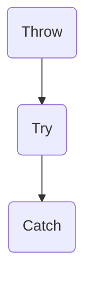

# C++ Learning Notes

## C++ 相对C新增的基础特性

### 命名空间 namespace


### 引用


### 内联函数


### 函数重载


### 函数默认参数


### const


### 杂项


## C++ 面向对象---- 封装


## C++ 面向对象---- 继承


## C++面向对象----多态


## C++ 运算符重载


##  C++泛型编程----模板

 泛型程序设计（generic programming）是一种算法在实现时不指定具体要操作的数据的类型的程序设计方法。所谓“泛型”，指的是算法只要实现一遍，就能适用于多种数据类型。泛型程序设计方法的优势在于能够减少重复代码的编写。

为了实现泛型编程, C++中支持模板的概念.模板就是将数据类型也作为一个参数传递到具体的算法实现中(类型参数化),这样就实现了算法和数据类型的分离,即针对不同的数据类型,同一个模板都能正确处理.

#### 函数模板

所谓函数模板，实际上是建立一个通用函数，它所用到的数据的类型（包括返回值类型、形参类型、局部变量类型）可以不具体指定，而是用一个虚拟的类型来代替（实际上是用一个标识符来占位），等发生函数调用时再根据传入的实参来逆推出真正的类型。这个通用函数就称为**函数模板（Function Template）**。

**函数模板的定义**

```c++
template <typename TName1, typename TName2, ...> 返回值类型 函数名(形参列表) 
{
	// 函数体中可使用类型参数    
}
```

template 是定义函数模板的关键字,后面紧跟尖括号,尖括号内用于声明类型参数,其中typename也是关键字,可以声明多个类型参数.template <typename T>这样的结构被称为模板头,模板头中声明的类型参数可以用在后面函数定义或声明的任何位置.需要注意的是,typename 关键字可以被class关键字替代.

**函数模板的调用**

在调用函数模板时，可以不用显示的指明具体类型参数，编译器会自动根据实参的类型做类型推断得到模板中的类型参数的类型，这个过程称为模板实参推断。对于模板实参推断，我们要注意函数调用时的类型转换问题。函数模板调用时，参数的类型转换相较于普通函数调用会收到更多限制，仅能进行[const]转换和数组或者函数指针转换，其他都不能应用于模板函数。例如有如下5个函数模板：

```c++
template<typename T> void func1(T a, T b);
template<typename T> void func2(T *buff);
template<typename T> void func3(const T &stu);
template<typename T> void func4(T a);
template<typename T> void func5(T &a);
```

当按照如下代码进行调用时：

```c++
int name[20];
Student Stu1("XiaoMing", 20, 96.5);

func1(12.5, 30);   	// Error
func2(name);		// T == int
func3(stu1);		// T == Student
func4(name);		// T == int*
func5(name);		// T == int[20]
```

对于func1的调用由于第一个参数为double类型，第二个为int类型，编译器不知道T应该为哪个类型，并且也不会做自动类型的转换，所以调用出错。

对于func2的调用，name数组会转换为指针。所以T对应的类型为int。

对于func3的调用，stu1参数会从非const转换为const，所以T对用的类型为Student类。

对于func4的调用，name参数会从数组类型int [20]转换为指针int *, 所以T对应的类型为int *;

对于func5的调用，name参数作为引用类型时不会从数组类型转换为指针，仍然为int [20]类型，所以T对应的类型为int [20]；

**Notice**

由于将引用作为函数参数时，数组参数传入函数时并不会转换为指针，所以对于下面的函数模板调用方式就会出错：

```c++
template <typename T> void func(T &a, T &b);
int a[20];
int b[10];
func(a, b);
```

在上述调用中，由于传入参数a,b的类型分别为int [20]和int [10]，导致编译器不能确定T的类型，从而报错。

#### 类模板

C++中除了函数模板还支持类模板，类模板中定义的类型参数可以用在类的声明和实现中。类模板同样将数据的类型参数化，将类的实现与数据类型分离。声明类模板的方式与函数模板类似，同样是再类声明之前加上一个模板头。

```c++
template <typename Name1, typename Name2>
class ClassName {
    // Class body
};
```

上面的代码仅仅是模板类的声明，对于在类外定义的成员函数，在定义时也需要加上模板头，类模板的成员函数定义格式如下：

```c++
template <typename T1, typename T2, ...>
ReturnType ClassName<T1, T2, ...>::Func(Args) 
{
	// Function body    
}
```

与函数模板不同的是，类模板在实例化时必须要显式的指明数据类型，编译器不能根据给定的数据推演出数据类型。

类模板的实例化演示如下：

```c++
Point<int, int> p1(10, 20);
Point<float, float> p2(10.1, 15.5);

Point<int, float> *p1 = new Point<int, float>(10, 15.5);
```

上面的代码实例化了3个Point模板类对象。


## C++ 异常处理

C++中异常处理的流程：抛出，检测，捕获



C++ 捕获异常的语法：

```c++
try {
	// those codes may throw an excption
} catch(exceptionType vari) {
	// handle exception
}
```

程序会执行try所包含的代码段，如果在该段代码内没有明确的抛出异常，那么代码会执行完try所包含的代码段，并跳过catch所包含的代码段继续执行后面的代码。而如果在try代码段中抛出了异常并被catch捕获，那么程序就会直接从异常点跳到catch所包含的代码段中，执行catch所包含的异常处理代码段，然后继续执行后面的程序。而try代码段中出现异常点后的部分代码就会再被执行了。

