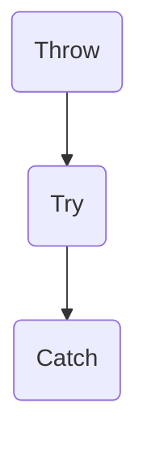

# C++ Learning Notes

## C++ 相对C新增的基础特性

### 命名空间 namespace


### 引用


### 内联函数


### 函数重载


### 函数默认参数


### const


### 杂项


## C++ 面向对象---- 封装


## C++ 面向对象---- 继承


## C++面向对象----多态


## C++ 运算符重载 (Operator Overloading)

C++支持函数重载，让同名函数能够在不同情况下发挥不同的功能。C++同样支持运算符重载，对运算符的行为进行重新定义，使同一个运算符在作用于不同的对象时进行不同的操作。

运算符重载其实就是定义一个函数，在函数体内实现想要的功能，当用到该运算符时，编译器会自动调用这个函数。也就是说，运算符重载是通过函数实现的，它本质上是函数重载。运算符重载函数除了函数名有特定的格式，其它地方和普通函数并没有区别。

运算符重载的语法如下：

```c++
// 返回值类型 operator 运算符 （形参列表）
complex operator+(const complex &A);
```

上面的代码针对complex对象重载了加号运算符，这样对于complex对象，加运算就被赋予了新的含义。

### 运算符重载的规则

1. 并不是所有运算符都能被重载，例如长度运算符`sizeof`、条件运算符`: ?`、成员选择符`.`和域解析运算符`::`不能被重载。
2. 重载不能改变运算符的优先级和结合性。
3. 重载不会改变运算符的用法，例如有几个操作数，操作数的相对位置这些都不会变。
4. 运算符重载函数不能有默认的参数。
5. 运算符重载函数既可以作为类的成员函数，也可以作为全局函数。
6. 箭头运算符`->`、下标运算符`[ ]`、函数调用运算符`( )`、赋值运算符`=`只能以成员函数的形式重载。

**Notice**

将运算符重载函数作为类的成员函数时，二元运算符的参数只有一个，一元运算符不需要参数。之所以少一个参数，是因为这个参数是隐含的，通过 this 指针隐式的访问 c1 的成员变量。

将运算符重载函数作为全局函数时，二元操作符就需要两个参数，一元操作符需要一个参数，而且其中必须有一个参数是对象，好让编译器区分这是程序员自定义的运算符，防止程序员修改用于内置类型的运算符的性质。

### 运算符重载方式的选择

运算符重载可以以类的成员函数的形式，也可以以全局函数加友元的形式。具体选择重载方式时应当考虑运算符本身的性质。当以成员函数的形式来重载运算符时，会出现一个问题：**运算符两端的操作数是不对等的** ，例如如果采用成员函数的形式重载二元运算符"+"号，那么左侧的操作数相当于程序函数的调用者，而右侧的操作数相当于成员函数的参数。这种角色的不对称与加号运算符本身的性质是不符的。例如当有如下的复数类：

```c++
class Complex {
public:
    Complex(double a, double b) : m_real(a), m_imag(b) { }
    Complex(double a) : m_real(a), m_imag(0.0) { }
    Complex & operator+(const Complex &a);
private:
    double m_real;
    double m_imag;
};

Complex & Complex::operator+(const Complex &a)
{
    return new Complex(this->real + a.real, this->imag + a.imag)
}
```

上述代码定义了一个复数类，并且以成员函数的形式重载了加号运算符。假如有如下调用，对于第一次运算，复数对象在加号左侧，因此会调用加号运算符重载函数，而19.8则作为函数参数，又经过转换构造函数的作用从double类型自动转换为Complex类型，因此运算成功进行。而对于第二次运算，19.8在加号运算符的左侧，它是double类型，并没有重载的加号运算函数，因此他没有办法直接于Complex类相加，会报错。这就是以成员函数形式进行运算符重载可能会带来的问题。

```c++
Complex c(10, 20);
Complex d, e;

d = c + 19.8; // Ok, d = 29.8+20i
e = 19.8 + c; // error, 19.8 is a double type
```

从上面的例子可以看出，虽然以成员函数的形式进行运算符重载符合面向对象的初衷，但是由于会导致运算符两端操作数的角色不对称造成问题。**所以对于加，减，乘，除，等于，不等于这种要求操作数具备等价性的运算符，一般采用全局函数加友元的形式**，这样两个操作数都是作为函数参数，在角色上是同等的地位。而对于"+=", "-=", "*=", "/="本来就要求操作数顺序的的运算符，最好还是使用成员函数的形式做运算符重载。

**Notice**

C++ 规定，箭头运算符`->`、下标运算符`[ ]`、函数调用运算符`( )`、赋值运算符`=`只能以成员函数的形式重载。

##  C++泛型编程----模板

 泛型程序设计（generic programming）是一种算法在实现时不指定具体要操作的数据的类型的程序设计方法。所谓“泛型”，指的是算法只要实现一遍，就能适用于多种数据类型。泛型程序设计方法的优势在于能够减少重复代码的编写。

为了实现泛型编程, C++中支持模板的概念.模板就是将数据类型也作为一个参数传递到具体的算法实现中(类型参数化),这样就实现了算法和数据类型的分离,即针对不同的数据类型,同一个模板都能正确处理.

### 函数模板

所谓函数模板，实际上是建立一个通用函数，它所用到的数据的类型（包括返回值类型、形参类型、局部变量类型）可以不具体指定，而是用一个虚拟的类型来代替（实际上是用一个标识符来占位），等发生函数调用时再根据传入的实参来逆推出真正的类型。这个通用函数就称为**函数模板（Function Template）**。

**函数模板的定义**

```c++
template <typename TName1, typename TName2, ...> 返回值类型 函数名(形参列表) 
{
	// 函数体中可使用类型参数    
}
```

template 是定义函数模板的关键字,后面紧跟尖括号,尖括号内用于声明类型参数,其中typename也是关键字,可以声明多个类型参数.template <typename T>这样的结构被称为模板头,模板头中声明的类型参数可以用在后面函数定义或声明的任何位置.需要注意的是,typename 关键字可以被class关键字替代.

**函数模板的调用**

在调用函数模板时，可以不用显示的指明具体类型参数，编译器会自动根据实参的类型做类型推断得到模板中的类型参数的类型，这个过程称为模板实参推断。对于模板实参推断，我们要注意函数调用时的类型转换问题。函数模板调用时，参数的类型转换相较于普通函数调用会收到更多限制，仅能进行[const]转换和数组或者函数指针转换，其他都不能应用于模板函数。例如有如下5个函数模板：

```c++
template<typename T> void func1(T a, T b);
template<typename T> void func2(T *buff);
template<typename T> void func3(const T &stu);
template<typename T> void func4(T a);
template<typename T> void func5(T &a);
```

当按照如下代码进行调用时：

```c++
int name[20];
Student Stu1("XiaoMing", 20, 96.5);

func1(12.5, 30);   	// Error
func2(name);		// T == int
func3(stu1);		// T == Student
func4(name);		// T == int*
func5(name);		// T == int[20]
```

对于func1的调用由于第一个参数为double类型，第二个为int类型，编译器不知道T应该为哪个类型，并且也不会做自动类型的转换，所以调用出错。

对于func2的调用，name数组会转换为指针。所以T对应的类型为int。

对于func3的调用，stu1参数会从非const转换为const，所以T对用的类型为Student类。

对于func4的调用，name参数会从数组类型int [20]转换为指针int *, 所以T对应的类型为int *;

对于func5的调用，name参数作为引用类型时不会从数组类型转换为指针，仍然为int [20]类型，所以T对应的类型为int [20]；

**Notice**

由于将引用作为函数参数时，数组参数传入函数时并不会转换为指针，所以对于下面的函数模板调用方式就会出错：

```c++
template <typename T> void func(T &a, T &b);
int a[20];
int b[10];
func(a, b);
```

在上述调用中，由于传入参数a,b的类型分别为int [20]和int [10]，导致编译器不能确定T的类型，从而报错。

### 类模板

C++中除了函数模板还支持类模板，类模板中定义的类型参数可以用在类的声明和实现中。类模板同样将数据的类型参数化，将类的实现与数据类型分离。声明类模板的方式与函数模板类似，同样是再类声明之前加上一个模板头。

```c++
template <typename Name1, typename Name2>
class ClassName {
    // Class body
};
```

上面的代码仅仅是模板类的声明，对于在类外定义的成员函数，在定义时也需要加上模板头，类模板的成员函数定义格式如下：

```c++
template <typename T1, typename T2, ...>
ReturnType ClassName<T1, T2, ...>::Func(Args) 
{
	// Function body    
}
```

与函数模板不同的是，类模板在实例化时必须要显式的指明数据类型，编译器不能根据给定的数据推演出数据类型。

类模板的实例化演示如下：

```c++
Point<int, int> p1(10, 20);
Point<float, float> p2(10.1, 15.5);

Point<int, float> *p1 = new Point<int, float>(10, 15.5);
```

上面的代码实例化了3个Point模板类对象。

### 模板的显式具体化


### 模板的非类型参数

C++模板中除了支持类型参数，还支持非类型的参数。例如下面的模板头：

```c++
template<typename T, int N> void func(T (&arr)[N])
```

上面的模板函数定义中，在模板头中除了类型参数T， 还有一个非类型参数N，它有具体的类型int， 用来传递值。当调用一个函数模板或者一个类模板时，非类型参数会被用户提供，或者编译器推断出的值取代。

模板中非类型参数的类型受到了严格限制，只能是一个整数，或者是一个指向对象或函数的指针（引用）。并且：

1. 当非类型参数是一个整数时，传递给它的实参或者由编译器推导出的实参必须是一个常量表达式，而不能是变量。
2. 当非类型参数是一个指针（引用）时， 绑定到该指针的实参必须具有静态生命周期，即实参必须是存在虚拟地址空间中的静态数据区，而不能是栈区或堆区的。

### 模板的实例化

模板（Templet）并不是真正的函数或类，它仅仅是编译器用来生成函数或类的一张“图纸”。模板不会占用内存，最终生成的函数或者类才会占用内存。由模板生成函数或类的过程叫做模板的实例化（Instantiate），相应地，针对某个类型生成的特定版本的函数或类叫做模板的一个实例（Instantiation）。模板也可以看做是编译器的一组指令，它命令编译器生成我们想要的代码。

模板的实例化是按需进行的，用到哪个类型就生成针对哪个类型的函数或类，不会提前生成过多的代码。也就是说，编译器会根据传递给类型参数的实参（也可以是编译器自己推演出来的实参）来生成一个特定版本的函数或类，并且相同的类型只生成一次。实例化的过程也很简单，就是将所有的类型参数用实参代替。

**Notice**

通过类模板创建对象时并不会实例化所有的成员函数，只有等到真正调用它们时才会被实例化；如果一个成员函数永远不会被调用，那它就永远不会被实例化。这说明类的实例化是延迟的、局部的，编译器并不着急生成所有的代码。

由于类模板实例化的特殊性，模板的定义并不会直接将模板实例化，而只是提供一个实例化的图纸，因此在多文件编程中，不能像传统模块化那样将模板的声明和实现分别放到头文件和源文件中，这样做可能会导致链接器无法找到实例。而应该把模板的定义也一起放到头文件中，或者使用模板的显示实例化。

通过代码明确地告诉编译器需要针对哪个类型进行实例化，这称为显式实例化。模板的显示实例化语法如下：

```c++
// 函数模板声明
template<typename T1, typename T2> void func(T1 &a, T2 &b);

// 类模板声明
template<typename T1, typename T2> class Point {
public:
    Point();
};


//显示实例化一个函数模板：template 返回值 函数名（类型1 a, 类型2 b, ...）;
template void func(double &a, double &b);
//显示实例化一个类模板：template class 类名<类型1， 类型2, ...>
template class Point<int, double>;
```

显式实例化一个类模板时，会一次性实例化该类的所有成员，包括成员变量和成员函数。

## C++ 异常处理

C++中异常处理的流程：抛出，检测，捕获



C++ 捕获异常的语法：

```c++
try {
	// those codes may throw an excption
} catch(exceptionType vari) {
	// handle exception
}
```

程序会执行try所包含的代码段，如果在该段代码内没有明确的抛出异常，那么代码会执行完try所包含的代码段，并跳过catch所包含的代码段继续执行后面的代码。而如果在try代码段中抛出了异常并被catch捕获，那么程序就会直接从异常点跳到catch所包含的代码段中，执行catch所包含的异常处理代码段，然后继续执行后面的程序。而try代码段中出现异常点后的部分代码就会再被执行了。

