# CCS10安装和使用说明

[TOC]

## CCS10 安装

1. 将离线安装包解压缩，然后右键以管理员权限运行ccs_setup文件。

   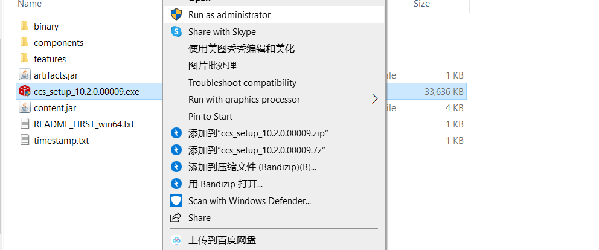

2. 安装过程中会让选择安装目录和需要安装的组件。安装目录可以直接默认或者自己设置都可以（目录路径最好不要有中文）。

3. 安装组件选择这里可以直接选择全部安装，或者自己选择必要的组件（C2000 real-time MCUS必选）。

   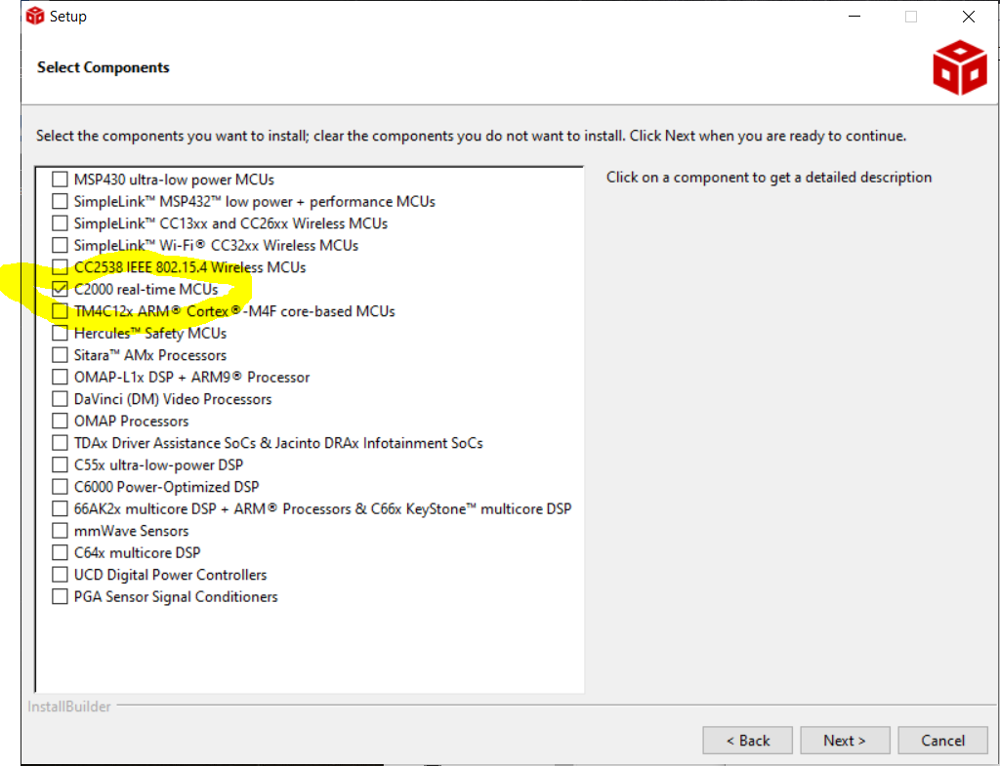

4. 然后还会选择开发工具的组件，可以都勾上。

5. 然后点击下一步开始安装，等待一段时间后即可安装完成，最后需要重启一次系统。

   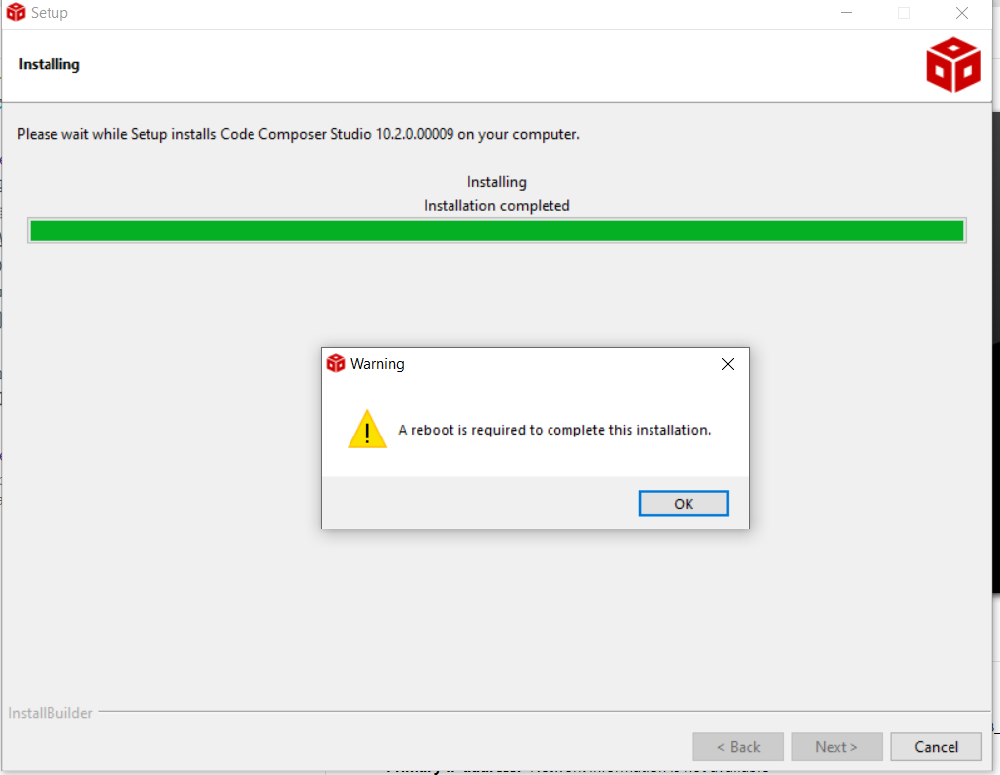

   

## CCS10 的使用

### CCSv10 IDE的一些基本概念

CCS其实是基于Eclipse IDE的再开发，基本的交互和界面设计理念和eclipse相同，下面是交互界面中主要涉及的一些概念介绍。

| concepts    |   名称   |                             介绍                             |
| ----------- | :------------: | :----------------------------------------------------------: |
| workspace   | 工作目录 | 当前CCS的工作目录，这个目录里有到所有在此工作目录下打开的工程的链接，同时也保存了用户界面的所有设置。 |
| workbench   |  工作台  | 每次打开CCS软件时的整个开发环境，workbench提供多个不同的perspective。 |
| perspective |   视图   | 视图定义了不同功能需求下，窗口、菜单栏和工具栏在工作台中的布局方式。每一个perspective都提供了旨在完成特定任务的一组功能。最常用的两个视图是编辑（Edit）视图和调试（Debug）视图。 |
| view        |   窗口   | 窗口是嵌入在工作台中提供某个特定功能显示的子区域。常用的窗口如：Problems， Debug， Outline等。 |


### CCSv10的用户界面介绍

1. 打开CCSv10之后，首先会要求指定一个目录为workspace，可以自己新建一个CCSv10_workspace文件夹作为默认的workspace。

   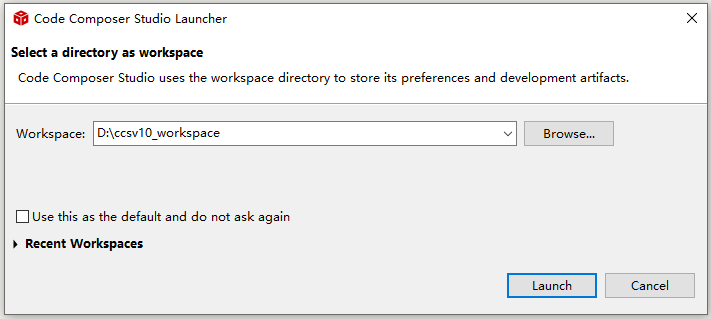

2. 点击launch之后，进入CCS的工作台（workbench）如下，这里已经打开了一个工程。

   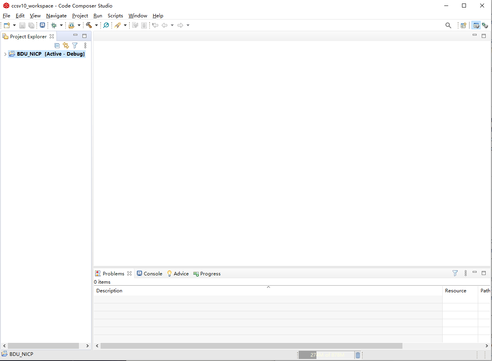

3. 通过右上角的perspective选择，可以切换编辑和调试等不同的视图，如下图就是切换到debug的视图界面，可以看到菜单栏，工具栏和显示的窗口都发生了变化。

   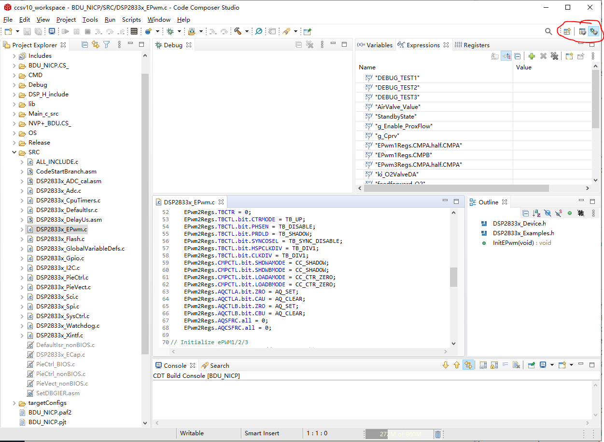

4. 显示窗口的选择，点击菜单栏中的view选项，可以选择在当前界面中开启或者关闭相关功能窗口。下表介绍了一些常用窗口的功能。

   |                  |                                                |
   | ---------------- | ---------------------------------------------- |
   | Project Explorer | 工程浏览器，显示目前打开的所有工程和其中的文件 |
   | Problems         | 显示代码编译和链接过程中出现的错误和警告       |
   | Outline          | 显示当前打开文件中的所有变量和函数             |
   | Expressions      | 调试时实时显示自己定义的想要查看的变量         |
   | Search           | 显示搜索的结果                                 |

   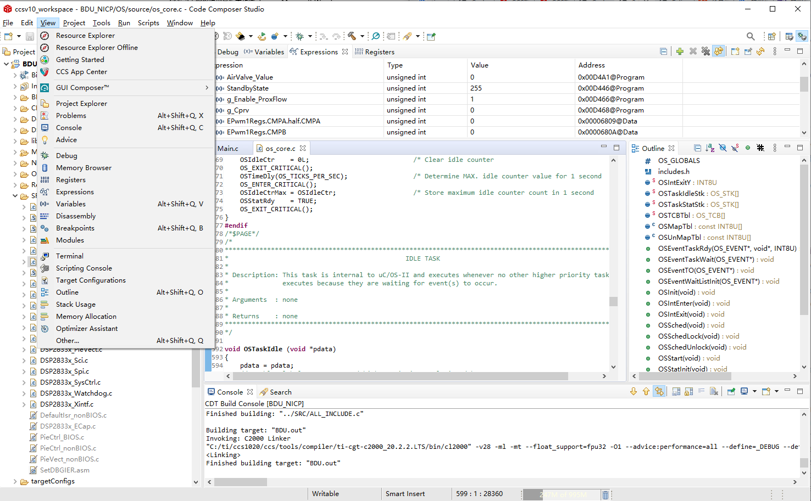

### CCSv10的基本使用

1. 导入一个已有的工程：

   点击菜单栏的Project-->Import CCS Projects，在弹出窗口中选择浏览，找到工程所在的目录，CCS会自动识别出目录下的工程。下面有两个选项框，第一个是导入该目录下的其他相关工程，第二个是直接将选中的工程复制到当前工作空间下（默认是使用链接的方式），一般都不用选。点击完成后即导入成功。

   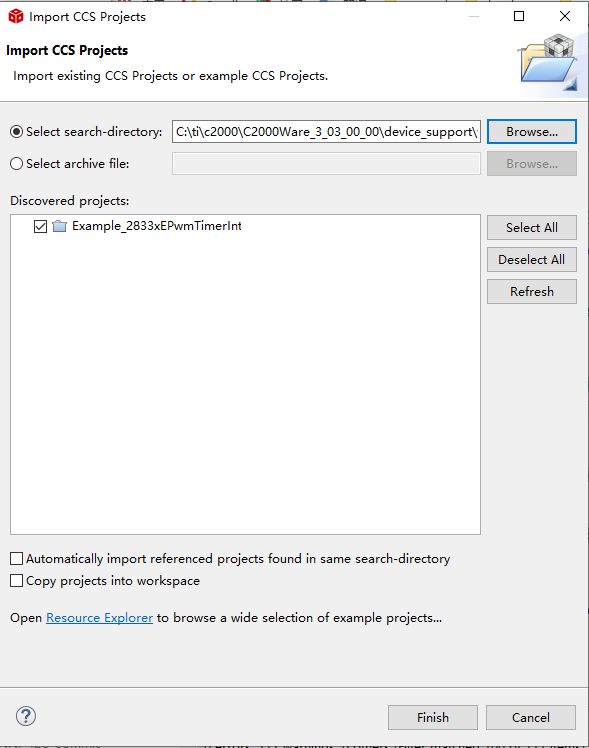

2. 新建一个新的工程：

   点击菜单栏的Project-->New CCS Project。出现对话框如下图。

   1. 在target一栏中选择目标芯片型号，这里选择TMS320F28335。
   2. Connection一栏中选择要使用的仿真器，这里选择了XDS100 V2。
   3. Project Name填入新建的工程名称，
   4. 在location中选择工程新建的目录路径，默认会新建到当前工作空间目录下。
   5. Project templates and examples 选择Empty Project，其他选项都默认即可。
   6. 点击完成后就建好了一个新的空的工程。

   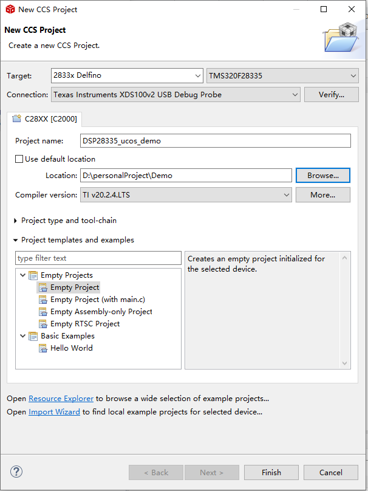

3. 在线调试一个工程：

   Edit Perspective下的工具栏如下，其中的"小铁锤"图标（build）表示对代码进行编译链接，"瓢虫"图标（debug）则表示对工程进行在线仿真。"笔"状图标（search）是搜索功能，用于我们代码查找。

   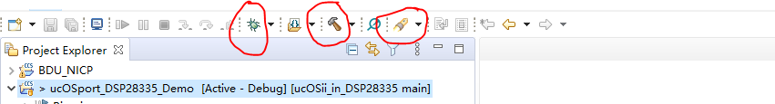

   a. 建立好工程后，首先点击工具栏的build，对工程进行编译链接，如果在编译和链接过程中出错或者有警告，会在problems窗口中显示出错信息和警告信息，直接双击相应的出错信息，可以直接定位到编译出错的代码的位置。

   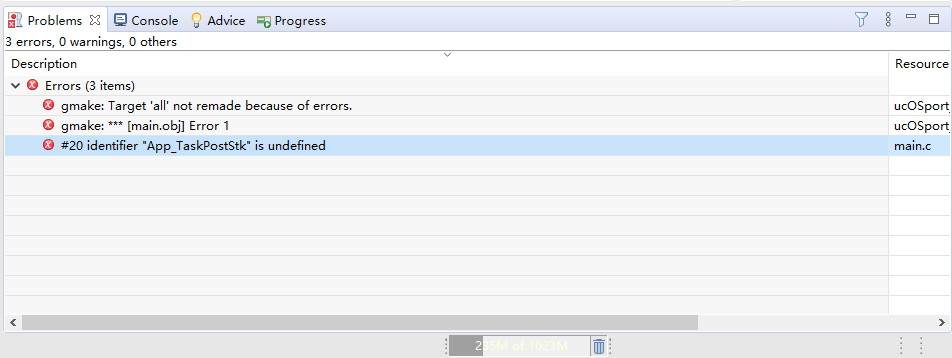

   b. 在编译链接没有错误情况下通过之后，点击工具栏的debug按钮，CCS会进入仿真状态（会自动从edit 视图切换到debug 视图）。通过仿真器CCS会对芯片的flash进行擦除和程序烧录。

   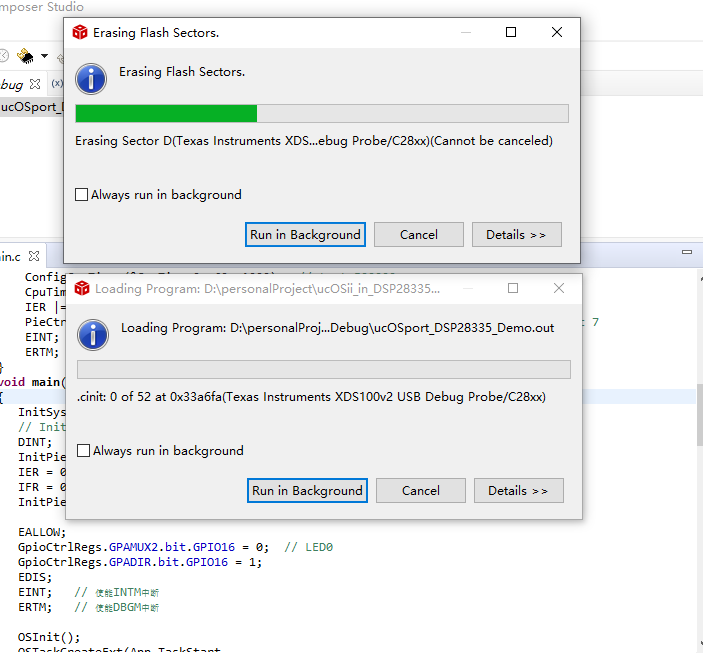

   c. 烧录完毕后进入的debug视图如下图所示，图中圆圈包围的按钮为程序运行按钮，该按钮右侧依次为暂停，停止，单步进入，单步跳过，单步返回等常用调试按钮。通过在程序编辑器的左侧双击就可以在相应的位置设置断点，但是目前连接仿真器只能同时设置两个断点。上方的Variables窗口可以观察当前的所有局部变量，Expressions可以观察自定义的想观察的变量或表达式，Registers窗口可以观察当前芯片的所有寄存器。

   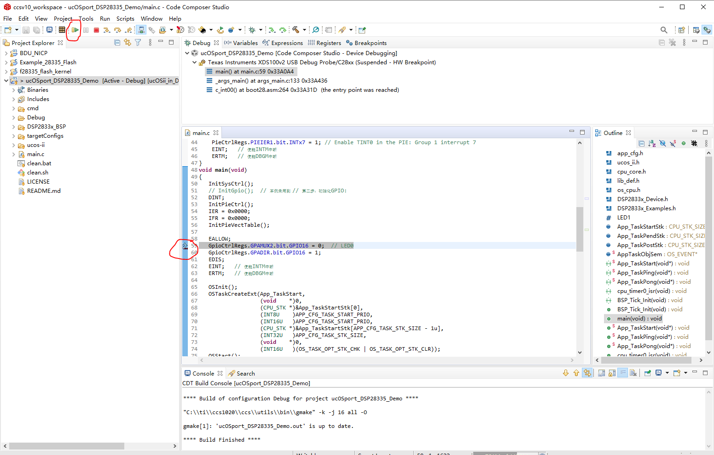
   

### CCSv10中的一些小技巧

1. 使用outline窗口快速定位C程序中的宏定义，变量定义和函数定义。

2. 在任何位置，按住ctrl键，然后鼠标左键单击变量名或函数名或者宏定义名，可以直接跳转到相应变量，函数，宏定义的定义位置，再次按住ctrl键单击可以跳转到相应的声明位置。

3. 善用代码搜索来查找bug，双击选中想要搜索的变量或者函数名，然后点击工具栏上的search工具，然后就会弹出搜索对话框，主要有两种搜索功能：

   1. 一种是C/C++ search，这种搜索只会显示当前工程代码中的搜索结果，不会显示注释，非程序文件中的搜索结果。
   2. 另一种是file search，这种类型的搜索会显示当前工作空间下的所有匹配的结果，相当于一种纯文本搜索。

   在search窗口中会显示搜索结果，直接双击就可以跳转到相应的代码位置。

   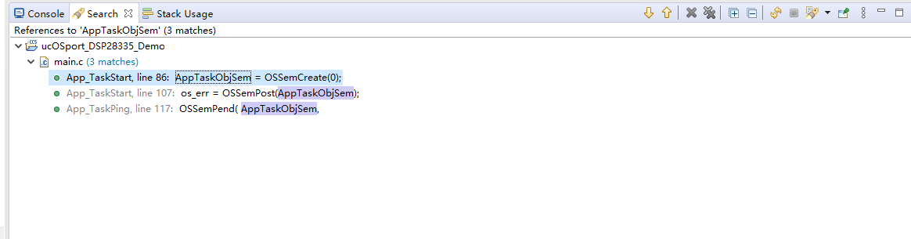

4. 对于在线仿真过程中任何想看的变量都可以双击变量名选中，然后右键单击选择"Add Watch Expressions"，然后点击确定，所选择的变量就会出现在Expressions窗口中，相关的属性，数值都会实时刷新。对于数组，指针，结构体等类型还可以直接看其内部变量数值。

   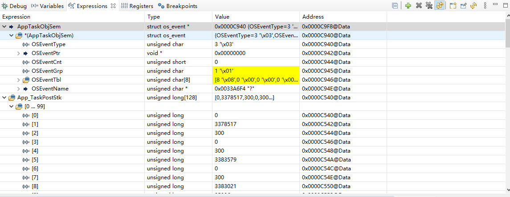

5. 修改程序中的变量或者函数名，有时候想要修改程序中的变量或者函数命名，但是这个变量可能在很多地方都有使用，直接搜索替换又容易发生误改。在ccsv10中可以直接选中该变量或者函数名，然后"alt+shift+R"键（或鼠标右键->refactor->rename）进行改名，改完之后enter确认，就可以将工程中所有对应的变量名修改。

6. 选择菜单栏view选项下的“memory allocation”选项可以看到当前芯片的存储空间使用情况，选择"Stack Usage"则可以看到当前工程中所有函数的栈使用情况。

   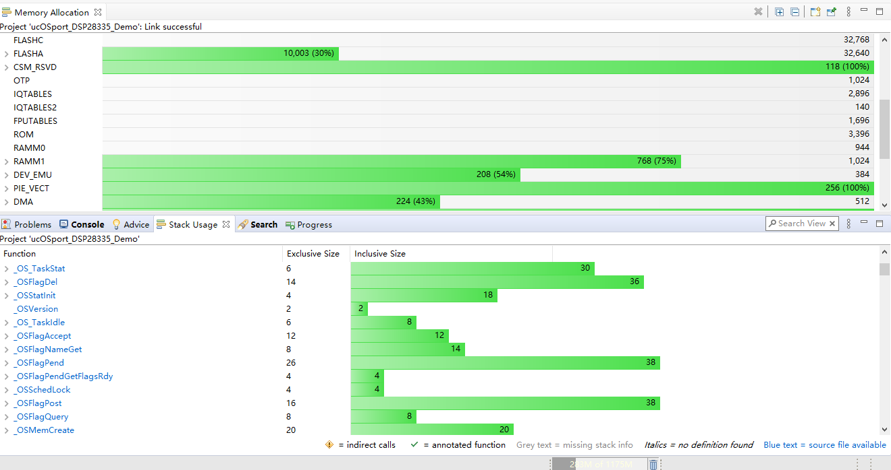 

## CCSv3.3的工程移植到CCSv10的步骤

1. 在本地新建一个workspace用于存放移植后的工程,打开CCSv10.2，选择刚刚新建的workspace。

2. 在工具栏中点击”Project-->Import Legacy CCSv3.3 projects”。

3. 在弹出对话窗中点击Browse然后找到CCSv3.3的工程文件（.pjt文件），选中窗口下方的"Copy projects into workspace"选项，然后点击next。

   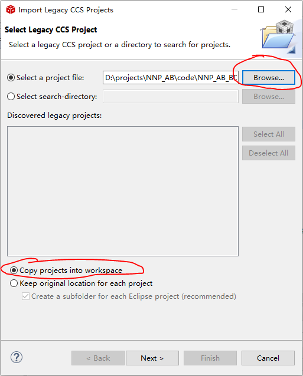

4. 接下来会选择编译器，选择默认的CCS10.2编译器就可以，直接点击finish，这时会出现警告信息，暂时忽略。

5. 右键工程名，选择"properties"进入工程属性选项卡，点击左侧的"General"，然后右侧选择"Products"页面，将XDAIS选项移除。

   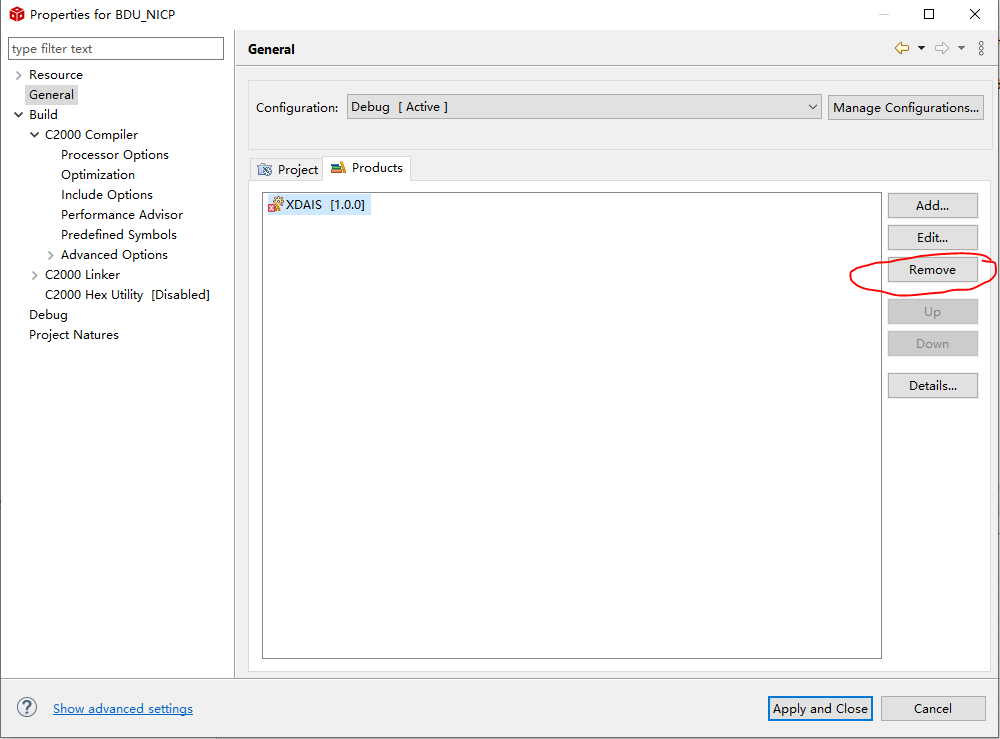

6. 点击"C2000 Complier"下的"Include Options"选项，将右侧的头文件搜索路径全部从绝对路径改为相对路径，同时将"XDAIS"的路径删除。

   改头文件搜索路径前：

   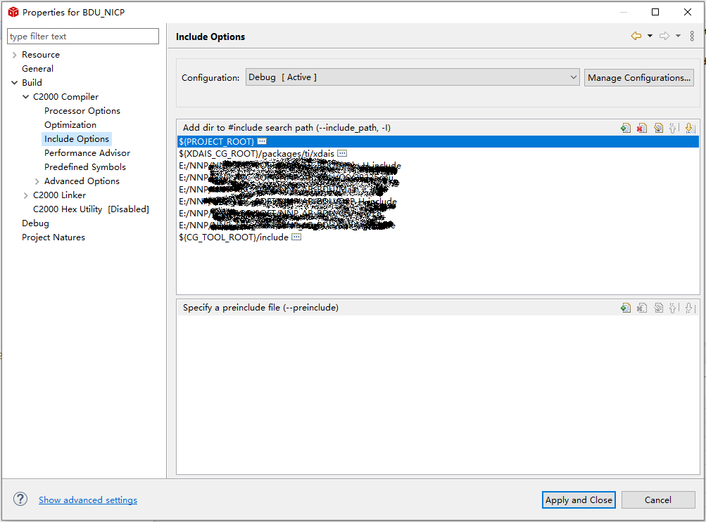

   修改搜索路径后：

   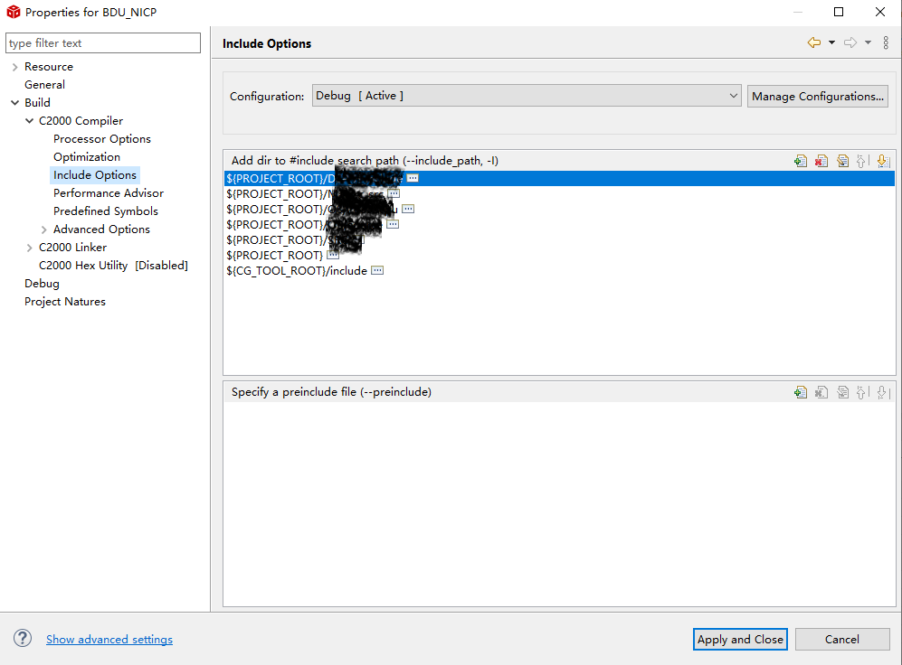

7. 点击"C2000 Linker"下的"File Search Path"选项，将右侧的库文件搜索路径全部从绝对路径改为相对路径。

   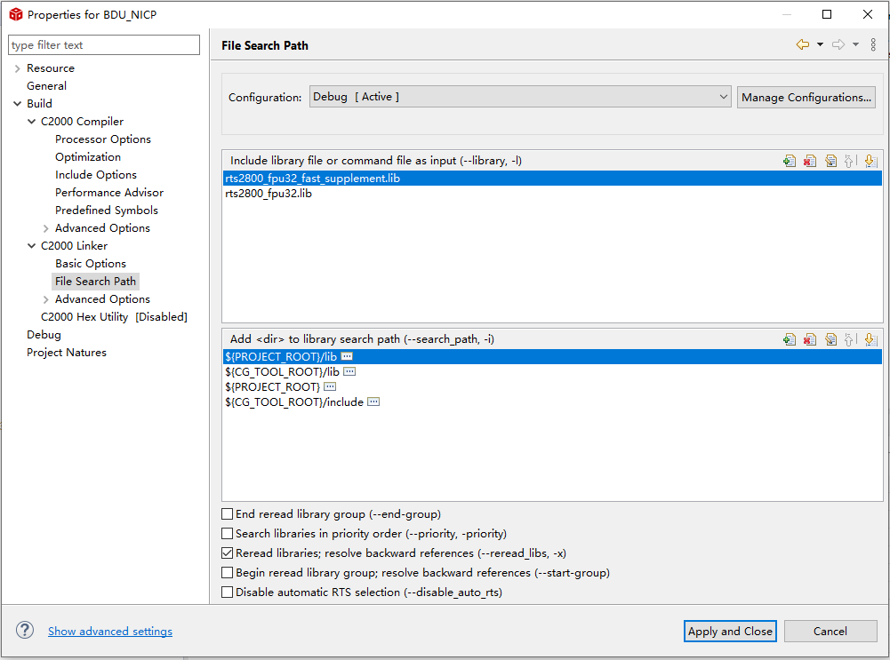

8. 点击"Ok",确认以上工程属性的修改，然后编译工程通过，没有error，出现的warning是因为使用的链接库版本比较低，一般不影响运行调试。

### Notice 移植后可能出现的问题及解决办法:

1. 部分语法在新版本的编译器中不再支持。

   ​	一些不太规范的C语言写法在老版本中可能只会报出警告，但是仍然能够编译通过，但是在高版本的编译器中可能会被认为是错误写法而报错。例如下的代码用整形值给一个整形数组赋初值，在老版本中只会报出告警，但是仍能编译通过，而在高版本编译器中已经将这种形式的赋值认为是错误并报出errors：

   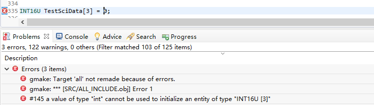

   解决办法就是规范程序写法，例如将上面的数组赋初值写为如下形式：

   ```c
   INT16U TestSciData[3] = {0};
   ```

   这样就能在新版本中编译通过，因此如果出现在移植之后程序中某些地方报错，请先检查代码书写是否规范合理。

2. 部分老版本的库函数与当前开发环境不再兼容。

   目前发现老版本中用来将flash中的程序copy到ram中运行的库函数memcopy与新的开发环境不再兼容，由于目前工程中没有将flash程序拷贝到ram中运行的情况，最直接的解决办法是将如下两句代码注释。

   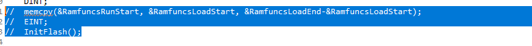

## 参考资料

1. CCS官方文档网页，包含所有官方文档：http://software-dl.ti.com/ccs/esd/documents/ccs_documentation-overview.html

2. [Code Composer Studio User’s Guide](http://software-dl.ti.com/ccs/esd/documents/users_guide/index.html?_ticdt=MTYxMjE2NTUxNXwwMTc3MjI3OWVhYmUwMDE5MzM5YWJiZDAxM2UwMDMwNzMwMDE2MDZiMDBiZDB8R0ExLjMuMTg4Nzg1NzMwMi4xNjExMTkxMTUyfDA)

