# DSP28335中的I2C模块应用

## I2C总线介绍

### I2C总线背景

I2C总线是由飞利浦半导体公司（现在的NXP半导体）于1982年发明的同步，多主机，多从机，分组交换，单端，串行通信总线标准。它广泛用于在板内短距离通信中，可以将低速外围IC连接到处理器和微控制器。

I2C总线标准的更新如下表所示，目前的标准维护主要掌握在NXP半导体公司，DSP28335目前支持的标准是V2.1版本：

| Year | Version  | Maximum speed |                            Notes                             |
| :--: | :------: | :-----------: | :----------------------------------------------------------: |
| 1982 | Original |  100 kbit/s   | The I2C system was created as a simple internal bus system for building control electronics with various Philips chips. |
| 1992 |    1     |  400 kbit/s   | Added *Fast-mode (Fm)* and a 10-bit addressing mode to increase capacity to 1008 nodes. This was the first standardized version. |
| 1998 |    2     |  3.4 Mbit/s   | Added *High-speed mode (Hs)* with power-saving requirements for electric voltage and current. |
| 2000 |   2.1    |  3.4 Mbit/s   | Clarified version 2, without significant functional changes. |
| 2007 |    3     |   1 Mbit/s    | Added *Fast-mode plus (Fm+)* (using 20 mA drivers), and a device ID mechanism. |
| 2012 |    4     |   5 Mbit/s    | Added *Ultra Fast-mode (UFm)* for new USDA (data) and USCL (clock) lines using [push-pull](https://en.wikipedia.org/wiki/Push–pull_output) logic without [pull-up resistors](https://en.wikipedia.org/wiki/Pull-up_resistors), and added an assigned manufacturer ID table. It is only a [unidirectional](https://en.wikipedia.org/wiki/Simplex_communication) bus. |
| 2012 |    5     |   5 Mbit/s    |                     Corrected mistakes.                      |
| 2014 |    6     |   5 Mbit/s    |     Corrected two graphs. This is the current standard.      |

### I2C总线结构

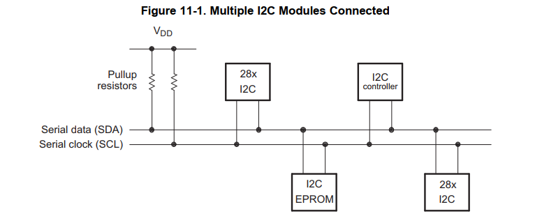

I2C总线的结构如上图所示，I2C总线只有两条线，一条时钟信号线SCL，一条数据信号线SDA，所有设备都通过这两条线挂到总线上。两条信号线还需要分别通过上拉电阻接到一个正电压源上。

## I2C通讯协议

### 物理层规范

1. I2C总线由一条时钟线SCL和一条数据线SDA构成。
2. I2C总线的逻辑0和逻辑1的电平定义不是固定的，而是由通过上拉电阻连接的电源电压VDD决定。

### 数据有效性定义

在时钟线SCL为高电平时，I2C的数据线SDA电平必须保持稳定才算有效。I2C的SDA的电平变化只能发生在SCL电平为低的状态下。

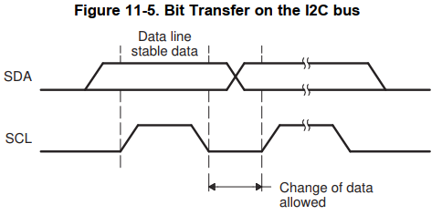

### I2C设备的运行模式

I2C模块有四种基础的运行模式分别作为主设备或者从设备传输数据。

| operating mode           | description                                                  |
| ------------------------ | ------------------------------------------------------------ |
| Slave-receiver modes     | 所有的从设备初始时都处于此模式。这个模式下，从设备在主设备产生的时钟信号下接收SDA上的数据。从设备不能产生时钟信号，但是当出现总线过载时（RSFULL=1），从设备可以将时钟总线SCL拉低。 |
| Slave-transmiitter mode  | 从设备只有在Slave-receiver模式下收到来自主设备的命令时才会进入此模式。当从设备发现发现总线上收到的从设备地址与自身地址相同，同时主设备发送的R/W=1,从设备就会切换到此模式，将数据通过SDA线发出去。同样此模式下，SCL时钟信号由主设备产生，从设备只在特殊情况下（XSMT=0）会将SCL拉低。 |
| Master-receiver mode     | 主设备只有在Master-transmitter模式时发送指令给主设备之后才会进入此模式。在主设备发送了从设备地址，并且R/W=1时，主设备会切换到接收模式，从SDA逐位接收数据。此时SCL仍由主设备控制，只在发生异常时（RSFULL=1）会将SCL拉低。 |
| Master-transmitter modes | 所有主设备在初始时都处于此模式，此模式下数据通过SDA逐位发送出去，SCL上的脉冲信号则由主机的模块时钟产生，只有在发生异常时（XSMT=0）会将SCL拉低。 |

### I2C 总线上的START和STOP条件

I2C总线传输数据时的开始和结束条件可以由总线上的主设备产生。

- START条件：在SCL为高电平时，SDA电平由高到低转变，这个条件发生时，表示总线上要开始一次数据传输。
- STOP条件：在SCL为低电平时，SDA电平由低到高转变，这个条件发生时，表示总线上的一次数据传输结束。

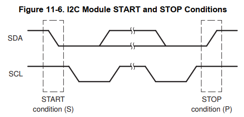

### I2C总线上的数据格式

I2C模块支持1到8位的数据模式，放到SDA上的每一位数据对应着SCL上的一个脉冲，所有数据都是从最高位（MSB）开始传输的，一次传输的数据量多少没有限制。

I2C支持7位地址模式和扩展的10位地址模式，下图是7bit地址，8bit数据格式的I2C总线数据传输示意图：

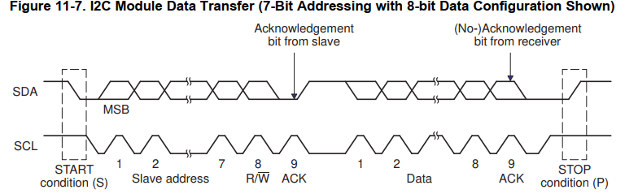

1. 7位地址模式

   7位地址模式是I2C模块复位后的默认模式，当DSP28335的I2CMDR.XA和I2CMDR.FDF位都为0时，I2C模块就处于此模式。

   此模式下在START条件之后的第一个字节由一个7位的地址和1位的R/W标志位组成。其中R/W标志位决定数据传输的方向：

   1. R/W=0：I2C主设备发送数据到从设备，在DSP28335中可通过置位I2CMDR.TRX=1实现。
   2. R/W=1: I2C主设备接收来自从设备的数据，在DSP28335中可通过I2CMDR.TRX=0实现。

   每两个byte之间都会插入一个额外的时钟周期，作为应答(ACK)信号。如果主机发送了第一个字节之后由从机插入应答信号，那么总线上紧接着就是n bits来自发送者的数据。当所有数据bits传输完后，接收端会在总线上插入一个ACK位。

   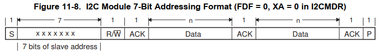

2. 10位地址模式

   10位地址模式与7位地址模式类似，但是从机的地址用10bits 来表示，因此主机会分成两个byte发送从机地址。第一个字节的固定由11110b开始，然后是10bits从机地址的最高两位，然后是R/W标志位。第二个字节就是10bits从机地址的低8位。对于从机，主机发送的这两个字节每一个都要单独发送ACK标志。

   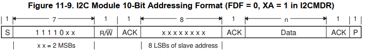

3. 自由数据格式 (Free Data Format)

   在DSP28335中通过置位I2CMDR.FDF=1就可以使能自由数据格式模式。在这种模式下，START条件之后紧接着就是要传输的数据，没有地址和数据方向位需要发送。因此在这种模式下的I2C总线上，发送端和接收端都需要支持这种模式，并且数据的传输方向要一直不变。

   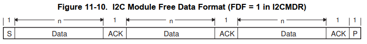

4. 使用重复START条件

   I2C总线上的主设备不需要每次都产生STOP条件来放弃总线控制然后再切换的方式来和多个从设备通讯。只需要再一个data发送完成之后再次发起一次START条件，就可以重新和其他从设备开始通讯。

   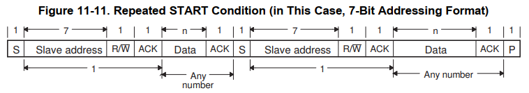

5. 发送NACK位

   当I2C模块作为接收方时，可以决定去确认或者忽略来自发送者的数据。如果要忽略接收到的一个数据，I2C模块需要在该数据后的ACK位上发送一个不应答位（NACK）。

6. 时钟同步

   当总线上存在多个主设备时，就会需要总线仲裁（arbitration），这时时钟信号需要被同步。

   I2C的时钟信号SCL具有线与（wired-AND）的特点，因此在SCL线上第一个产生低电平周期的设备将会控制整个总线的时钟，在这个时钟信号的下降沿，总线上其他主设备的时钟信号将会被同步，也即被迫开始它们自身的低电平周期。而SCL将会一直维持低电平，直到总线上所有设备的时钟都恢复高电平，对于其他在这之前时钟已经要变高电平的设备必须要等待总线被释放才能恢复他们自身时钟信号的高电平。对I2C时钟信号的同步，满足最慢的设备决定总线的低电平时间，而最快的设备决定总线的高电平时间。

   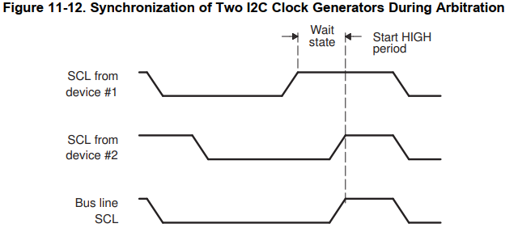

7. 总线仲裁

   对于两个或多个主设备在总线上同时发起数据传输的情况，需要对SDA做总线仲裁。两个设备在接受I2C总线仲裁时，总是先企图拉高SDA电平的设备退出仲裁，换句话说，所要传输的数据字节越小，在总线仲裁中的优先级越高。

   如果一个主设备在总线仲裁中退出了，那么会自动切换到slave-receiver模式，并将ARBL标志位置位，并且会产生一个仲裁失败中断。在以下三种情况中是不允许总线仲裁的：

   1. 重复START条件和一个数据bit
   2. STOP条件和一个数据bit
   3. 重复START条件和STOP条件

   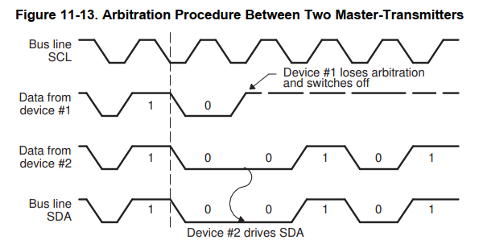

   

## DSP28335中的I2C模块

### DSP28335 I2C模块特点

DSP28335中的I2C具备以下功能：

1. 完全兼容NXP半导体制定的I2C总线规格（V2.1）。
2. 接收和发送的缓冲FIFO。
3. 支持两类ePIE中断：I2Cx中断和I2Cx_FIFO中断。
4. 能够控制使能/不使能。
5. 支持自由数据格式模式。

### I2C模块构成

I2C模块内部由以下部分组成：

1. 串行接口：SCL和SDA引脚。
2. 数据寄存器和FIFO。
3. 控制和状态寄存器。
4. 与CPU之间的外设总线接口。
5. 时钟同步器
6. 预分频器
7. 噪声滤波器
8. 仲裁器
9. 中断逻辑单元
10. FIFO中断逻辑单元

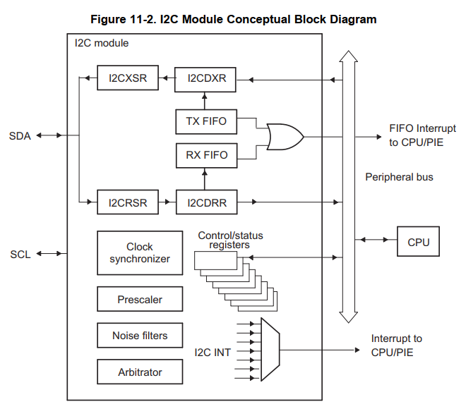

### 时钟信号的产生

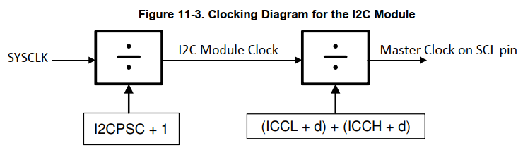

如上图所示，系统时钟首先经过预分频器的分频得到I2C模块时钟，然后再经过模块内部的ICCL和ICCH寄存器分频得到SCL引脚上的主时钟。因此有如下关系：
$$
I2C{\ }Module {\ }Clock(Fmod)=\frac{SYSCLK}{(I2CPSC+1)} \\
Master{\ }Clock{\ }Clock(Fmst)=\frac{I2C{\ }Module {\ }Clock(Fmod)}{(ICCH+d)+(ICCL+d)}
$$
其中的d由divide-down value IPSC决定：

| IPSC | d    |
| ---- | ---- |
| 0    | 7    |
| 1    | 6    |
| >1   | 5    |

**Notice**:

1. I2C模块的时钟预分频设置只在I2C处于reset状态时有效，即IRS=0时有效，并且预分频的设置只在IRS重新置位后才能生效。
2. 为了满足I2C协议对于时钟规格的要求，I2C模块的时钟需要配置在7-12MHz之间。

### 第一次传输数据前的配置

在DSP28335的I2C模块第一次开始数据传输之前，应该采取以下步骤进行配置：

1. 通过IRS置位让I2C模块复位，等待一段时间确定应用中所有数据都能传输完毕。通过等待一段时间，用户可以确保I2C总线上至少有一次START或者STOP条件发生并被Bus Busy bit（BB）捕捉到，这之后BB位才能正确反映I2C总线的状态。
2. 在数据传输之前检查BB bit确认BB=0（总线不忙）
3. 开始数据传输

**Notice**：

在I2C总线传输过程中不要复位I2C模块，以确保BB bit能正确反应总线状态。如果需要复位则要重复上面三个步骤。

### DSP28335中的I2C中断

DSP28335中的I2C中断分为两类，一类是基础I2C中断，一类是I2C的FIFO中断。

#### 基础I2C中断

DSP28335中的I2C模块有多种类型，如下表所列，所有的I2C中断会被多路复用到一个I2C中断仲裁器然后再传递给CPU，I2C中断的结构如图所示。

| i2c iNTERRUPT REQUEST | INTERRUPT SOURCE                                             |
| --------------------- | ------------------------------------------------------------ |
| XRDYIN                | 数据发送中断。I2CDXR中的数据已经被发送出去，I2CSTR.XRDY=1。  |
| RRDYINT               | 数据接收中断。I2CDRR中收到了新数据，I2CSTR.RRDY=1            |
| ARDYINT               | I2C寄存器操作中断。I2C模块的寄存器已经准备好被操作。之前的地址，数据，命令等数据已经使用了。I2CSTR.ARDY=1 |
| NACKINT               | 没有应答中断。当主设备发送数据而没有收到从设备的应答。I2CSTR.NACK=1 |
| ARBLINT               | 仲裁退出中断。作为主设备在总线仲裁中失败被退出。I2CSTR.ARBL=1 |
| SCDINT                | 停止条件中断。在总线上检测到了STOP条件。I2CSTR.SCD=1         |
| AASINT                | 识别位从设备中断。I2C模块被总线上的其他主设备识别为从设备。I2CSTR.AAS=1 |

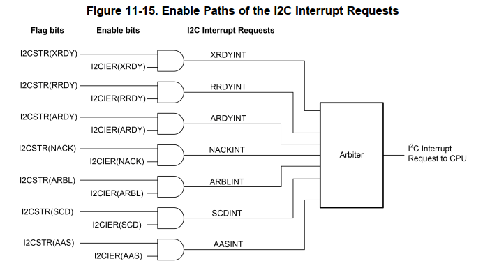

#### I2C FIFO中断

DSP28335除了7个基础I2C中断，还提供了I2C接收FIFO和发送FIFO两个中断。当I2C发送FIFO发送了超过设定数量的字节（最多16个），或者接收FIFO接收了超过设定数量的字节（最多16个），均会产生FIFO中断，这个中断以“或”的关系传到CPU中断，通过在中断服务函数中读取FIFO中断状态寄存器来确认具体中断源。下图是DSP28335中的I2C FIFO中断结构图：

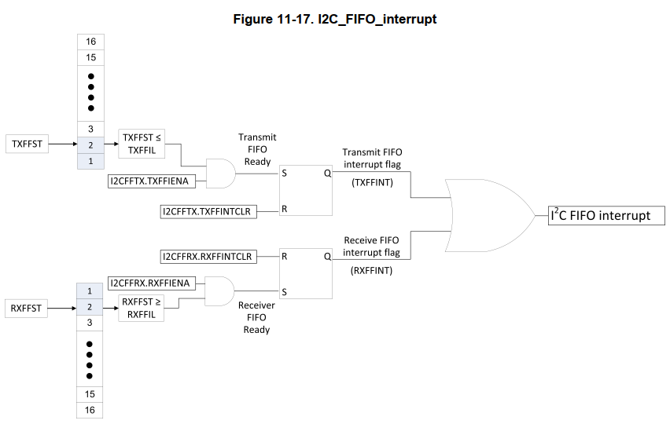

### I2C模块的复位和不使能

DSP28335中可以用以下两种方式复位或者关闭I2C模块

1. 向I2C模式寄存器I2CMDR的IRS位写0。所有的状态寄存器会回到默认值，SDA和SCL引脚会进入高阻态，直到IRS再被置位。
2. 将XRS引脚拉低，将会使模块进入复位状态并且一直保持复位状态直到XRS引脚被拉高。当XRS引脚被释放后，I2C模块寄存器会回到默认值，并且IRS位会被置0，I2C模块会一直处于复位状态直到IRS位被写1。

**NOTICE**

进行I2C模块配置的时候要首先将IRS位写0，配置完之后再重新置位IRS位。