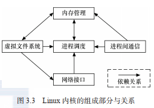
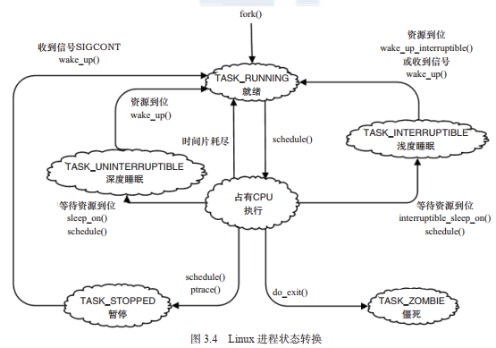
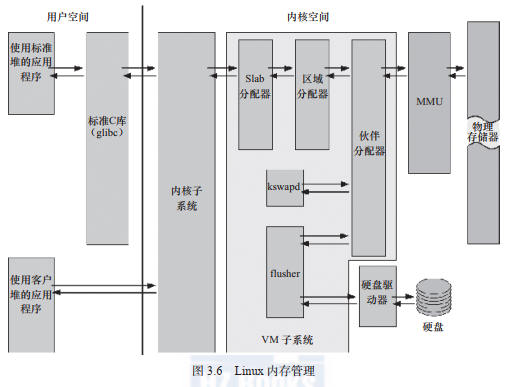
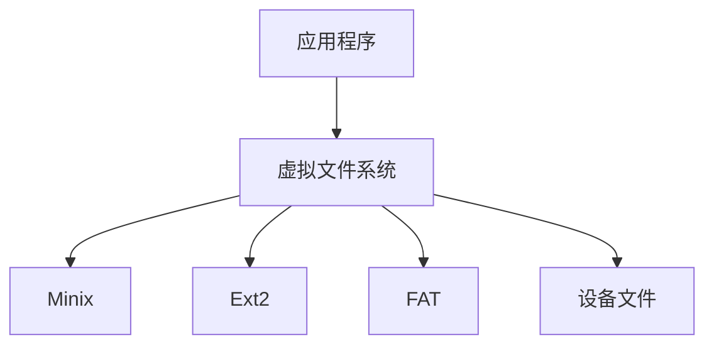
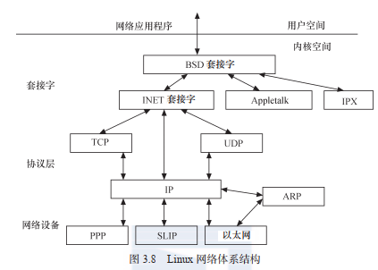

# Linux 内核及内核编程

## Linux2.6后的内核特点

### 1. 新的调度器

目前主要有CFS(完全公平调度)调度算法和EDF(最早截止期限优先)调度算法。

### 2. 内核抢占

Linux2.6以后版本的linux内核支持内核任务的抢占，但linux内核本身只提供软实时的能力，因为linux内核中仍然存在，中断，软中断，自旋锁等不能被抢占的上下文。

### 3. 改进的线程模型

Linux2.6以后的线程模型采用NPTL(Native POSIX Thread Library, 本地POSIX线程库)模型。

### 4. 虚拟内存管理优化

Linux2.6以后Linux的虚拟内存管理引入了反向映射(r-map)技术，改善了虚拟内存的性能。

### 5. 文件系统

增加了对日志文件系统功能的支持。

### 6. 音频支持

高级Linux音频体系结构(Advanced Linux Sound Architecture, ALSA)取代了原来的OSS(Open Sound System)。

### 7. 总线，设备，驱动模型

总线，设备，驱动模型实现对设备的控制。

### 8. 电源管理

支持高级配置和电源接口(Advanced Configuration and Power Interface, ACPI), 用于调整CPU在不同的负载下工作于不同的时钟频率以降低功耗。

### 9. 联网和IPSec

Linux 2.6 内核中加入了对 IPSec 的支持，删除了原来内核内置的 HTTP 服务器 khttpd，加入了对新的 NFSv4（网络文件系统）客户机 / 服务器的支持，并改进了对 IPv6 的支持。

### 10. 用户界面层

Linux2.6内核重写了帧缓冲/控制台层，内核API中增加了不少新功能，例如内存池，sysfs文件系统，内核模块从.o改为.ko，驱动模块的编译方式等。

### 11. ARM架构的变更

  Linux3.0以后ARM Linux代码在时钟，DMA, pinmux等诸多方面做了优化和调整，Linux3.7以后的内核可以支持多平台，即用同一份内核镜像可以运行于多家SoC公司的芯片，实现一个Linux可适用于所有的ARM系统。

## Linux 内核组成



### 1. 进程调度(Schedule)



### 2. 内存管理（Memory Management）



### 3. 虚拟文件系统



Linux 虚拟文件系统隐藏了各种硬件的具体细节，为所有设备提供了统一的接口。而且，它独立于各个具体的文件系统，是对各种 文 件 系 统 的 一 个 抽 象。 它 为 上 层的应用程序提供了统一的 vfs_read()、vfs_write() 等接口，并调用具体底层文件系统或者设备驱动中实现的 file_operations 结构体的成员函数。  

### 4. 网络接口



网络接口提供了对各种网络标准的存取和各种网络硬件的支持。如图 3.8 所示，在 Linux中网络接口可分为网络协议和网络驱动程序，网络协议部分负责实现每一种可能的网络传输协议，网络设备驱动程序负责与硬件设备通信，每一种可能的硬件设备都有相应的设备驱动程序。  

### 5. 进程间通信

Linux支持进程间的多种通信机制包括：

1. 信号量
2. 信号
3. 共享内存
4. 消息队列
5. 管道
6. UNIX域套接字

## Linux内核的配置、编译和加载

### 1. 内核配置

在编译内核之前需要进行内核的配置，可以使用下面的命令之一：

```shell
make config 		#基于文本的最为传统的配置界面
make menuconfig		#基于文本菜单的配置界面
make xconfig		#基于QT的图形界面，要求QT被安装
make gconfig		#基于GTK+，要求GTK+被安装
```

其中最推荐的是make menuconfig命令，它不依赖于QT或GTK+，相较于纯文的界面也更加直观方便。

Linux内核配置系统主要由3个部分组成：

- Makefile: 分布在linux内核源码中，定义Linux内核的编译规则
- Kconfig: 配置文件，给用户提供配置选择的功能
- 配置工具：包括配置命令解释器和配置用户界面。

在Linux内核中增加程序需要完成以下三项工作：

- 将编写的源代码复制到Linux内核源代码的相应目录中。
- 在目录的Kconfig文件中增加关于新源代码对应项目的编译配置选项。
- 在目录的Makefile文件中增加对新源代码的编译条目。

### 2. 内核编译


### 3. 内核加载

