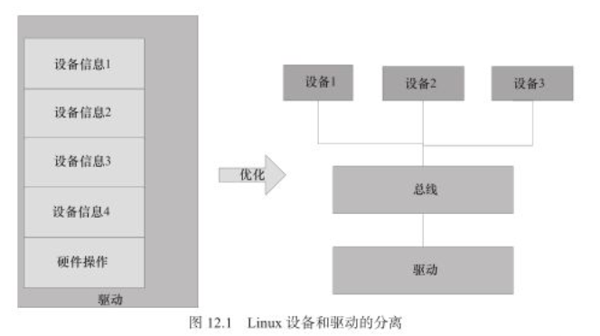
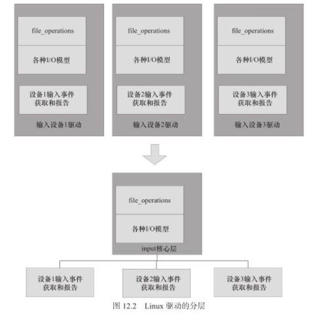
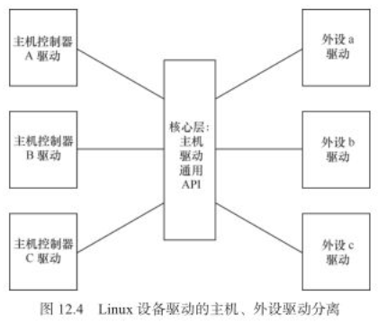
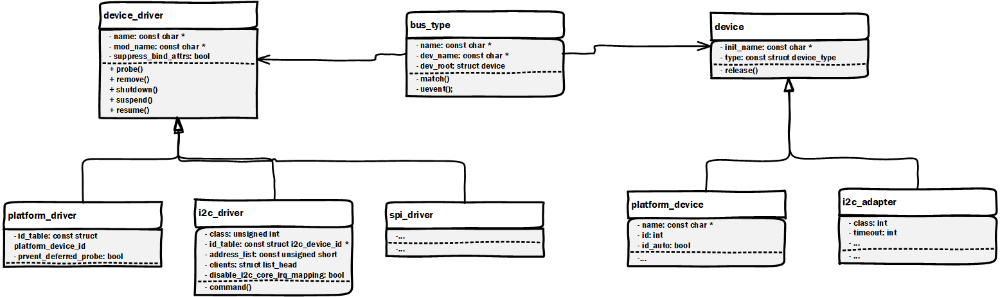

# Linux 设备驱动开发

## Linux设备驱动的软件架构

### Linux 设备驱动软件的需求

Linux操作系统不是针对具体的硬件架构而设计的，它支持约30种体系结构下的大量硬件平台。因此Linux操作系统对于软件的跨平台能力，可移植性都有很高的要求。对于Linux设备驱动软件，同样要求：

1. 跨平台性，对于不同的硬件平台兼容。
2. 可移植性，不同的硬件平台不用修改任何代码或者只需要修改很少量的配置就可以直接编译运行。
3. 可扩展性，一个设备驱动应该能够做到支持多个同类设备。

### Linux 设备驱动的核心思想

为了满足上述对于驱动软件的需求，Linux 设备驱动的核心思想是：  

**1. 设备和驱动分离** ，所谓设备与驱动分离，就是指驱动程序部分不针对具体的硬件平台，只负责实现驱动（对硬件操作）的功能。而设备文件则包含具体的硬件平台信息，针对具体的硬件。这样驱动只管驱动，设备只管设备，而Linux种的总线则负责匹配设备和驱动，驱动通过标准的途径拿到设备的板级信息，如下图所示的架构。通过这种方式，驱动程序就可以在不同的硬件平台上运行。



**2. Linux驱动软件的分层设计** 很多同类型设备的驱动程序种具有大量相似的操作，例如Linux的字符输入设备驱动需要编写文件操作（file_operation）成员函数，并负责实现复杂的I/O模型，但是所有输入设备的这部分代码是相似的。因此Linux在这种情况下，Linux就会提炼出一个中间层，把这些相似的工作全部搞定。下图就表示了Linux针对input设备提炼出一个核心层，核心层种负责实现与Linux的接口以及整个一套的input事件汇报机制。



**3. CPU和外设分离** ，设备驱动同时与CPU和外设相关，如果设备驱动的程序种同时包含CPU和外设自身的信息，那么就意味着，同一个设备在不同的CPU下有不同的驱动程序，而不同设备的驱动程序种又需要出现针对同一CPU的相同操作，对于N个外设在M个CPU上的情况，就需要又M*N个驱动程序。这种在驱动程序种出现CPU和设备之间强耦合会导致软件臃肿负责不可靠。Linux采取的方式同样是提取一个中间层，让所有的CPU和设备都与这个中间层交互，类似软件设计模式中的适配器模式，通过中间层的代理，就避免了CPU与设备之间的直接耦合。这种情况下对于N个外设在M个CPU上的情况，只需要M+N个驱动程序。



### Linux设备驱动的架构

用类图的方式表示linux中驱动，设备和总线之间的关系如下图所示（只画出部分成员示意），可以看到在linux程序中，对应设备，驱动和总线分别有一个基类（结构体）：device, device_driver 和bus_type，这几个基类分别对设备，驱动和总线一些共性的属性和操作做了抽象。通过这几个基类可以再继承出不同类型的设备，驱动和总线，并且设备与驱动之间通过总线进行沟通。



#### device 类（结构体）

device类是Linux中所有设备描述的基类，device类包含设备模型所需的所有设备信息。一般很少直接使用device类，而是使用继承（结构体包含）了device类的具体设备类型。如下是linux源码中对于device结构体的注释：

> At the lowest level, every device in a Linux system is represented by an instance of struct device. The device structure contains the information that the device model core needs to model the system. Most subsystems, however, track additional information about the devices they host. As a result, it is rare for devices to be represented by bare device structures; instead, that structure, like kobject structures, is usually embedded within a higher-level representation of the device.

```c
struct device {
	struct kobject kobj;
	struct device		*parent;

	struct device_private	*p;

	const char		*init_name; /* initial name of the device */
	const struct device_type *type;

	struct bus_type	*bus;		/* type of bus device is on */
	struct device_driver *driver;	/* which driver has allocated this
					   device */
	void		*platform_data;	/* Platform specific data, device
					   core doesn't touch it */
	void		*driver_data;	/* Driver data, set and get with
					   dev_set_drvdata/dev_get_drvdata */
#ifdef CONFIG_PROVE_LOCKING
	struct mutex		lockdep_mutex;
#endif
	struct mutex		mutex;	/* mutex to synchronize calls to
					 * its driver.
					 */

	struct dev_links_info	links;
	struct dev_pm_info	power;
	struct dev_pm_domain	*pm_domain;

#ifdef CONFIG_GENERIC_MSI_IRQ_DOMAIN
	struct irq_domain	*msi_domain;
#endif
#ifdef CONFIG_PINCTRL
	struct dev_pin_info	*pins;
#endif
#ifdef CONFIG_GENERIC_MSI_IRQ
	struct list_head	msi_list;
#endif

	const struct dma_map_ops *dma_ops;
	u64		*dma_mask;	/* dma mask (if dma'able device) */
	u64		coherent_dma_mask;/* Like dma_mask, but for
					     alloc_coherent mappings as
					     not all hardware supports
					     64 bit addresses for consistent
					     allocations such descriptors. */
	u64		bus_dma_mask;	/* upstream dma_mask constraint */
	unsigned long	dma_pfn_offset;

	struct device_dma_parameters *dma_parms;

	struct list_head	dma_pools;	/* dma pools (if dma'ble) */

#ifdef CONFIG_DMA_DECLARE_COHERENT
	struct dma_coherent_mem	*dma_mem; /* internal for coherent mem
					     override */
#endif
#ifdef CONFIG_DMA_CMA
	struct cma *cma_area;		/* contiguous memory area for dma
					   allocations */
#endif
	/* arch specific additions */
	struct dev_archdata	archdata;

	struct device_node	*of_node; /* associated device tree node */
	struct fwnode_handle	*fwnode; /* firmware device node */

#ifdef CONFIG_NUMA
	int		numa_node;	/* NUMA node this device is close to */
#endif
	dev_t			devt;	/* dev_t, creates the sysfs "dev" */
	u32			id;	/* device instance */

	spinlock_t		devres_lock;
	struct list_head	devres_head;

	struct class		*class;
	const struct attribute_group **groups;	/* optional groups */

	void	(*release)(struct device *dev);
	struct iommu_group	*iommu_group;
	struct iommu_fwspec	*iommu_fwspec;
	struct iommu_param	*iommu_param;

	bool			offline_disabled:1;
	bool			offline:1;
	bool			of_node_reused:1;
#if defined(CONFIG_ARCH_HAS_SYNC_DMA_FOR_DEVICE) || \
    defined(CONFIG_ARCH_HAS_SYNC_DMA_FOR_CPU) || \
    defined(CONFIG_ARCH_HAS_SYNC_DMA_FOR_CPU_ALL)
	bool			dma_coherent:1;
#endif
};
```

#### device_driver类（结构体）

device_driver类是所有设备驱动的基类，它包含设备驱动需要知道的所有信息，device_driver与具体的设备是解耦的，它包含了设备驱动的一些公共属性和方法，如probe， remove， shutdown， resume等，因此设备驱动能够操作与之连接的任何具体的设备。对于具体的设备驱动，一般是通过继承device_driver类来实现。如下是Linux源码中对于device_driver结构体的注释。

> The device driver-model tracks all of the drivers known to the system. The main reason for this tracking is to enable the driver core to match up drivers with new devices. Once drivers are known objects within the system, however, a number of other things become possible. Device drivers can export information and configuration variables that are independent of any specific device.

```c
struct device_driver {
	const char		*name;
	struct bus_type		*bus;

	struct module		*owner;
	const char		*mod_name;	/* used for built-in modules */

	bool suppress_bind_attrs;	/* disables bind/unbind via sysfs */
	enum probe_type probe_type;

	const struct of_device_id	*of_match_table;
	const struct acpi_device_id	*acpi_match_table;

	int (*probe) (struct device *dev);
	int (*remove) (struct device *dev);
	void (*shutdown) (struct device *dev);
	int (*suspend) (struct device *dev, pm_message_t state);
	int (*resume) (struct device *dev);
	const struct attribute_group **groups;
	const struct attribute_group **dev_groups;

	const struct dev_pm_ops *pm;
	void (*coredump) (struct device *dev);

	struct driver_private *p;
};
```

#### bus_type类（结构体）

bus_type类是linux中对所有总线的一个抽象，总线在linux中是沟通设备和驱动之间的桥梁，在linux的设备模型当中，所有的设备都需要了挂接在一个总线上，无论是实际的I2C, USB或者PCI总线，还是虚拟总线，platform总线等。一个设备可以相互挂载，例如USB控制器通常就挂载在PCI总线上。bus_type类中包含总线的一些公共属性和方法，例如名称，默认属性，电源管理方法等。实际使用时，通常会从bus_type类实例化一个具体的总线。如下是linux源码中对于bus_type结构体的注释：

> A bus is a channel between the processor and one or more devices. For the purposes of the device model, all devices are connected via a bus, even if it is an internal, virtual, "platform" bus. Buses can plug into each other. A USB controller is usually a PCI device, for example. The device model represents the actual connections between buses and the devices they control. A bus is represented by the bus_type structure. It contains the name, the default attributes, the bus' methods, PM operations, and the driver core's private data.

```c
struct bus_type {
	const char		*name;
	const char		*dev_name;
	struct device		*dev_root;
	const struct attribute_group **bus_groups;
	const struct attribute_group **dev_groups;
	const struct attribute_group **drv_groups;

	int (*match)(struct device *dev, struct device_driver *drv);
	int (*uevent)(struct device *dev, struct kobj_uevent_env *env);
	int (*probe)(struct device *dev);
	int (*remove)(struct device *dev);
	void (*shutdown)(struct device *dev);

	int (*online)(struct device *dev);
	int (*offline)(struct device *dev);

	int (*suspend)(struct device *dev, pm_message_t state);
	int (*resume)(struct device *dev);

	int (*num_vf)(struct device *dev);

	int (*dma_configure)(struct device *dev);

	const struct dev_pm_ops *pm;

	const struct iommu_ops *iommu_ops;

	struct subsys_private *p;
	struct lock_class_key lock_key;

	bool need_parent_lock;
};
```

## Linux中的platform设备驱动

### platform设备模型

Linux中所有的具体设备都需要挂在一种总线上，对于实际就依附于I2C，SPI, PCI，USB等总线上的设备，这一点很明确。但是还有一些设备是系统集成的，或者直接挂接在内存空间的，这些设备不对应某一个具体的总线。针对这类设备，Linux提供了一种虚拟总线：platform总线，所有挂在platform总线上的设备都是platform_device, 对应的驱动则为platform_driver。

platform_device是描述platform设备的结构体（类），它包含一个device类实例，可以认为是继承自device类，其定义如下：

```c
struct platform_device {
	const char	*name;
	int		id;
	bool		id_auto;
	struct device	dev;
	u64		platform_dma_mask;
	u32		num_resources;
	struct resource	*resource;

	const struct platform_device_id	*id_entry;
	char *driver_override; /* Driver name to force a match */

	/* MFD cell pointer */
	struct mfd_cell *mfd_cell;

	/* arch specific additions */
	struct pdev_archdata	archdata;
};
```

通过bus_type的实例化得到platform总线，platform_bus_type定义如下：

```c
struct bus_type platform_bus_type = {
	.name		= "platform",
	.dev_groups	= platform_dev_groups,
	.match		= platform_match,
	.uevent		= platform_uevent,
	.dma_configure	= platform_dma_configure,
	.pm		= &platform_dev_pm_ops,
};
```

总线中的match()函数正是进行设备与驱动之间匹配的方法，在platform总线中就是要将platform_device和platform_driver进行匹配。其源码如下：

```c
static int platform_match(struct device *dev, struct device_driver *drv)
{
	struct platform_device *pdev = to_platform_device(dev);
	struct platform_driver *pdrv = to_platform_driver(drv);

	/* When driver_override is set, only bind to the matching driver */
	if (pdev->driver_override)
		return !strcmp(pdev->driver_override, drv->name);

	/* Attempt an OF style match first */
	if (of_driver_match_device(dev, drv))
		return 1;

	/* Then try ACPI style match */
	if (acpi_driver_match_device(dev, drv))
		return 1;

	/* Then try to match against the id table */
	if (pdrv->id_table)
		return platform_match_id(pdrv->id_table, pdev) != NULL;

	/* fall-back to driver name match */
	return (strcmp(pdev->name, drv->name) == 0);
}
```

从上面的源程序中可以看出，由于match方法的参数是device和driver的基类指针，因此在platform总线的match方法中首先要通过基类指针获得子类platform_device和platform_driver的指针。

接着platform总线会尝试5中方法去匹配传入的设备和驱动：

1. 如果platform设备中将device_override置位，那么将直接匹配设备中重写的驱动。
2. 尝试基于设备树风格的匹配。
3. 尝试基于ACPI风格的匹配。
4. 尝试基于ID表进行匹配。
5. 尝试基于platform_device和platform_driver的名称进行匹配。

platform总线将按照上述顺序，尝试对设备和总线进行匹配，并返回匹配结果。

### platform设备资源和数据

在platform_device结构体定义中有一个struct resource类型的成员resource，它描述了platform设备的资源，其定义如下：

```c
struct resource {
	resource_size_t start;
	resource_size_t end;
	const char *name;
	unsigned long flags;
	unsigned long desc;
	struct resource *parent, *sibling, *child;
};
```

resource是一种树形数据结构，需要关注的是start, end和flags3个字段的成员，他们分别标明资源的开始值，结束值和类型。flags表征资源类型可以有以下几种：

| 可取值         | 实际值     | 含义       |
| -------------- | ---------- | ---------- |
| IORESOURCE_IO  | 0x00000100 | IO资源     |
| IORESOURCE_MEM | 0x00000200 | 内存资源   |
| IORESOURCE_REG | 0x00000300 | 寄存器资源 |
| IORESOURCE_IRQ | 0x00000400 | 中断资源   |
| IORESOURCE_DMA | 0x00000800 | DMA资源    |
| IORESOURCE_BUS | 0x00001000 | 总线资源   |

start和end的含义会随着flags的不同而变化，当资源类型为IORESOURCE_MEM时，start和end表示占据的内存的开始和结束地址。当资源类型为IORESOURCE_IRQ时，start和end表示占据的中断号的开始和结束值。支持一个设备可以占据多个相同类型的资源，通常在BDP的板文件中对资源进行定义，通过platform_get_resource() API来获取platform设备的资源。

除了设备拥有的资源，linux中还支持通过platform_data字段来描述设备的附带信息，如一些配置信息等。platform_data定义在device结构体中，定义为一个抽象类型，在编写设备驱动时需要自己定义设备的附带信息，这项工作通常也在设备的板级文件中完成。通过dev_get_platdata() API 就可以拿到设备的附带数据信息。

### platform设备模型的作用

1. 使设备被挂接在一个总线上，符合Linux2.6以后的内核设备模型。
2. 隔离BSP和驱动。在BSP中定义platform设备和设备的资源，相关配置信息，在驱动中只需要通过调用相应的API就可以获取资源和数据，做到了驱动代码与具体硬件平台的解耦。
3. 让一个设备驱动能够支持多个设备实例。