# NNP 项目用IP阀测试与控制器设计

## VS600S用IP阀介绍

VS600S机型中使用直动阀作为呼气控制阀，其结构如下：

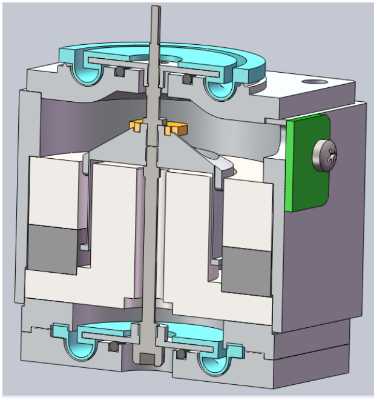

通过控制电磁线圈产生电磁力把阀芯从阀座上提起，阀芯顶住管道口的膜片，在管道内产生压力。断电时，电磁力消失，阀芯回到原位置，膜片松开，管路内气压被释放。

## IP阀压力控制测试

### IP阀硬件驱动

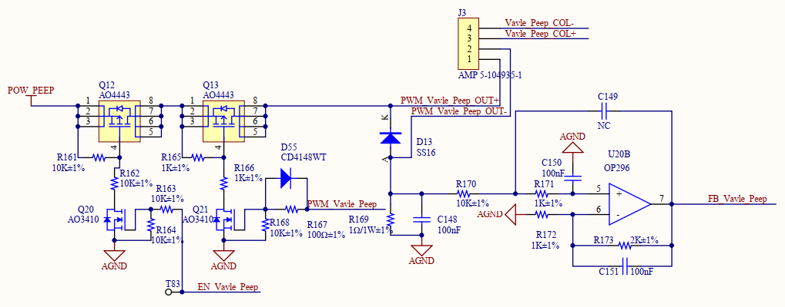

IP阀通过一个mos管的栅极信号来控制是否运行或者关闭IP阀，通过另一个mos管上的栅极信号（PWM波）来驱动IP阀，生成IP阀驱动信号。通过控制PWM信号的占空比，就可以控制IP阀芯到不同位置顶住膜片，从而控制管路内的气压。

### IP阀压力控制测试方法

将呼吸机的吸气管道接到PF300，然后在接回呼吸机的呼气口。呼吸机接入气源，调节呼吸机的基础流参数，调整呼吸机的流量。使用仿真器连接呼吸机控制器通过在线仿真的方式，在不同的流量情况下实时给定IP阀对应PWM模块的比较寄存器值，记录比较寄存器的值和PF300内部测量得到的流量数据和压力数据。

在不同的流量情况下按照如前所述的压力控制测试，下面给出一组在流量为10L/min时的测试数据：

| Flow(L/min) | CMPA | Duty        | Pressure PF300(l/MIN) |
| ----------- | ---- | ----------- | --------------------- |
| 10.6        | 0    | 0           | 0                     |
| 10.6        | 500  | 6.666666667 | 0.38                  |
| 10.6        | 1000 | 13.33333333 | 10.46                 |
| 10.6        | 1500 | 20          | 23.08                 |
| 10.5        | 2000 | 26.66666667 | 35.31                 |
| 10.5        | 2500 | 33.33333333 | 47.11                 |
| 10.4        | 3000 | 40          | 58.13                 |
| 10.4        | 3500 | 46.66666667 | 67.77                 |
| 10.3        | 4000 | 53.33333333 | 78.01                 |
| 10.3        | 4500 | 60          | 87.03                 |
| 10.3        | 4000 | 53.33333333 | 76.22                 |
| 10.3        | 3500 | 46.66666667 | 66.39                 |
| 10.5        | 3000 | 40          | 56.12                 |
| 10.5        | 2500 | 33.33333333 | 45.27                 |
| 10.6        | 2000 | 26.66666667 | 33.76                 |
| 10.6        | 1500 | 20          | 22.06                 |
| 10.7        | 1000 | 13.33333333 | 10.2                  |
| 10.7        | 500  | 6.666666667 | 0.61                  |
| 10.7        | 0    | 0           | 0                     |

在相同的驱动信号占空比条件下，流速不同时，管路内的气压也会不同，给定固定的IP阀驱动信号占空比，然后调节呼吸机的基础流量，就可以得到固定占空比驱动信号下的气道压力与流速之间的关系。如下表给出了在驱动信号占空比给定为13.33%时的一组数据：

| DutyofPeep  | CMP of Air Valve | Flow | Pressure |
| ----------- | ---------------- | ---- | -------- |
| 13.33333333 | 2900             | 2.8  | 8.79     |
| 13.33333333 | 3200             | 4.6  | 9.63     |
| 13.33333333 | 3500             | 6.6  | 10.09    |
| 13.33333333 | 3800             | 8.8  | 10.66    |
| 13.33333333 | 4100             | 11.2 | 11.11    |
| 13.33333333 | 4400             | 13.6 | 11.51    |
| 13.33333333 | 4700             | 16.2 | 11.89    |
| 13.33333333 | 5000             | 18.8 | 12.32    |
| 13.33333333 | 5300             | 21.4 | 12.66    |
| 13.33333333 | 5600             | 24.4 | 13.07    |
| 13.33333333 | 5900             | 27.2 | 13.34    |
| 13.33333333 | 6200             | 29.7 | 13.55    |
| 13.33333333 | 6500             | 32.2 | 13.75    |

### IP阀测试数据分析

#### 压力与驱动信号占空比关系

根据记录的数据，可以画出在一定流速条件下，程序内PWM信号占空比与气道压力之间的关系，下图是在流速为10L/min条件下测试得到的曲线，从曲线中可以看出，IP阀的控制存在滞环，但是滞环的影响较小，相同压力情况下的占空比差不超过5%。从曲线还可以看出，当驱动信号占空比低于一个开启阀值时，IP阀完全开放，没有压力。在这之后，气道压力与驱动信号的占空比基本呈线性关系。

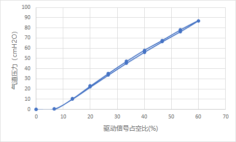

#### 压力与流速关系

IP阀所控制的气道压力不仅与自身的驱动信号占空比有关，与气体的流速也有关系。当气体流速不同时，同样的驱动信号下，IP阀会产生不同的气道压力。下图是在不同的气体流速条件下，测试得到的气道压力与IP阀驱动信号占空比之间的关系。从图中可以看出，当流速不同时，气道压力随驱动信号占空比的变化关系随之发生改变，总体来看，流速越大时，同样的驱动信号占空比产生的气道压力越大。

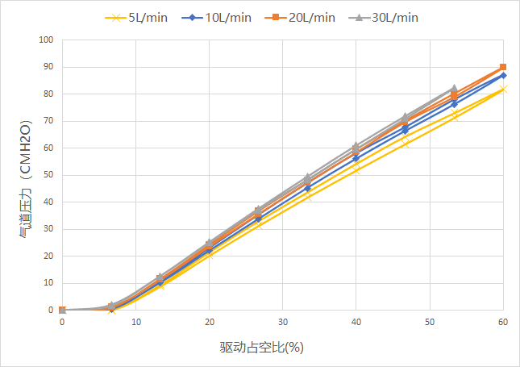

为了更好的揭示气道压力与流速之间的关系，下图做出了固定驱动信号占空比（13.3%）条件下，气道压力与流速之间的关系曲线。从图中可以看出，当驱动信号占空比一定时，气道压力随着流速的增大而增大，二者之间的关系近似为2次多项式关系。

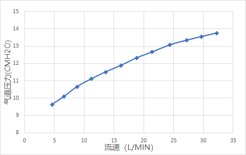

考虑到在实际使用中的气体流速和气道压力范围，可以以线性关系表示气道压力与驱动信号占空比之间在流速为一个典型值10L/min时的关系，如下表达式：
$$
P = \begin{cases}
	0, & \text{if } D<7.46\\
	1.812D-13.521, &\text{if } D > 7.746
	\end{cases} \tag{1}
$$
上面的模型只是针对在气体流速为10L/min的情况下，针对流速不同时带来的气道压力变化，可以采取将其他流速情况下的气道压力转换为标准10L/min流速下的气道压力。转换可以按照如下关系：
$$
P^*=P+0.003Q^2-0.258Q+2.28 \tag{2}
$$
上式中，Q代表当前流速，P表示当前流速下的气道压力，$P^*$ 表示转换到10L/min标准状况下后的气道压力。

#### 比例阀响应时间

下图是压力阀直接控制压力从0cmH2O到22cmH2O的阶跃测试的压力和流速波形，从图中可以看出，压力阶跃的上升时间大约为40ms。压力上升后由于流速的变化，压力波形会有一个小的下降坑。

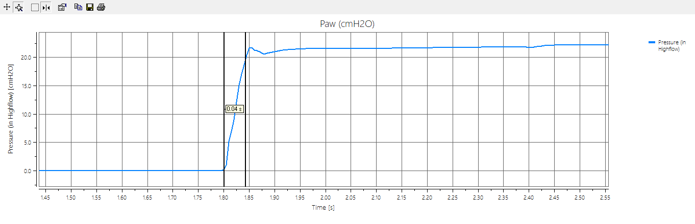

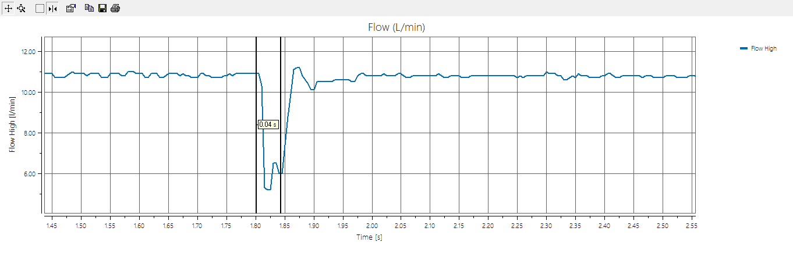

在IP阀的驱动信号占空比保持不变时，流速发生阶跃变化，压力也会发生变化，下图是给定固定的IP阀驱动信号，控制比例阀直接产生流量阶跃时的压力和流速变化曲线。从下图可以看出，当流速阶跃变化时，上升时间大约为30ms，稳定时间约为96ms。

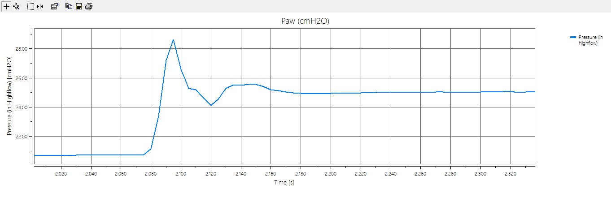

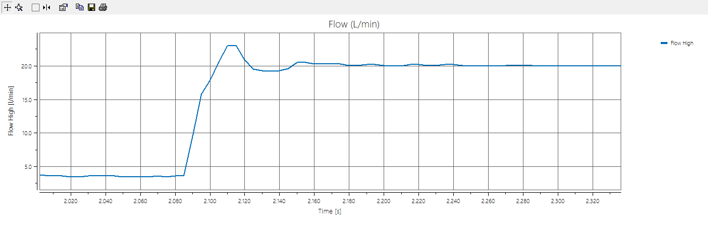

##  IP阀模型在气道压力控制过程中的应用

### 气道压力控制模型

下图给出了利用IP阀进行气道压力控制的控制框图，其中上文所推导的IP阀模型主要用于气道压力控制中的前馈通道。首先通过上文中通过测试推导得到的公式（2），代入当前的气道压力给定和流速，换算得到在标准10L/min下的气道压力给定值。第二步再代入到上文通过测试得到的IP阀压力与控制信号占空比之间的关系式（1）中，可以得到当前气道压力给定下需要的PWM占空比。该结果作为前馈项与PI反馈控制器计算得到的占空比相加作为最终的驱动信号占空比给定。

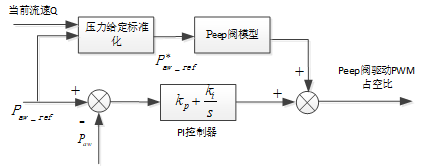

通过将上文中推导得到的IP阀模型应用到起到压力控制中作为前馈项，可以提高气道压力控制的动态性能，同时也提高了控制鲁棒性，而PI控制器用于反馈控制则可以保证控制的精确性。

## 控制效果测试

下图是按照如上涉及的控制器进行实际控制测试的结果，所用的铁肺参数为：气阻50，气容3。设置吸气压力位12cmH2O, Peep为4cmH2O。用PF300测波形如下：

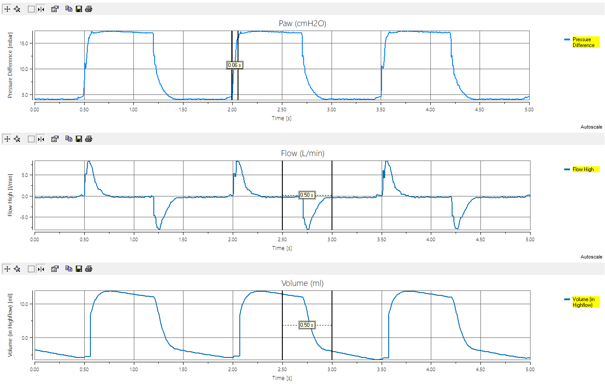

PF300显示Peak为16.3cmH2O，Peep为3.5cmH2O。从波形可以看出上升时间为60ms。

## 存在问题

1. 当IP阀有阶跃变化时，阶跃之后流速会有一个小的下降坑，导致压力模型也会出现一个下降小坑。如下图中的圆圈位置。

   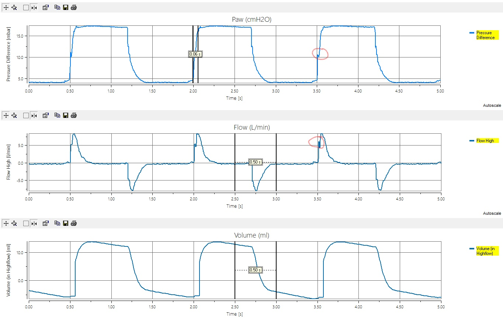

2. 对于新生儿肺和成人肺，需要不同的控制参数。如下图是同样的控制参数在成人肺参数下的测试结果（C=20, R=50）。压力上升时间较慢，大约120ms， 如果选择成人的控制参数，则新生儿肺条件下会出现超调和震荡。

   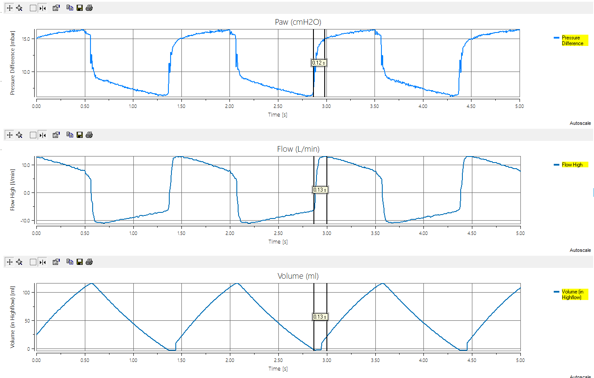

3. 在成人肺条件下，呼气呼尽较慢，如上图中的呼气相中，IP阀的驱动占空比已经给到0，完全打开，但是压力任然从8cmH2O缓慢下降到4cmH2O。

4. 当PEEP压力设置小于3cmH2O时，控制出的PEEP也不会小于3cmH2O。

## 后续计划改进措施

1. 针对新生儿和成人肺，在程序内部设置两套控制参数，以在不同的肺参数条件下达到好的控制效果。
2. 针对压力目标很小时，模型可能不准确的问题，考虑直接测试一组小压力条件下的控制给定，写入EEPROM，当压力给定很小时，直接通过查表方式给定驱动。
3. 压力阶跃的抖动问题，以及成人肺参数条件下呼完气较慢的问题需要和硬件一起讨论改进。