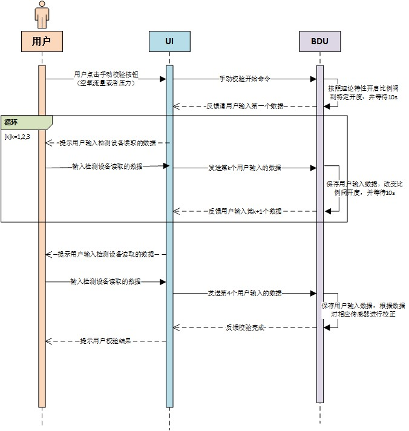

# NNP手动校验功能设计

## 需求说明

​        NNP项目的呼吸机对于控制性能要求的指标较高，这对于呼吸机所使用的压力，流量传感器的精度要求就很高，而呼吸机使用的的压力和流量传感器以及比例阀，peep阀特性都可能会随着时间出现一定的偏移。因此需要在呼吸机中实现手动校验功能，该功能具体描述为：在呼吸机UI界面中提供用户输入校正数据的接口，通过用户输入第三方监测设备的测量数据，BDU程序实现对相应传感器的校验，保证传感器的测量精确度。

## 手动校验流程设计

### 手动校验时序图

### 空气和氧气流量传感器手动校验

1. 将呼吸机的吸气口通过管路连接到PF300等流量监测设备上
2. UI界面上点击开始空气流量传感器手动校验，BDU收到指令后，会将比例阀开到理论输出5L的位置。
3. 等待10s后，BDU会反馈状态给UI，UI提示用户输入当前监测设备测量得到的流量数据。
4. 用户输入完成后，BDU会将空气比例阀开到理论输出10L的位置。
5. 等待10s后，BDU会反馈状态给UI, UI提示用户输入当前监测设备测量得到的流量数据。
6. 用户输入完成后，BDU会将空气比例阀开到理论输出20L的位置。
7. 等待10s后，BDU会反馈状态给UI, UI提示用户输入当前监测设备测量得到的流量数据。
8. 用户输入完成后， BDU会根据输入的数据对相应的传感器进行校验，并反馈校验结果，成功或失败。

氧气流量传感器的校验与空气流量传感器相同。

### 压力流量传感器校验

1. 将无创单管路带科恩达发生器连接到呼吸机的吸气口，并且通过管路接到PF300的压力测量口。
2. UI界面上点击开始压力传感器校验按钮，BDU收到指令后，会按照科恩达发生器的理论特性，让比例阀输出理论2cmH2O的流量。
3. 等待10s后，BDU会反馈状态给UI， UI提示用户输入当前检测设备测量得到的压力数据。
4. 用户输入完成后，BDU会将空气比例阀开到理论输出8cmH2O的开度。
5. 等待10s后，BDU会反馈状态给UI, UI提示用户输入当前监测设备测量得到的流量数据。
6. 重复步骤4，5，分别让用户输入在理论压力为20cmH2O和30cmH2O时监测设备测量压力值。
7. 用户最后一个数据输入完成后，BDU根据用户输入的数据进行相应的传感器校验，并反馈校验结果。

## 手动协议通讯协议设计

### UI向BDU发送数据

1）手动校验命令：1005

2）手动校验数据1：校验状态(16位数据)： 

| bits          | 描述     | 取值描述                                                     |
| ------------- | -------- | ------------------------------------------------------------ |
| 低8位 bit0-7  | 校验类型 | 1：空气流量传感器， 2：氧气流量传感器， 3：压力传感器 |
| 高8位 bit8-15 | 校验阶段 | 1： 开始校验， 2：用户已输入第一个数据，  3： 用户已输入第二个数据， 4：用户已输入第3个数， 5： 用户已输入第4个数据。 |

3）手动校验数据2： 用户输入的流量或压力数据（16位数据）  

### BDU向UI发送数据

1） 手动校验命令字：1005

2） 手动校验数据：校验状态（16位数据）

| bits         | 描述     | 取值描述                                                     |
| ------------ | -------- | ------------------------------------------------------------ |
| 低8位bit0-7  | 校验类型 | 1：空气流量传感器， 2：氧气流量传感器， 3：压力传感器 |
| 高8位bit8-15 | 校验阶段 | 1：请用户输入第一个数据； 2： 请用户输入第二个数据， 3： 请用户输入第三个数据； 4：请用户输入第4个数据。 64：校验失败。 128：校验成功。 |

