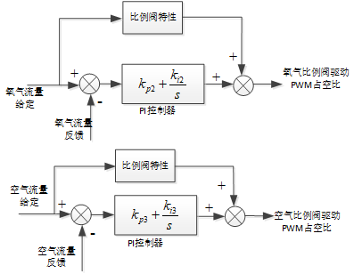

# NNP机型控制器控制性能优化

## 流速控制

### 流速控制算法

控制对象：呼吸机吸气端输出的混合气体总流速。

执行机构：空气比例阀和氧气比例阀。

反馈机构：空气和氧气流量传感器。

控制方法：比例阀理论模型（前馈）+实时PI控制（反馈）。

控制器输出：比例阀驱动占空比。

对于混合气体的流速控制就是对比例阀的控制。具体的控制算法见:

[NNP比例阀建模和控制算法设计](https://github.com/RanFang66/WorkNotes/blob/main/NNP%E9%A1%B9%E7%9B%AE%E7%94%A8%E6%AF%94%E4%BE%8B%E9%98%80.md)

### 流速控制测试

#### 静态误差测试

测试结果如下表（单位为L/min），其中最后一项通过PF300的高流量通道测试，PF300本身误差较大，不具有参考意义：

| 给定值             | 呼吸机测量值 | PF300测量值 | 误差        |
| ------------------ | ------------ | ----------- | ----------- |
| 1                  | 0.96         | 0.92        | 0.08(8%)    |
| 3                  | 2.99         | 2.92        | 0.08(2.3%)  |
| 5                  | 4.98         | 4.91        | 0.09(1.8%)  |
| 8                  | 7.98         | 7.84        | 0.16(2%)    |
| 10                 | 9.96         | 9.82        | 0.18(1.8%)  |
| 15                 | 15           | 14.71       | 0.29(1.9%)  |
| 20                 | 19.98        | 19.70       | 0.3(1.5%)   |
| 25                 | 24.96        | 24.88       | 0.12(0.48%) |
| 30(高流量通道测试) | 30           | 31.6        | 1.6(5.3%)   |

从测试结果看，流量控制精度能够满足要求。而**限制流量控制精度的主要因素是空气和氧气流量传感器的精度**

#### 动态控制效果测试

下图是呼吸机流量给定从5L/min阶跃到20L/min时的流速波形，从图中可以看出流速给定阶跃时，流速控制的上升时间约为20ms，流速的调整时间大约为1s。

下图是呼吸机流量给定从20L/min阶跃到5L/min时的流速波形，从图中可以看出流速给定向下阶跃时，流速控制的上升时间约为20ms，流速的调整时间大约为1.5s。

## 氧浓度控制

控制对象：空氧混合气体的氧气浓度。

执行机构：流量控制

反馈机构：氧浓度传感器。

控制方法：理论模型（前馈）+实时PI控制（反馈）。

控制器输出：氧气在混合气体中的占比系数。

氧浓度控制是流量控制的外环，最终的氧浓度控制是需要通过流量控制来实现的。

## 压力控制

### 压力控制算法

控制对象：气道压力(近端压力)，包括吸气压力（峰值压力）和呼吸末气道正压。

执行机构：IP阀

反馈机构：近端压力传感器

控制方法：IP阀理论模型(前馈)+PI控制(反馈)。

控制器输出：IP阀驱动占空比。

对于气道压力的控制其实就是对IP阀的控制，具体的控制算法见：

[NNP IP阀建模和控制](https://github.com/RanFang66/WorkNotes/blob/main/NNP%20%E9%A1%B9%E7%9B%AE%E7%94%A8IP%E9%98%80%E6%B5%8B%E8%AF%95%E4%B8%8E%E6%8E%A7%E5%88%B6%E5%99%A8%E8%AE%BE%E8%)

### 压力控制测试

#### 静态误差测试

测试条件:气容:2 气阻:50

| 设定压力(Peak\|peep) | 呼吸机监测值 | PF300检测值 | 误差值     |
| -------------------- | ------------ | ----------- | ---------- |
| 5 \| 0               | 5.1 \| 0.7   | 5.2 \| 0.5  | 0.2 \| 0.5 |
| 10 \| 2              | 10 \| 1.8    | 10 \| 1.6   | 0 \| 0.4   |
| 14 \| 4              | 14 \| 3.9    | 14.2 \| 3.9 | 0.2 \| 0.1 |
| 22 \| 8              |              |             |            |
|                      |              |             |            |
|                      |              |             |            |

测试条件: 气容：2 气阻：200

测试条件：气容50， 气阻：20

#### 动态控制效果测试

## 潮气量控制

### 潮气量控制算法

控制对象：患者的潮气量

执行机构： 压力控制器

反馈机构： 近端流量传感器（对采样流速做积分计算）

控制方法：通过理论推导可以得到潮气量与峰值压力PIP以及PEEP之间的关系，根据该关系将对潮气量的控制转化为对气道压力的控制。但这种控制是开环的，会有静态误差。因此在前面的基础上还需要加上闭环的控制，直接采用PI反馈调节即可。具体控制算法推导可以见：

[潮气量控制算法](https://github.com/RanFang66/WorkNotes/blob/main/%E6%BD%AE%E6%B0%94%E9%87%8F%E6%8E%A7%E5%88%B6%E7%AE%97%E6%B3%95.md)

控制器输出： 吸气相时的最大气道压力给定PIP。

### 潮气量控制测试
