# NNP项目用比例阀测试及控制

## VS600S产品所用比例阀介绍

​	VS600S小儿呼吸机产品中所有的空气和氧气控制阀为Parker公司的VSO® LOWPRO微型比例阀，该比例阀具有体积小，功耗低等优势。

​	下图是在12V供电，1.7bar的压力条件下，比例阀的流量与控制电流之间的关系曲线，可以发现比例阀的流量控制具有滞环的特点。

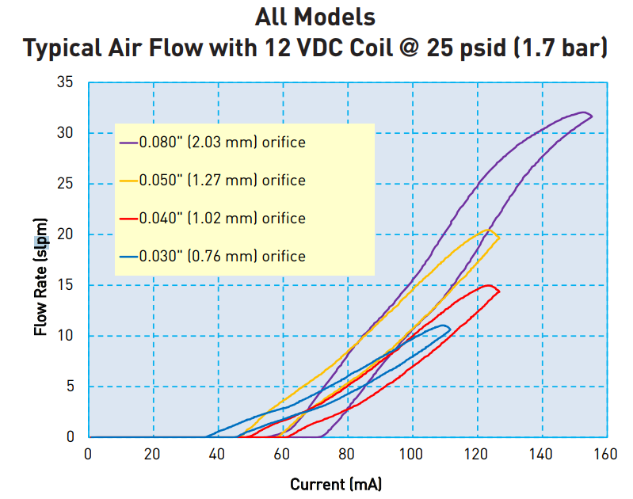

​	下图则是比例阀的流量与入口压力之间的关系曲线， 从图中可以看出流量随着压力的增大，但是增长速度在减慢，与平方根关系曲线接近，这和阀的理论模型是符合的。

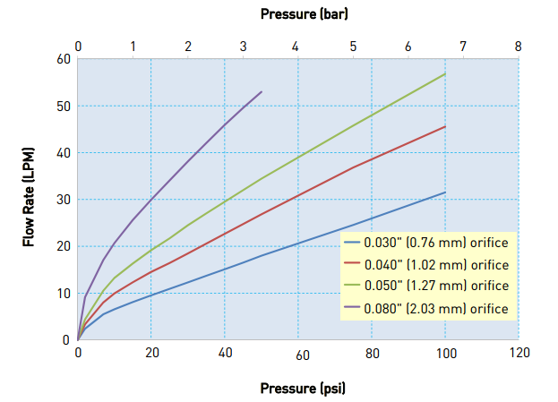

下图是该比例阀的主要性能参数，与软件控制相关的主要有操作压力，控制滞环和相应时间等。

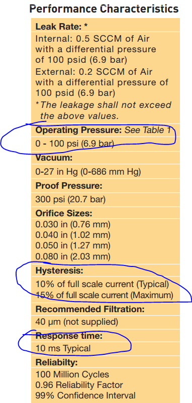

## 比例阀理论模型

​	比例阀的输出流量与气体性质，有效通气面积，阀门前后两端的气压压差有关，呼吸机中通过比例阀的气体绝大部分为氧气和空气（$N_2,O_2$），均为双原子气体分子，气体动力学性质基本相同，在模型中可以不用考虑气体自身性质的影响。因此可以得到比例阀的理论数学模型如下：
$$
Q=k(v)A\sqrt{\frac{g}{5}} \sqrt{\Delta P}H(s)\\
H(s)=\frac{1}{Ts+1}
$$
​    其中：Q为流过比例阀的流量（L/s），A为比例阀开度到最大时的等效通气面积($cm^2$)，$\Delta P$ 为比例阀前后的气压差($cmH_2O$)。H(s) 为惯性环节，用来表示比例阀的动态特性，k 为一个系数，与比例阀的驱动电压有关，表示在驱动电压的控制下比例阀的开度情况。g为重力加速度($m/s^2$)。

​	将datasheet中的直径参数带入到该理论模型中，画出流量与压力之间的理论曲线如下图所示，将理论模型的曲线与datasheet中给出的曲线对比，当直径较小时，理论模型与实际较接近，当直径较大时，理论流量要偏大。

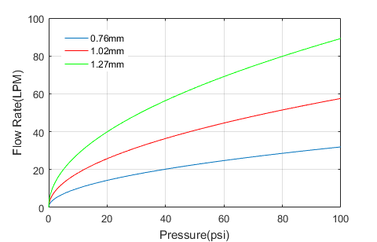

## 比例阀流量控制测试

### 比例阀驱动电路

​	下图是在VS600S中的比例阀驱动电路，驱动电路的输入为来自控制芯片的使能信号和PWM脉冲信号。通过控制PWM脉冲的占空比就可以控制比例阀端口的驱动电流，从而达到控制流量的目的。

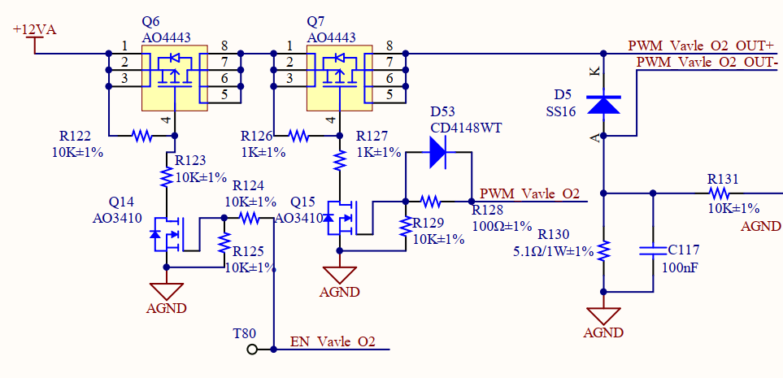

### 比例阀流量控制测试方法

​	比例阀的驱动脉冲信号的占空比对应程序中的一个数字量（PWM比较寄存器值），通过控制这个数字量就能够控制比例阀的输入端口电流，从而控制流量。

​	将呼吸机的吸气管道接到PF300，同时将呼气管堵住，然后接入氧气源（氧气瓶）。使用仿真器连接呼吸机控制器通过在线仿真的方式，实时给定对应PWM模块的比较寄存器值，记录比较寄存器的值和PF300以及呼吸机内部测量得到的流量数据等。

​	在不同的气源压力下按照如前所述的流量控制测试，下面给出一组在初始气源压力为290kpa时的测试数据：

| CMPA | DUTY | O2 Supply Pressure(kpa) | FLOW in PFC3000(L/min) | FLOW in Sensor(L/min) |
| :--: | :--: | :---------------------: | :--------------------: | :-------------------: |
|  0   |  0   |           287           |           0            |           0           |
| 300  |  4   |           287           |           0            |           0           |
| 600  |  8   |           287           |           0            |           0           |
| 900  |  12  |           287           |           0            |           0           |
| 1200 |  16  |           287           |           0            |           0           |
| 1500 |  20  |           287           |           0            |           0           |
| 1800 |  24  |           287           |           0            |           0           |
| 2100 |  28  |           286           |           0            |           0           |
| 2400 |  32  |           286           |           0            |          0.1          |
| 2700 |  36  |           284           |          1.3           |          1.4          |
| 3000 |  40  |           283           |          3.5           |          3.5          |
| 3300 |  44  |           281           |          5.9           |           6           |
| 3600 |  48  |           280           |          8.4           |          8.4          |
| 3900 |  52  |           279           |           11           |         11.1          |
| 4200 |  56  |           278           |          13.9          |         13.9          |
| 4500 |  60  |           278           |          16.3          |         16.4          |
| 4800 |  64  |           277           |          19.1          |         19.2          |
| 5100 |  68  |           276           |          22.3          |         22.6          |
| 5400 |  72  |           275           |          25.5          |         25.8          |
| 5700 |  76  |           274           |          28.8          |          29           |
| 6000 |  80  |           274           |          31.7          |         31.7          |
| 6300 |  84  |           273           |          34.5          |          34           |
| 6600 |  88  |           272           |          37.1          |         37.3          |
| 6900 |  92  |           272           |           39           |         39.1          |
| 7200 |  96  |           272           |           39           |          39           |
| 7500 | 100  |           272           |           39           |          39           |
| 7200 |  96  |           272           |           39           |          39           |
| 6900 |  92  |           272           |          38.7          |         38.4          |
| 6600 |  88  |           274           |           37           |          37           |
| 6300 |  84  |           274           |          34.9          |          35           |
| 6000 |  80  |           276           |          32.6          |         32.8          |
| 5700 |  76  |           276           |          29.9          |         30.3          |
| 5400 |  72  |           277           |           27           |         27.4          |
| 5100 |  68  |           278           |          23.8          |         24.3          |
| 4800 |  64  |           279           |          20.7          |         21.1          |
| 4500 |  60  |           280           |          17.8          |          18           |
| 4200 |  56  |           281           |           15           |         15.1          |
| 3900 |  52  |           282           |          12.2          |         12.2          |
| 3600 |  48  |           283           |          9.5           |          9.5          |
| 3300 |  44  |           283           |          6.9           |          6.9          |
| 3000 |  40  |           285           |          4.4           |          4.4          |
| 2700 |  36  |           287           |          2.2           |          2.1          |
| 2400 |  32  |           289           |           0            |          0.3          |
| 2100 |  28  |           289           |           0            |           0           |
| 1800 |  24  |           289           |           0            |           0           |
| 1500 |  20  |           289           |           0            |           0           |
| 1200 |  16  |           289           |           0            |           0           |
| 900  |  12  |           289           |           0            |           0           |
| 600  |  8   |           289           |           0            |           0           |
| 300  |  4   |           289           |           0            |           0           |
|  0   |  0   |           289           |           0            |           0           |

### 比例阀测试数据分析	

​	根据记录的数据，可以画出程序内PWM信号占空比与实际流量之间的关系，下图是290kpa下测试得到的曲线，从曲线中可以看出，比例阀的控制存在滞环，但是滞环的影响较小，相同流量情况下的占空比差不超过5%。从曲线还可以看出，当驱动信号占空比低于一个开启阀值时，比例阀完全关闭，没有流量。高于一个饱和值时，比例阀完全打开，流量也基本不再变化。而在这中间，流量数据与驱动信号的占空比基本呈线性关系。

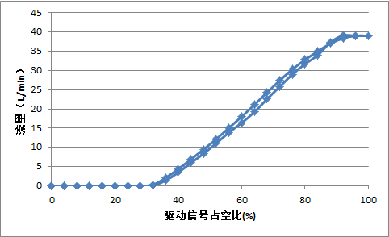

​	从理论模型中可以知道，流过比例阀的流量还与比例阀两端的气压差有关，由于实际使用中比例阀出口端的压力相较于入口端的压力很小，因此出口端的压力变化可以忽略，仅考虑入口端的气源压力的影响。下图是在不同气源压力下进行测试得到数据绘制的曲线（仅考虑阀由闭到开的过程）。从图中可以看出，在气源压力不同时，流量随驱动信号占空比变化曲线的偏移是很小的。这可能与气源压力的变化范围，流量变化范围比较小有关。

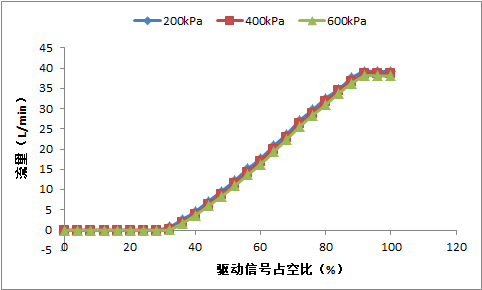

​	

​	考虑到实际测试中在一般使用范围内，气源压力对流量控制的影响较小，可以选择一个实际应用中气源压力的典型值400kpa，来拟合得到驱动信号占空比与流量之间的关系。通过线性拟合，可以得到驱动信号占空比和流量之间的关系如下：
$$
Q = \begin{cases}
	0, & \text{if } D<34\\
	0.676D - 22.976, & \text{if } 34<D<91;\\
	38.54 & \text{if } D>91
	\end{cases}
$$
上式中Q表示流量，D表示驱动信号的占空比。

## 比例阀模型在控制中的应用

### 1. 在流量控制闭环中引入前馈量

​	在得到了占空比与流量的关系之后，可以根据目标流量值反推出控制器应该给出的控制信号占空比。将该控制量作为流量控制环路的前馈项，可以提高系统的动态响应性能，降低对PI控制器的带宽要求和饱和风险，提高控制稳定性。引入前馈项后的比例阀控制框图如下图所示：

​	前馈控制用于确定基本的控制量级别，来得快且直接，反馈控制用于误差修正，能确保稳和准，两者配合则可获得各自优点。如果前馈控制做得足够准的话，反馈控制是可以去掉的，但是实际很少这样做，因为系统是不断变化的，需要反馈保证稳定性。

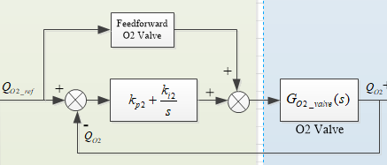	

### 2. PI参数计算

​	将实验得到的比例阀的模型，带入到上述流量控制系统中，同时考虑实际控制中的延时环节，可以得到流量反馈控制的传递函数模型。根据模型，按照所需要的流量控制带宽和相角裕度，可以计算出PI控制器的参数值。

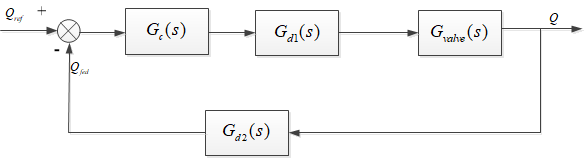

可以按照如下方式计算比例阀的PI控制参数，可在matlab等软件中完成如下计算过程：

1. 比例阀控制器传递函数:
   $$
   G_c(s)=k_p+\frac{k_i}{s}
   $$

2. 控制器延时传递函数:
   $$
   G_{d1}(s)=e^{-\frac{3}{2}T_c s}
   $$
   其中$T_c$ 为控制周期。

3. 比例阀传递函数
   $$
   G_{valve}(s)=k_v \frac{1}{T_v s+1}
   $$
   其中$k_v, T_v$ 分别为比例阀模型中的系数和时间常数。

4. 采样延时传递函数
   $$
   G_{d2}=\frac{1}{T_{s}s+1}
   $$
   其中$T_s$ 表示采样延时。

5. 开环传递函数
   $$
   G_{op}(s)=G_{c}(s) G_{d1}(s)G_{d2}(s)G_{valve}(s)
   $$

6. 闭环传递函数
   $$
   G_{cl}(s)=\frac{G_c(s)G_{d1}(s)G_{valve}(s)}{1+G_{op}(s)}
   $$

7. 根据系统的动态响应速度，超调量与稳定性要求给出需要的控制带宽 $f_c$ 和相角裕度 $M$ 。

8. 根据开环传函在截止频率处的模值为1，以及相角裕度的定义列出如下方程：
   $$
   \begin{cases}
   \lVert G_{op}(2\pi f_ci)\rVert =1 \\
   \angle G_{op}(2\pi f_ci)+180=M
   \end{cases}
   $$
   根据上述方程求解出PI控制器中的$k_p$ ，$k_i$ 参数。

9. PI参数离散化，增量式PI控制器的表达式如下：
   $$
   \begin{align}
   	u(k) &=u(k-1)+(k_p+k_iT_s)e(k)-k_pe(k-1) \\
   		 &=u(k-1)+\alpha e(k)-\beta e(k-1)
   \end{align}
   $$
   其中$u(k)$ 表示k时刻的控制器输出，$e(k)$ 表示k时刻的给定和反馈之间的误差。离散化后的系数和PI参数有如下关系：
   $$
   \begin{align}
   \alpha &= k_p + k_iT_s \\
   \beta &= k_p
   \end{align}
   $$
其中Ts为控制周期。
   
10. 验算，测试。

    这是根据NNP所用比例阀测试数据，选择控制带宽50hz，相角裕度80度计算得到PI参数后，做出比例阀流量控制系统的闭环传递函数波特图以及阶跃响应曲线。

    ​	从波特图可以看出闭环控制带宽为50hz，从系统阶跃响应可以看出系统的上升时间为7ms,超调小于10%.

    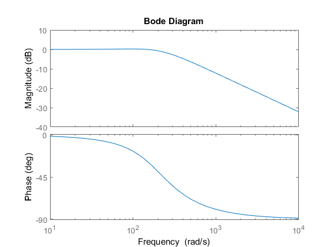

    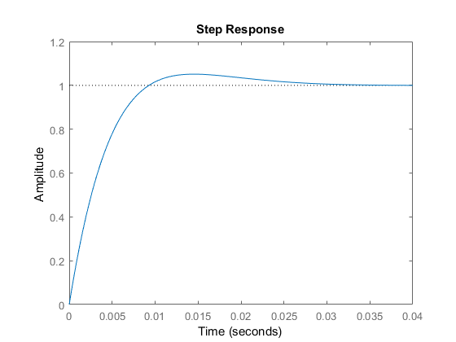
    
    
