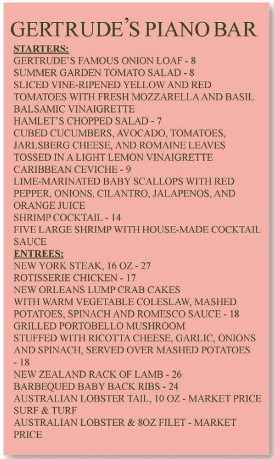

# The Non-Designer's Design Book

## 设计的四大基本原则概述

有一些基本的设计原则，每一个优秀的设计中都应用了这些原则。我们在观察评价一个设计作品时，也要从这几条基本原则去考虑。

- 亲密性 Proximity

  彼此相关的项应当靠近，归组在一起。如果多个项相互之间存在很近的
  亲密性，它们就会成为一个视觉单元，而不是多个孤立的元素。

- 对齐 Alignment

  任何东西都不能在页面上随意安放。每个元素都应当与页面上的另一个
  元素有某种视觉联系。

- 重复Repetition

  让设计中的视觉要素在整个作品中重复出现。可以重复颜色、形状、材
  质、空间关系、线宽、字体、大小和图片，等等。

- 对比 Contrast

  对比的基本思想是，要避免页面上的元素太过相似。如果元素（字体、
  颜色、大小、线宽、形状、空间等）不相同，那就干脆让它们截然不同。

## 亲密性 Proximity

亲密性原则并不是说所有一切都要更靠近，其真正含义是：

**如果某些元素在理解上存在关联，或者相互之间存在某种关系，那么这些元素在视觉上也应该有关联**

如果多个项之间有很近的亲密性，它们就会成为一个视觉单元，而不是多个孤立的元素，亲密性（即紧密性）意味着存在关联。逻辑上关联紧密的项目在布局上也应该紧密，关联性不强的元素之间可以适当增加区隔。位置是否靠近可以体现出元素之间是否存在关系。

具体做法：在设计时，应该厘清哪些信息在逻辑上存在关联，那些信息应当强调，而哪些信息不用强调，然后可以通过分组形象地表现这种信息。利用亲密性原则合理的组织信息的效果可以从下面的对比中看出来，将需要表现的信息进行分组，从排版上就体现这种信息之间的关系。

下面是依据菜单设计的对比，第一张菜单将所有信息的不加区分的堆叠在一起，让读者很难确定阅读的逻辑和顺序。

首先要做的是对菜单上的信息元素进行分组，然后为了区分不同属性的信息可以采取不同样式，同时也要注意不同信息之间的分隔大小。重新设计之后的菜单看起来简洁了很多，也更加清晰明确。

进一步的改进，菜单中的Starters和Entrees对于具体的菜品其实是具有层次关系的，可以利用缩进的方式体现这种层次关系。同时对于需要强调的菜品名称和价格，以及不需要强调的菜品具体介绍可以采用更明显的区分方式，如不同的颜色。还可以使用对齐原则，让菜单开起来更加整洁清晰。

## 对齐  Alignment

对齐原则是指：

**任何元素都不能在页面上随意安放。每一项都应当与页面上的某个内容存在某种视觉联系。** 

如果页面上的一些项是对齐的，即使这些对齐的项彼此分离，在读者阅读感受上，仍然会有一条看不见的线将它们彼此连在一起。对齐原则会告诉读者，对齐的元素虽然并不靠近，但他们属于一组，因为对齐增强了元素间的内聚性。

示例：

关于对齐原则的事项：

1. 任何元素在放置到页面上时都要考虑与页面中其他内容的视觉联系，都要经过认真的考虑，而不是随意摆放。
2. 在阅读作品或者自己设计时可以通过画基线的方式来分析页面元素之间的视觉关系，也可以找出那些元素缺少视觉联系。
3. 居中对齐不要成为默认选择。居中对齐看起来更加正式和稳重，显得中规中矩而乏味。并且居中对齐在视觉上的边界线较软，没有一条明确的对齐边界，给人的视觉感受不够强烈，有时读者甚至都无法看出是否居中对齐。
4. 在设计对齐时，优先考虑左右对齐或者两端对齐（在文本行足够长的情况下使用），这样在视觉上能够有更明确的边界，能避免设计的平淡。而如果需要使用居中对齐时，那么也要让居中对齐看起来更加明确。
5. 尽量坚持在一个页面中只使用一种对齐方式的原则。有时可能会在一个页面上使用超过一种对齐方式，如同时使用右对齐和左对齐，这时也要确保让这些文本以某种方式对齐。
6. 在页面上放其他项时，一定要确保每一项都与页面上的其他项存在某种对齐。如果文本行水平摆放，则按其基线对齐。如果有多个单独的文本块，则对齐其左边界或右边界。如果有图片元素，将其边界与页面的其他边界对齐。任何元素都不能随意摆放。
7. 应当找一条明确的对齐线，并用它来对齐。如果有一张照片或图片（有
   明确的直边），可以沿着照片的这个直边与文本的平边对齐。
8. 对齐规则可以被打破，打破规则的原则是：在打破规则之前必须清楚规则是什么。也就是说规则的打破应该是你有意为之，你要清除的知道自己在做什么。此外，如果要打破规则就要大胆干脆一点，而不能保守。

对齐原则的总结：**倾听你的眼睛**

眼睛看向哪里，路线是什么，这是最佳路径吗？重要的信息是否都归入了逻辑亲密性中？对齐是否对清晰的表达有帮助？

## 重复 Repetition

重复原则指的是：

**设计的某些方面需要在整个作品中重复。**

重复元素可能是一种粗字体、一条粗线、某个项目符号、颜色、设计要素、某种格式、空间关系等。读者能看到的任何方面都可以作为重复元素。

重复能够带来作品的统一性，正是由于某些元素的重复，才使整个作品看起来是一体的。

在上面的例子中，粗体字的重复是设计人员常用来控制读者视线的一种视觉技巧，以使读者的注意力尽可能长地保持在页面上。粗体的重复也有助于统一整个设计。这是一种非常简单的将设计块的各个部分连接在一起的方式。

重复原则应用技巧：

1. 把已有的重复元素取出，让这些元素效果更强、更生动。通过把重复表现得更明显，这样不仅页面看上去更有趣，还能在视觉上增强其条理性和一致性。
2. 在利用企业名片、信笺和信封创建一致的企业包装时，需要使用明显而突出的重复，不仅在各部分内部，在所有作品之间也要大量使用重复。
3. 即使在一个只有一页的文档中，重复元素也可以建立一种连续性，将文
   档“整个捆在一起” 。如果在创建一个多页的、作为一个精美包装一部分的文档，充分使用重复就很关键。
4. 有时重复的项并不一定完全相同，而只是存在明确关联的紧密相关的对象。为了实现重复，完全可以为此增加一些全新的东西。或者，也可以选择一个简单的元素，然后以多种不同的方式加以使用，比如说指定不同的大小、颜色或角度。
5. 通常还可以增加实际上与页面主题没有任何关系的重复元素。只要确保，作品看起来是有意为之，而不是乱七八糟就行了。
6. 使用重复原则时，有时可以把一个元素从现在的设计中抽取出来，并根据这个元素创建一个新设计。
7. 重复性元素并不必须是图形或者剪贴画。可以是空白、线、字体、对齐，或者任何你有意重复的东西。
8. 有时，尽管只有重复元素的一点儿暗示，但这可能与使用整个元素有同样的效果。对于一个大家都熟悉的元素，可以尝试只包含其中的一部分，或者采用不同的方式加以使用。
9. 要避免太多地重复一个元素，重复太多会让人讨厌。

**示例：**

重复原则总结：

视觉元素的重复可以将作品中的各部分连接在一起，从而增强整个作品，不会使各个部分成为彼此孤立的单元。

重复的目的就是统一，并增强视觉效果。在设计时可以从两个方面考虑：

1. 作品中的元素是否有可以抽取出来作为重复项，对这些元素做加强，增强整个作品的统一性，并增强视觉效果。
2. 能否增加一些纯粹为建立重复而设计的元素，来增强设计的效果并提高信息的清晰度。

## 对比 Contrast

对比原则指的是：

**页面上的不同元素之间要有对比效果，达到吸引读者的对比效果。**

对比是为页面增强视觉效果的最有效途径，也是在不同元素之间建立一种有组织的层次结构最有效方法。对比不仅可以用来吸引眼球，还可以用来组织信息，清晰层次，在页面上指引读者，并制造焦点。

在使用对比原则时，有一个重要规则：

**要想实现有效的对比，对比就必须强烈。**

可以采用多种方式产生对比。如大字体与小字体的对比；典雅的旧式体与加粗的无
衬线体产生对比；细线与粗线的对比；冷色与暖色的对比；平滑材质与粗糙材质的
对比；水平元素（如很长的一行文本）与垂直元素（如又高又窄的一列文本）的对
比....

对比原则使用技巧：

1. 如果两个元素虽然不同，但是区别不大，这就不是对比，而是**冲突**。如果想要对比，就要让不同的元素区别足够明显，有足够强的视觉对比，不要畏首畏尾。
2. 使用对比原则时要明确自己想要突出的信息，想要吸引读者实现的地方。对比对于信息的组织至关重要，它能让读者一眼就能理解文档的内容。
3. 要增加有意思的对比，最容易的方法就是实现字体的对比，此外，还可以利用线、颜色、元素之间的间隔、材质等形成对比。
4. 如果排版中使用了又高又窄的列，就可以在水平方向有一些突出的标题，在页面上形成对比。将对比与重复相结合，如页码、标题、项目符号、线或空间布局，从而在整个出版物中建立一种强烈的统一标识。
5. 对比原则是几大原则里抓人眼球效果最显著的，同时也是实施起来创造性最强的。只需要几个小小的改动，就能把一个普通的设计变得精美。对比能够制造视觉上的“冲突”，让读者的实现被吸引，给读者以视觉冲击。

示例：

对比原则总结：

对比的根本目的在于：

1. 增强页面的视觉效果，让页面看起来更有意思，更有可读性（抓人眼球）
2. 帮助组织信息，让读者立即了解信息以何种方式组织，以及从一项到另一项的逻辑流程。（突出重点）

对比的实现可以通过字体选择、线宽、颜色、形状、大小、空间等。无论怎样实现，重要的是：对比一定要强烈。如果各个项不完全一样，那干脆就让它们截然不同。

## 四大基本原则总结

### 亲密性

如果项彼此相关，就把它们分在一组，建立更近的亲密性。相互之间没有直接关联
的项要分开。设置不同的间隔来指示各项的接近程度或关系的重要性。除了可创造
出更漂亮的页面外观，亲密性也可以令表达更清晰。

### 对齐

应当注意放在页面上的每一个元素。要保证整个页面是统一的，将每个对象与另外
某个对象的一个边界对齐。只有在对齐很明显的基础上，才可以选择偶尔打破对齐规则。在这种情况下打破常规对齐看上去不会是个失误。

### 重复

重复是更能保证一致性的一种方式。可以看看现在已经重复的元素（项目符号、字
体、线条、颜色等），是不是可以让其中某个元素更突出，把它作为重复元素。重
复还有助于增强读者对设计所表示的实体的认知度。

### 对比

对比能够吸引读者的眼球，增强设计的视觉效果。同时也能帮助组织信息，将读者的视线引导到重要的内容上。可以用很多种方式实现对比效果，需要注意的是对比应该要能够强烈，带来不一样的视觉效果，同时需要明确哪些信息需要重点突出。

**案例：**

亲密性：

对齐：

重复

对比

