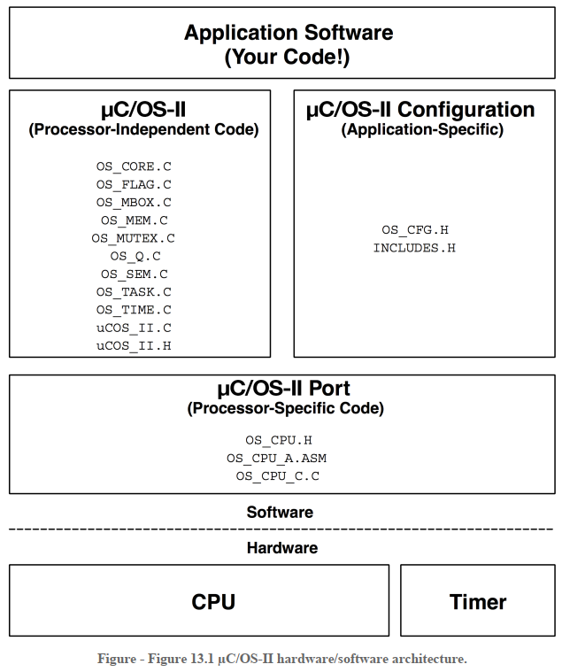

# μc/OS ii嵌入式实时操作系统在DSP28335上的移植

## μC/OS简介

μC/OS是一款应用非常广泛的嵌入式实时系统，它最大的特点是抢占式（preemptive）的内核，确保高优先级的任务能够优先得到执行。除了任务调度，μC/OS系统还提供信号量（semaphore），消息队列（message queue），内存管理（Memory Management）等多种可配置的服务。同时官方还提供了多个平台下的移植例程，参照历程用户可以方便的将μC/OS系统移植到自己的平台上。

μC/OS目前已经发展到了μC/OS-iii了，但是本文主要介绍μC/OS-ii在TI的TMS320F28335 DSP芯片上的移植。

## μC/OS-II内核移植的硬件要求

1. 平台有对应的C编译器能够生产可重入代码
2. 能够通过C语言屏蔽和使能中断
3. 处理器支持中断，并且能够产生周期性的中断
4. 处理器支持硬件stack
5. 处理器存在加载和保存栈指针和其他CPU寄存器的指令

## μC/OS-II内核移植的架构

移植μC/OS-II的的系统架构如上图所示，application software是用户需要基于系统开发的应用代码。接下来便是μC/OS-II系统层，左侧是μC/OS-II的源代码，右侧是内核的配置文件（OS_CFG.h）,通过该文件用户可以对内核进行裁剪和配置。再下面一层就是内核与硬件平台的接口层，该层的文件就是<u>需要用户根据不同的硬件平台进行编码的部分</u>，主要包含三个文件：OS_CPU.h, OS_CPU_C.c, OS_CPU_A.asm(可选)，其中的汇编文件是可选的，如果平台支持C语言对中断进行操作，可以不用编写汇编文件。

## μC/OS内核移植的具体过程

