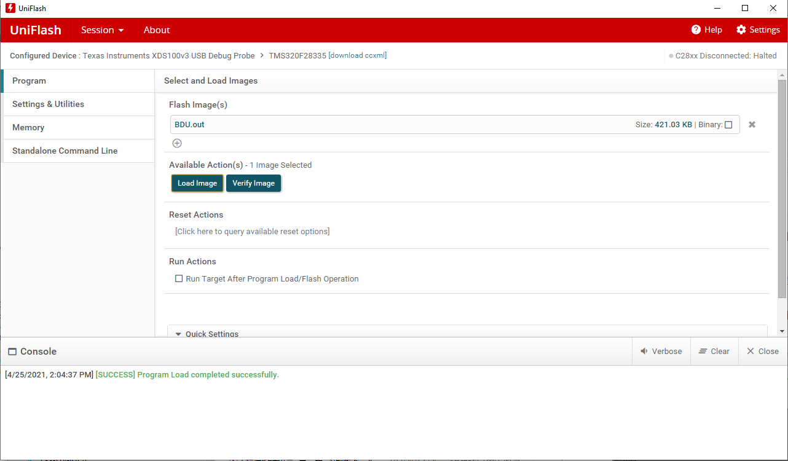

# Uniflash烧写DSP程序教程

## 要解决的问题

某些时候我们需要把编译好的程序二进制文件烧写到TI的dsp中，在没有boot loader功能的情况下，只能借助于仿真器和CCS开发环境烧写。但是直接使用CCS进行烧写有如下问题：

1. 需要源程序源代码工程
2. CCS软件本身非常大，安装使用不方便。

而TI官方提供了Uniflash烧写工具，Uniflash软件体量小，而且支持多种仿真器以及多种TI的芯片的程序烧写，不需要源程序的工程，只需要编译好的二进制文件就可以将程序烧写入芯片中。

## Uniflash程序烧写步骤：

1. 下载uniflash，直接百度，进入ti官网就可以下载。
2. 安装uniflash，直接默认安装即可。
3. 打开uniflash，在界面中的"New Configuration"选项卡下，先要选择芯片种类，例如我们使用DSP28335，直接搜索335，在下面的选项中就会出现。

4. 选择好28335dsp后，就会让你选择仿真器类型，在支持的仿真器中找到我们所用的仿真器类型（XDS100V3 USB Debug Probe）。

5. 芯片和仿真器类型确认ok后，直接点击start。

6. 接着就会让你选择编译好的二进制.out文件，点击浏览找到你想要烧录的.out文件。如下图，选择了BDU_NNP_C_20210425.out.

7. 接下来直接点击Load Image按钮，程序就开始烧录，完成后会有烧录成功提示。

