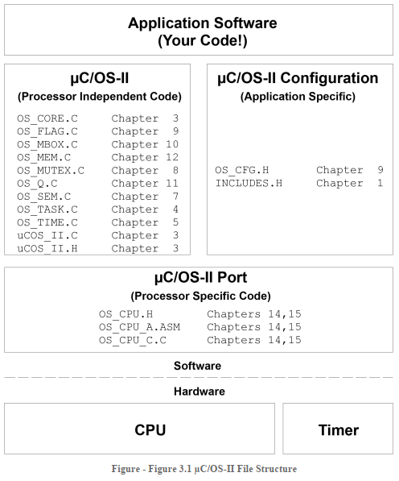

# μC/OS-II嵌入式实时操作系统

## μC/OS简介

μC/OS是一款应用非常广泛的嵌入式实时系统，它最大的特点是抢占式（preemptive）的内核，确保高优先级的任务能够优先得到执行。除了任务调度，μC/OS系统还提供信号量（Semaphore），消息队列（Message Queue），内存管理（Memory Management）等多种可配置的服务。同时官方还提供了多个平台下的移植例程，参照历程用户可以方便的将μC/OS系统移植到自己的平台上。

μC/OS目前已经发展到了μC/OS-iii了，μC/OS-iii相较于ii在任务调度上引入了时间片的概念，允许多个任务具有相同的优先级，通过时间片轮转来调度就绪的相同优先级的任务。此外μC/OS-iii在还在其他功能上做了扩展，但本文主要介绍μC/OS-ii，因此下文不加说明的μC/OS指的就是μC/OS-II。

## μC/OS嵌入式实时操作系统的一些基本概念

- **实时系统（Real-Time System）:**

   系统中计算结果的正确性不仅取决于计算逻辑的正确性，还取决于产生结果的时间。如果完成时间不符合要求，系统就可能会出现严重问题。

  notice：实时系统的要求并不是处理速度快，而是**在预期的时间内完成任务**。例如个人PC系统的运算速度已经非常快，但是并不是实时系统。

- **原语（Primitive）:**

  由若干条指令组成的程序段，用来实现某个特定功能，**在执行过程中不可被中断**，也有称为临界代码区（Critical Section of Code）的。

- **任务（Task）：**

  内核进行任务调度的单位，任务在被调度器调度后就会占用CPU资源，每个任务有自己的一套CPU寄存器和栈空间的上下文。在μC/OS中任务都是被写成一个任务函数，内部运行一个死循环。

- **多任务并发（Multitasking）:** 

  多任务并发其实是靠操作系统对多个任务进行调度和切换实现的，下图是在μC/OS-ii内核的调度下，任务的状态切换图。

  

- **内核（Kernel）**

  内核是操作系统的核心，它提供操作系统的最基本功能，主要包括任务调度，内存管理，文件管理，设备管理等功能。对于μC/OS这样的嵌入式实时微内核来讲，最主要就是提供任务调度功能，文件管理，设备管理等功能没有集成。

- **抢占式内核（Preemptive Kernel）**

  大多数的实时操作系统都采用抢占式的内核，及存在高优先级的任务已经进入就绪之后，调度器会打断当前正在执行的低优先级的任务，将CPU控制权交给就绪的高优先级任务。与之相反的是非抢占式的内核，对于任何任务都需要任务自身执行操作去主动放弃CPU的占用。

  非抢占式内核逻辑简单，能够安全的调用不可重入函数，但是实时性差。抢占式内核则保证了实时性，但是由于低优先级的任务会被打断，因此再非抢占式内核中使用不可重入内核时要非常小心，一般会采取一些措施保证数据安全。

- **可重入函数/不可重入函数（Reentrancy）**

  可重入函数指的是函数在被执行的过程中可以在任意时刻被中断，过一段时间后再返回执行时不会对函数执行结果有影响。对于可重入函数来说，要么只使用本地变量，要么采取了措施对全局变量的操作进行保护。不满足可重入特性的函数就是不可重入函数，在抢占式内核中使用不可重入函数可能会导致意料之外的错误。

- **临界资源（Critical Resource）与临界区（Critical Section）**

  在某段时间内只允许一个任务使用的资源称为临界资源，任务中访问临界资源的那段程序称为临界区。为了防止多个任务同时访问临界资源，需要采取措施进行保护。μC/OS提供了信号量机制和开关调度器/中断的方式来保护临界资源。

## μC/OS 内核结构



μC/OS的结构如上图所示，主要包括

1. 内核功能代码文件，这部分文件与芯片和平台无关，其中每个文件都实现一个具体的内核功能。
2. 处理器接口代码文件，这部分代码与具体的CPU配置有关，将μC/OS移植到不同的处理器上时需要重新编写这部分代码。
3. 内核功能配置代码，主要是一个包含很多宏定义的头文件，用户可以通过修改宏定义来使能或者关闭内核的不同功能，对内核进行裁剪。

## μC/OS的任务调度

### μC/OS中的任务

μC/OS中的任务是通过一个包含死循环的函数来实现的，它包含一个空指针类型的参数，用来在运行过程中向任务传递参数，返回值类型只能定义为void型。

```c
void YourTask(void *pdata)
{
    for ( ; ; ) {
        /* USER CODE */
        
        /* Call one of uC/OS services: */
        OSFlagPend();
        OSMboxPend();
        OSMutexPend();
        OSQPend();
        OSSemPend();
        OSTaskDel(OS_PRIO_SELF);
        OSTimeDly();
        OSTimeDlyHMSM();
        
        /* USER CODE */
    }
}
```

除了死循环，任务还可以在完成工作之后删除自己，因此任务的定义还可以有如下形式：

```c
void YourTask(void *pdata)
{
    /* USER CODE */
    OSTaskDel(OS_PRIO_SELF);
}
```

μC/OS中最多可以管理256个任务，可以管理的任务数量由宏定义 `OS_LOWEST_PRIO` 定义，默认为64个。每个任务都需要有一个与其他任务不同的优先级，但系统中最低优先级的任务已经被分配给了IDLE任务，次低优先级已经被内核分配给了统计任务。此外μC/OS还建议保留最高优先级0，1用于今后扩展。

每个任务在内核中被分配一个任务控制块（TCB，Task Control Block ），其实就是操作系统中的进程控制块（PCB）的概念。TCB是一个结构体，会记录当前任务执行的所有重要属性信息，如任务优先级，任务栈指针等。内核对任务的调度，其实就是对于TCB的操作。