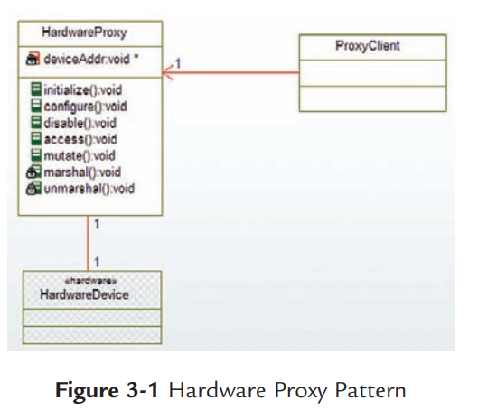

# 嵌入式软件中的设计模式

## 嵌入式软件设计

### 嵌入式软件开发特点

嵌入式软件开发相对于PC或者服务器上的软件开发主要有以下特点：

1. 嵌入式系统对于软件开发的资源限制更严格，嵌入式系统在CPU计算能力，内存大小，存储大小上对于软件开发的要求都更严格，即在很有限的资源条件下，完成指定的功能需求。
2. 嵌入式软件开发的过程中编译开发和实际运行可能在不同的硬件平台环境中。由于嵌入式平台的资源有限，一般会在PC或服务器等主机平台上进行开发编译，而在实际的嵌入式平台中调试运行，因此会存在交叉编译的要求。
3. 嵌入式软件会直接操作底层硬件，嵌入式软件开发一般会直接涉及与底层硬件的交互，嵌入式软件工程师需要对所操作的硬件设备有一定的了解，并在开发过程中大量涉及硬件的配置和操作。

### 设计模式

设计模式（Design pattern）代表了最佳的实践，通常被有经验的面向对象的软件开发人员所采用。设计模式是软件开发人员在软件开发过程中面临的一般问题的解决方案。这些解决方案是众多软件开发人员经过相当长的一段时间的试验和错误总结出来的。

使用设计模式是为了重用代码、让代码更容易被他人理解、保证代码可靠性。 毫无疑问，设计模式于己于他人于系统都是多赢的，设计模式使代码编制真正工程化，设计模式是软件工程的基石，如同大厦的一块块砖石一样。项目中合理地运用设计模式可以完美地解决很多问题，每种模式在现实中都有相应的原理来与之对应，每种模式都描述了一个在我们周围不断重复发生的问题，以及该问题的核心解决方案，这也是设计模式能被广泛应用的原因。[设计模式介绍](https://www.runoob.com/design-pattern/design-pattern-intro.html)

设计模式针对软件开发中的一般性问题总结了如下六大原则：

1. 开闭原则（Open Close Principle）

   对扩展开放，对修改关闭。在对程序进行扩展时不能去修改原有代码，实现如插拔的效果。一般通过接口和抽象类实现。

2. 里氏代换原则 (Liskov Substitution Principle)

   任何基类可以出现的地方，子类一定可以出现。里氏代换原则是对开闭原则的补充。实现开闭原则的关键步骤就是抽象化，而基类与子类的继承关系就是抽象化的具体实现，所以里氏代换原则是对实现抽象化的具体步骤的规范。

3. 依赖倒转原则 (Dependence Inversion Principle)

   针对接口编程，依赖于抽象而不依赖于具体。

4. 接口隔离原则 (Interface Segregation Principle)

   使用多个隔离的接口，比使用单个接口要好。

5. 迪米特法则（Demeter Principle）

   又称最少知道法则，一个实体应当尽量少地与其他实体之间发生相互作用，使得系统功能模块相对独立。

6. 合成复用原则 (Composite Reuse Principle)

   尽量使用合成/聚合的方式，而不是使用继承。

### C语言与面向对象编程

嵌入式软件开发中最常用的编程语言就是C语言，C语言支持指针，易于硬件操作，相对于汇编语言又具有良好的可读性和可移植性，非常适合嵌入式软件开发。

C语言是面向过程的程序设计语言，将任务分解为很多个步骤，协调这些步骤实现功能。C语言将数据（data）和行为（behavior）作为两台线并行处理，而面向对象的程序设计方法则将数据和行为封装在一起，增强了软件的内聚性，这一点对于大型软件的开发和维护效率具有明显的好处。

C语言原生上并不支持面向对象，没有直接用于继承和多态的语法。但是使用C语言自身的一些特性，也完全可以实现面向对象的程序设计。

1. C语言实现类的封装

   C语言实现面向对象中的封装特性非常简单，只需要在头文件中用结构体将类的属性定义好，然后将需要开放的方法也声明在头文件中，方法的头一个参数应该为该结构体指针，以保证方法访问到正确的对象。通过这种方式，文件就作为了封装的边界，只有在头文件中声明的属性和方法才是对外可见的，实现了封装的特性。

2. C语言实现类的继承

   

3. C语言实现类的多态

   

### 嵌入式软件开发中的设计模式

嵌入式软件在不同的系统下会有不同的规模，针对一些资源限制严格，使用场景和功能单一的嵌入式系统，嵌入式软件的规模一般不大，也不会引入操作系统，而是采取裸机开发的模式，这种情况下考虑到软件规模小，功能扩展和变更的可能性小，一般在开发过程中不太会考虑到设计模式。

但是对于使用场景复杂，功能多，软件规模较大的嵌入式软件系统，良好的软件架构对于软件的维护，拓展和移植都至关重要。

嵌入式软件开发具备一些PC上应用软件开发所没有的特点，因此并非所有设计模式都适合与嵌入式软件开发，其实也并非所有嵌入式软件开发都需要用到设计模式，因此在嵌入式软件设计时，应当与当前的系统和需求情况做评估分析，再决定是否需要使用设计模式以及选择何种设计模式。

## 与硬件操作相关的设计模式

嵌入式软件可能会配置和操作的硬件可以分为4类：

1. 基础设配（infrastructure）
2. 通讯设备（communication）
3. 传感器 （sensor）
4. 执行机构 （actuator）

### 硬件代理模式(Hardware Proxy Pattern)

#### 抽象

硬件代理模式使用一个类来封装一个硬件设备所有的接口，无论他的实际物理接口是什么。这个硬件设备可以是内存，接口，或者中断。代理可以提供读数据，写数据，初始化，配置和关闭等方法。代理(proxy)为客户端(clients)提供一个编码的并且与连接无关的接口，这样在物理接口发生变化时，软件的修改也会非常容易。

#### 适用问题

如果每一个客户端都是直接访问硬件，那么当硬件发生改变时，软件的维护会变得非常繁琐。例如如果硬件的位定义，内存地址或者连接方式发生了改变，那么需要访问该硬件的客户端软件都需要修改。

而通过在实际硬件和客户端之间增加一个代理，那么硬件改变带来的对软件的硬件就会被很好的限制。为了更好的维护软件，需要访问硬件的客户端软件应该不知道硬件内使用的位定义，加密，压缩等细节信息，这些细节都由硬件代理通过内部私有方法来管理。

#### 模式结构

代理模式的结构很简单，可能会有多个需要访问硬件的客户端，但是每个硬件设备只有一 个硬件代理，所有的客户端都访问这个代理而不是直接访问硬件设备。

#### 协作角色

1. 硬件设备

   这个角色就是实际的物理意义上的硬件设备，一般来说不需要为这个角色编写代码。硬件设备与硬件代理之间的连接一般是通过一个软件寻址的硬件接口来实现的，例如通过一个端口地址，内存地址或者中断。

2. 硬件代理

   硬件代理角色时这个设计模式下的基础类，它包含与硬件设备有关的所有属性和方法，一般都会提供设备的初始化，配置，和（不）使能等方法。此外也会提供从硬件设备读数据或者向硬件设备写数据的方法。硬件代理一般会提供的属性和方法介绍如下：

   - access(): 此方法通常用来返回硬件的特定数据。
   - configure(): 此方法提供配置硬件设备的功能。 
   - disable(): 此方法提供安全的关闭硬件设备的功能。
   - deviceAddr: 这是硬件代理的私有属性，用来提供底层访问物理硬件的地址。通常是一个端口号，内存地址等。如果底层硬件的访问需要更复杂的方式，如通过RS232串口或者Ethernet，那这个属性会是一个复杂类型的属性，并提供相应的私有的底层访问方法。而无论何种情况下，硬件代理对于硬件设备的访问对于客户端来说都是隐藏的。
   - initialize(): 此方法提供初始化一个硬件设备的方法。
   - marshal(): 这是一个私有方法，它接收来自其他方法的参数，并进行指定的操作（如位打包，加密，压缩等），以提供数据发送给硬件设备。这样做可以保证与硬件设备之间交互的各种格则协议，对于客户端来说都是隐藏的。对于直接与硬件交互的数据，称为marshaled data或者native format。而对于软件易于理解和操作的数据称为unmarshaled或者presentation format，由于这是个私有方法，因此与硬件有关的native format对于客户端是隐藏的。
   - mutate(): 这个公有方法提供向硬件设备写数据的功能。
   - unmarshal(): 这是一个私有方法，用来对从硬件获取来的数据完成指定的操作（如位解析，解密，解压缩等），以提供处理好的数据发送给客户端。

3. 代理客户端

   代理客户端是所有需要访问硬件设备的软件类或者模块，所有的代理客户端都只知道硬件代理的存在并调用硬件代理提供的服务，而不能直接访问硬件。

#### 效果

- 优势: 通过硬件代理的方式，对于需要访问硬件的客户端隐藏了硬件操作的细节。所有与硬件操作有关的位处理，加密，压缩，协议定义等都通过硬件代理实现，这样当硬件发生变化时，客户端软件部分不需要任何修改，大大提高了软件可维护性和复用能力。
- 劣势: 软件可维护性和复用性的提高是以牺牲效率作为代价的，由于多了一层硬件代理作为中间层，所以执行效率没有直接操作硬件高。需要根据实际的项目需求取舍。

