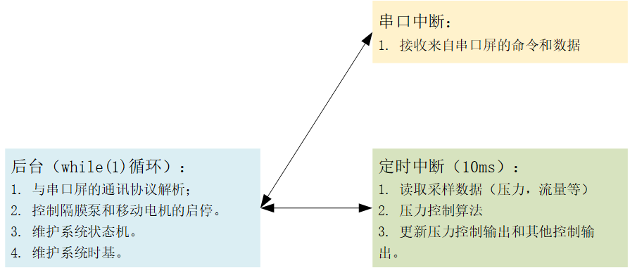
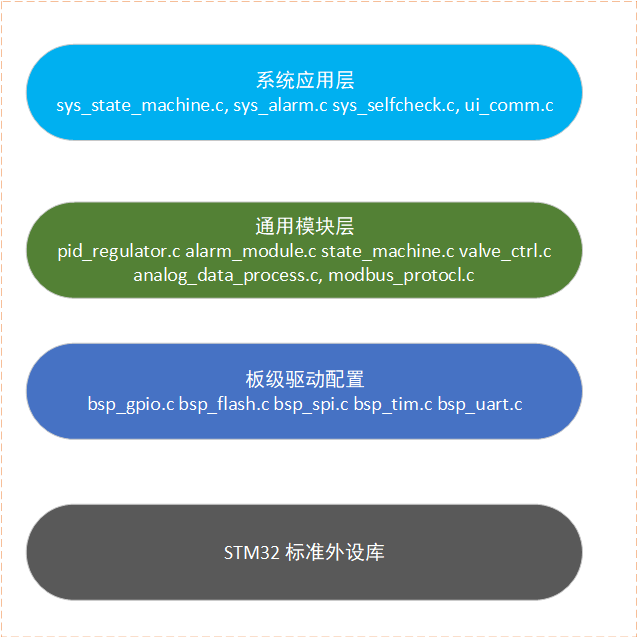
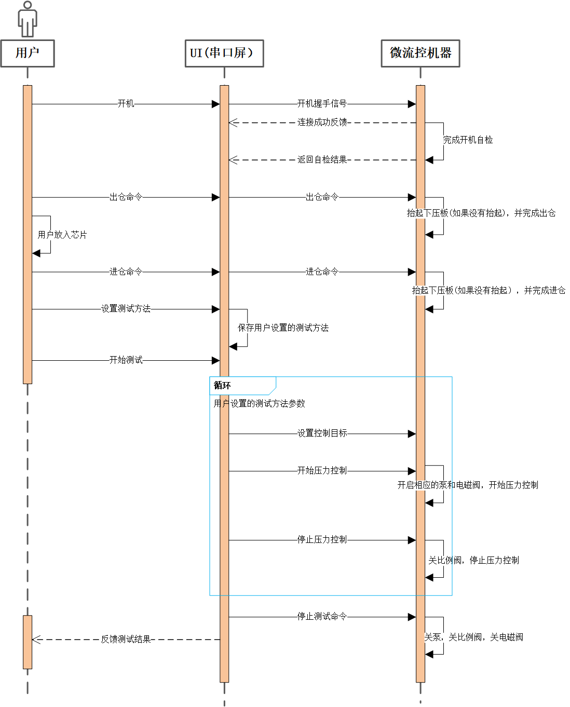
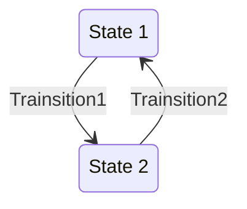
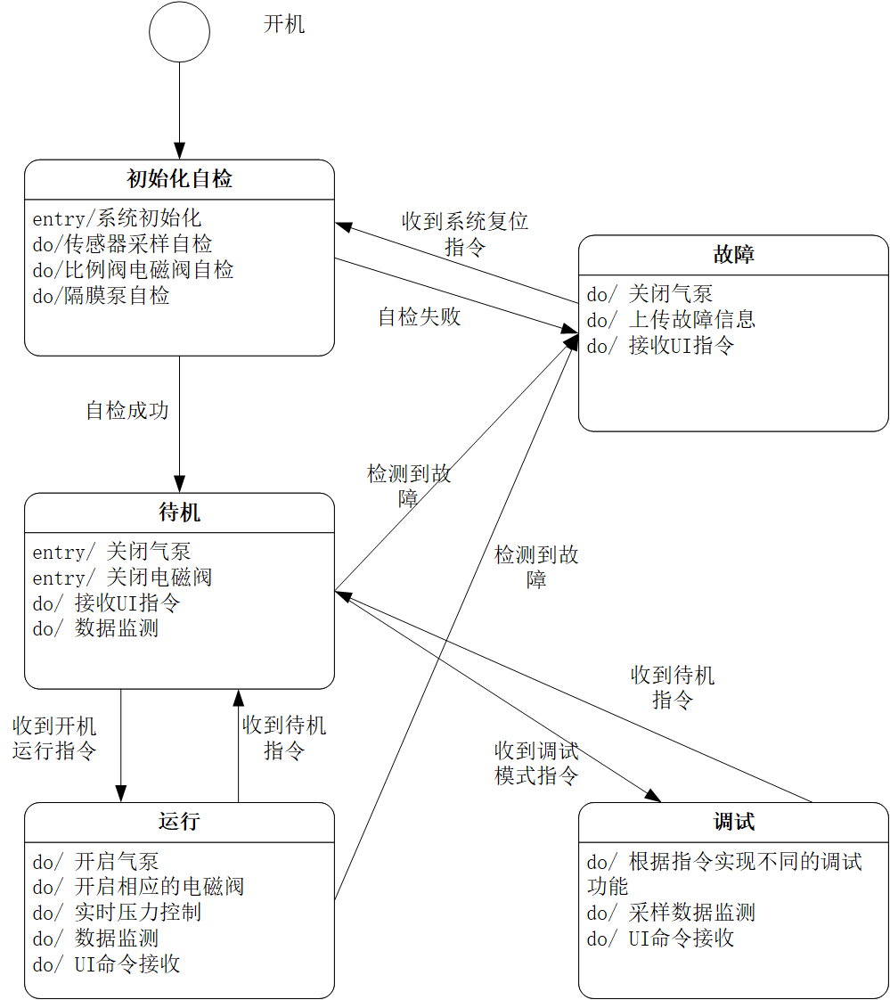

# 微流控程序设计文档

[toc]

## 历史

| version | description                                                  | author | date       | reviewer |
| ------- | ------------------------------------------------------------ | ------ | ---------- | -------- |
| 1.0     | 新建微流控底层控制软件设计文档                               | 方冉   | 2021.07.12 |          |
| 2.0     | 1. 增加开机自检模块设计<br />2. 增加了软件架构分层设计<br />3. 修改部分系统状态字和控制字 | 方冉   | 2021.08.01 |          |


## 软件架构设计

### 软件架构

由于项目的软件功能较简单，不需要采用嵌入式实时操作系统。因此直接采用经典的前后台式的软件架构，前台采用一个定时器中断，在中断中处理对实时性要求较高的任务，包括1. AD数据读取。2. 控制算法计算。3. DA控制量更新。

后台则是一个简单的while死循环，里面运行一些对实时性要求不是很高的任务，主要包括：1. 与串口屏的通讯解析。2. 系统状态机的维护等。



### 软件架构分层与模块划分

从控制系统软件的功能角度出发，底层控制软件在应用层（驱动层直接使用STM32官方外设库）上主要分为以下几个模块：

- 系统状态机：控制整个系统的运行状态
- UI通讯：通信数据收发，通信协议的解析
- 压力控制算法：通过比例阀实现压力控制
- 数据采样与处理：读取传感器采样的压力和流量数据，并做滤波等处理
- 故障检测：实时检测是否有故障发生，如果有则做相应处理。
- 其他辅助功能：包括进出仓控制，隔膜泵启停的控制

整个系统可以大致可以按照下图所示分为几个层级（图中列出部分该层级所包含的程序文件）：



## 系统开关机时序



1. 开机自检： 
   1. 发送连接握手命令
   2. 接收上位机的连接成功反馈
   3. 传感器零漂自检
   4. 下压板下压找到零点然后抬起
   5. 找进仓点
   6. 发送自检状态给上位机
2. 待机到运行：
   1. 接收出仓命令，出仓（会判断下压板是否下压）
   2. 接收进仓命令，进仓
   3. 接收设置压力目标
   4. 接收PID控制器开始运行命令，开电磁阀，开泵，开比例阀，开始压力控制
   5. 接收PID控制停止命令，关比例阀，
   6. 重复c-e，测试不同压力目标
3. 运行到待机
   1. 接收泵停止命令，关泵，关电磁阀，进入待机。

## 系统开机自检

开机自检主要包含以下功能：

### AD采样自检

AD采样自检主要完成开机之后的AD采样零漂校正，采取的方法为在上电开机之后连续采样50次取平均值，将该值作为零漂校正值，如果零漂值过大则报AD零漂校正失败错误。

### 下压板自检

开机时会先抬起下压板，通过光电传感器检测是否抬起成功，然后下压下压板，通过光电传感器检测是否下压成功。如果这个过程中出现没有成功抬起或者下压则报告下压板自检失败。

### 进出仓自检

在下压板抬起的状态下，进行进仓操作，通过光电传感器检测是否在进仓状态，如果不在，则报告进出仓自检失败。

### 比例阀自检

通过硬件反馈的比例阀驱动电压检测判断比例阀驱动是否正常（在给0开度和一个固定开度的情况下），如果反馈驱动电压不对，则报告比例阀自检失败。

### 电磁阀自检

通过硬件反馈的电磁阀开关状态信号检测判断比例阀驱动是否正常，如果反馈状态IO信号不对，则报告电磁阀自检失败。

### 开机自检状态字定义

```c
typedef union SELFCHECK_STATUS {
	uint16_t all;
    struct SELFCHECK_BITS {
        uint16_t selfcheck_flag 		:2; // 自检状态：0:自检未完成，1：自检成功，2：自检失败
        uint16_t ad_zero_check			:1;	// ad零漂自检 0：成功， 1： 失败(以下相同)
        uint16_t tray_check				:1; // 进出仓自检
        uint16_t plate_check			:1;	// 下压板自检
        uint16_t propo_valve_ch1		:1; // 比例阀1自检
        uint16_t propo_valve_ch2		:1; // 比例阀2自检
        uint16_t propo_valve_ch3		:1; // 比例阀3自检
        uint16_t propo_valve_ch4		:1; // 比例阀4自检
        uint16_t solenoid_valve_1		:1; // 电磁阀1自检
        uint16_t solenoid_valve_2		:1; // 电磁阀2自检
        uint16_t solenoid_valve_3		:1; // 电磁阀3自检
        uint16_t solenoid_valve_4		:1; // 电磁阀4自检
        uint16_t solenoid_valve_5		:1; // 电磁阀5自检
        uint16_t solenoid_valve_6		:1; // 电磁阀6自检
        uint16_t reserved				:1;
    } bits;
} SELFCHECK_STATUS_WORD;
```


## 系统状态机

### 状态机模型

系统状态机控制着整个系统的动态活动，状态机的模型如下图所示，状态机中主要包括状态，行为和转换条件。在不同的状态下，系统有不同的行为，执行不同的功能。而当满足相应的转换条件时，系统会从一个状态转换到另一个状态。



### 微流控系统状态机设计

针对微流控系统，整个系统的状态机设计如下图所示，微流控底层控制器可以分为5个状态：

- 初始化自检：上电之后控制器首先进入初始化自检状态，在该状态下完成底层控制器的初始化工作和开机自检工作。自检成功就会进入待机状态，自检失败则会进入故障状态。
- 待机：系统开机自检成功之后会进入待机状态，在此状态下，会接收来自UI的命令。此状态下，用户可以执行进出仓以及下压和抬起的操作。当收到运行（开始测试）指令后，系统会进入到运行状态。当收到工程师调试指令时，系统会进入调试状态。
- 运行：控制系统在待机状态下接收到运行指令后会进入运行状态，此状态下控制系统会更具压力控制指令和压力控制目标进行压力的闭环控制。当接收到关闭（测试结束）指令后，系统会回到待机状态。
- 故障状态： 当系统开机自检失败或者在除调试模式外的任一状态检测到故障发生时会进入故障状态。此状态下，系统会关闭气泵和比例阀，同时上传相关故障信息。
- 调试调试状态： 控制系统在待机状态下接收到调试指令时会进入此状态，在此状态下，操作者可以通过UI对系统的各个功能模块进行调试。收到退出调试指令后系统会再次回到待机状态。



### 状态机的实现

状态机定义：

```c
typedef uint16_t (*TriggerFcn)(void);
typedef void (*StateWorkFcn)(void);
typedef void (*StateEntryFcn)(void);
typedef void (*StateExitFcn)(void);

#define STATE_NUM_LIMIT		10

struct STATE {
	uint16_t		index;				// System state

	StateWorkFcn	work;			// Repeat running work in this state
	StateEntryFcn	entry;			// Function invoked when entry this state
	StateExitFcn	exit;			// Function invoked when exit this state
	TriggerFcn		trig;			// State transfer trigger function
};

struct STATE_MACHINE {
	struct STATE 	*current_state;
	struct STATE 	*state_tbl[STATE_NUM_LIMIT];
	uint16_t 			state_num;
	uint16_t      state_num_max;
};

/* 创建状态机 */
struct STATE_MACHINE *create_state_machine(uint16_t size);

/* 注册新的状态 */
int16_t register_state(struct STATE_MACHINE *machine, uint16_t index, StateWorkFcn work, StateEntryFcn entry, StateExitFcn exit, TriggerFcn trigger);

/* 运行状态机 */
uint16_t run_state_machine(struct STATE_MACHINE *machine);
```

系统状态机定义：

```c
/* System state machine index definition */
#define SELFCHECK				1u
#define STANDBY 				2u
#define RUNNING					3u
#define DEBUG_TEST				4u
#define FAULT		  			5u

/* System state definition */
#define SYS_SELFCHECK   		1u
#define SYS_STANDBY				2u
#define SYS_OPERATING			4u
#define SYS_DEBUG_TEST			8u
#define SYS_FAULT				16u

/* 创建系统状态机 */
void create_sys_state_machine(void);	

/* 运行系统状态机 */
void run_sys_state_machine(void);		
```

### 系统控制字定义

系统控制字是上位机（串口屏）发送下来的用户操作指令，串口屏将用户操作通过控制字传达给控制系统。控制字同时也是状态机的输入，会触发系统状态的改变。

```c
typedef union CTRL_WORD {
    uint16_t all;
    struct CTRL_BITS{
        uint16_t	tray :1;     //进出仓控制 0: 进仓， 1: 出仓
 		uint16_t 	plate : 1;			// 下压板控制 0: 抬起， 1: 下压
        uint16_t    sys_cmd: 6; 	 // 系统控制命令：1: 待机指令 2: 开始测试指令 4: 进入调试模式指令 16: 系统软件复位指令
        uint16_t    press_ctrl_ch1: 1;  // 比例阀1闭环控制: 1 使能闭环控制
        uint16_t	press_ctrl_ch2 : 1; // 比例阀2闭环控制: 1 使能闭环控制
        uint16_t    press_ctrl_ch3 : 1; // 比例阀3闭环控制: 1 使能闭环控制
        uint16_t    press_ctrl_ch4 : 1; // 比例阀4闭环控制: 1 使能闭环控制
        uint16_t    reserved: 3;       // 保留
    	uint16_t    heartbeat : 1;	   // 心跳位
    } bits;
} SYS_CTRL_WORD;
```

控制字2（调试模式下会使用）

```c
typedef union CTRL_WORD2 {
    uint16_t all;
    struct CTRL_BITS2 {
        uint16_t pumb_1	: 1;		  // 泵1控制： 1: 运行， 0: 关闭
        uint16_t pumb_2	: 1;		  // 泵2控制： 1: 运行， 0: 关闭
        uint16_t solenoid_valve1 : 1; // 电磁阀1控制： 1：打开， 0： 关闭
        uint16_t solenoid_valve2 : 1; // 电磁阀2控制： 1：打开， 0： 关闭
        uint16_t solenoid_valve3 : 1; // 电磁阀3控制： 1：打开， 0： 关闭
        uint16_t solenoid_valve4 : 1; // 电磁阀4控制： 1：打开， 0： 关闭
        uint16_t solenoid_valve5 : 1; // 电磁阀5控制： 1：打开， 0： 关闭
        uint16_t solenoid_valve6 : 1; // 电磁阀6控制： 1：打开， 0： 关闭
    	uint16_t reserved : 8		  // 保留
    } bits;
} SYS_CTRL_WORD2;
```

### 系统状态字定义

系统状态字包含当前整个系统的状态描述。

系统主状态字定义如下：

```c
typedef union SYS_STATUS {
    uint16_t	all;
    struct STATUS_BITS {
        uint16_t	sys_state : 5;		// 系统状态： 1: 自检状态，2：待机状态，4: 运行状态， 8：调试状态, 16：故障状态，其他:未定义
        uint16_t 	tray_state : 2;	   		// 仓位状态：0: 进仓状态，1：出仓状态 2: 进出仓中
        uint16_t    plate_state : 1;     		// 下压板状态： 0:抬起 1: 下压
        uint16_t    pump1 : 1;			// 泵1状态： 0: 未启动，1: 启动
        uint16_t    pump2 : 1;			// 泵2状态： 0: 未启动，1: 启动
        uint16_t    propo_Valve_ch1 : 1; // 比例阀1状态：0: 未工作， 1: 闭环控制中
        uint16_t    propo_valve_ch2 : 1; // 比例阀2状态：0: 未工作， 1: 闭环控制中
        uint16_t    propo_Vavle_ch3 : 1; // 比例阀3状态：0: 未工作， 1: 闭环控制中
        uint16_t    propo_valve_ch4 : 1; // 比例阀4状态：0: 未工作， 1: 闭环控制中
        uint16_t    reserved : 1; 		// 保留
        uint16_t    heartbeat : 1;		// 心跳位
    } bits;
} SYS_STATUS;
```

系统次状态字定义如下（目前主要包含所有的电磁阀状态）：

```c
typedef union SYS_STATUS2 {
    uint16_t all;
    struct STATUS_BITS_2 {
        uint16_t solenoid_valve1 : 1; // 电磁阀1状态： 1：打开， 0： 关闭
        uint16_t solenoid_valve2 : 1; // 电磁阀2状态： 1：打开， 0： 关闭
        uint16_t solenoid_valve3 : 1; // 电磁阀3状态： 1：打开， 0： 关闭
        uint16_t solenoid_valve4 : 1; // 电磁阀4状态： 1：打开， 0： 关闭
        uint16_t solenoid_valve5 : 1; // 电磁阀5状态： 1：打开， 0： 关闭
        uint16_t solenoid_valve6 : 1; // 电磁阀6状态： 1：打开， 0： 关闭
        uint16_t reserved : 12; 	  // 保留
    } bits;
} SYS_SATAUS_2;
```

## 故障报警

故障报警用于监测系统可能出现的各种故障，当满足故障条件时，就会将相应的故障信息上传到上位机，并采取相应的故障保护动作。故障模块的输入一般是各种采样处理后得到的模拟量或者是数字IO量，通过这些量与故障判断阈值比较，达到一定的持续时间后报出（也可以一检测到立刻报出）。判断故障后，系统会进入故障状态，并且会采取相应的故障应对措施。

### 故障报警模块设计

```c
struct SW_TIMER {					// 软件定时器
    uint16_t 	Tcnt;				// 定时器计数值
    uint16_t	Tsample;			// 定时器计数周期
    uint16_t	Texpire;			// 定时周期
};

union ALARM_ATTR {				// 故障报警属性
    uint16_t All;
    struct BITS {
        uint16_t Enable       :1;
        uint16_t Severe       :1;
        uint16_t Recoverable  :1;
        uint16_t Reserved     :13;
    }bits;
};

union ALARM_PREMISE {			// 报警状态的系统状态条件，只有相应的状态位置位才会进行报警判断
    uint16_t All;
    struct PREMISE_BITS {
        uint16_t SelfTest      :1;
        uint16_t Standby       :1;
        uint16_t OPERATING     :1;
        uint16_t Fault		   :1;
        uint16_t Debug         :1;
        uint16_t Reserved      :12;
    }bits;
};


struct ALARM_MODULE {
    uint16_t 				flag;			// 故障标志位
    union ALARM_PREMISE		Premise;		// 报警前提
    union ALARM_ATTR		Attr;			// 故障报警属性
    
    struct SW_TIMER			AlarmTimer;		// 报警计时
    struct SW_TIMER			RecoverTimer;	// 恢复计时
    
    int16_t			Thres;					// 报警阈值
    int16_t			ThresRecover;			// 报警恢复值
    
    int16_t  		(*Judge)(void *, void *);	// 报警判断函数
    int16_t			(*Recover)(void *, void *);	// 报警判断恢复函数
};
```

## 数据采样和处理

控制系统通过ADS1118芯片采样的数据包括4个通道的气压和3个通道的流量，ADS1118芯片最高可以每秒采样860次，我们可以把采样周期定为10ms。STM32通过SPI读取ADS1118芯片的采样数据，直接读取得到的数据是一个16位的数字量，读取之后应该先考虑AD零漂的校正。数字量经过采样变比相关的计算后得到实际的模拟量值，而在使用采样得到的模拟量数据之前最好先进行滤波处理。

### AD数据采样与零漂校正：

```c
struct AD_DATA {
    uint16_t 	press_ch1_ad;
    uint16_t    press_ch2_ad;
    uint16_t    press_ch3_ad;
    uint16_t	press_ch4_ad;
    uint16_t   	flow_ch1_ad;
    uint16_t	flow_ch2_ad;
    uint16_t	flow_ch3_ad;
};

struct AD_DATA sample_ad_value;			// 接收到的AD采样数字量
struct AD_DATA ad_value_cali;			// AD采样的零漂矫正值

void update_zero_drift(struct AD_DATA *cali)
{
    // 在系统上电的开机自检过程中记录AD采样的零漂数据。
}

/* 对直接采样得到的AD数据进行零漂矫正 */
void calibrate_ad_value(struct AD_DATA *in, struct AD_DATA *cali) {
	// 根据当前的校正数据对直接采样到的AD数据进行零漂校正。
}
```

### 实际模拟量计算与滤波：

``` c
struct SAMPLE_DATA {
    float	press_ch1;
    float 	press_ch2;
    float 	press_ch3;
    float	press_ch4;
    float 	flow_ch1;
    float 	flow_ch2;
    float	flow_ch3;
};
struct SAMPLE_DATA	sample_value;		// 采样得到的模拟量原始数据
struct SAMPLE_DATA	sample_filterd_value; // 经过滤波之后的采样数据
void calc_sample_data(struct AD_DATA *in, struct SAMPLE_DATA *value) 
{
	// 根据AD采样值和变比计算实际的压力，流量数据。    
}

void filter_sample_value(struct SAMPLE_DATA *in, struct SAMPLE_DATA *filtered, uint16_t filter_freq)
{
    // 根据给定的滤波频率对采样的压力流量等数据进行滤波。
}
```

## UI通讯

微流控底层控制系统通过串口与串口屏UI之间进行通讯。串口屏会下发指令和控制参数，底层控制系统则会向UI反馈当前的状态和采样数据等。二者之间采用的协议为自定义的通讯协议。

### 通讯数据的接收和发送

串口数据的接收采用中断的方式，当接收到一帧数据时，会将数据放到一个接收缓冲区中，然后将相应的待处理标志位置位，用于下一步接收数据的解析。

串口数据的发送采用缓冲的形式。

``` c
void ui_data_send(uint16_t length, uint8_t *buff);
```

### 通讯协议的解析

对于接收到的数据，按照协议进行解析之后转换为系统的控制命令和控制参数。

``` c
void protocol_parse(uint8_t *buff, uint8_t *cmd, uint8_t *data);
```

对于要发送的数据，则是按照协议封装成数据帧然后发送。

```c
void encapsulate_frame(uint8_t cmd, uint8_t *data, uint8_t *frame);
```

