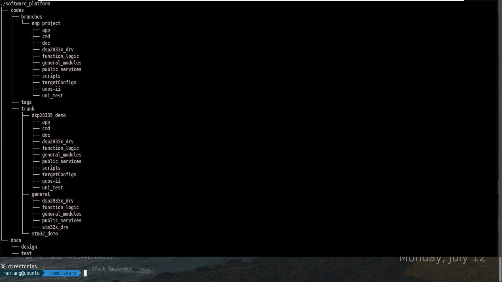

# 模块化软件平台工程管理规范

## 历史

| Version | date       | description                                                | author | review |
| ------- | ---------- | ---------------------------------------------------------- | ------ | ------ |
| V0.1    | 2021.07.12 | 1. 对于模块化软件平台项目在SVN上的工程管理规范做了初步制定 | 方冉   |        |
|         |            |                                                            |        |        |

## 前言

模块化软件平台的建设目标是打造一个通用的呼麻产品软件平台，不同的项目能够根据需要，直接移植或者简单的配置后就能使用平台中的各个软件模块。平台最终输出包括各个模块的程序（头文件，c文件），程序设计文档和测试相关文档。目前整个项目还在开发过程中，选择使用SVN来管理整个项目的开发和维护过程，该项目在SVN上的url链接为：

http://172.10.1.210:8080/svn/BDU%e5%b7%a5%e4%bd%9c%e7%9b%ae%e5%bd%95/software%20platform/

## 项目目录的结构

整个项目的目录结构如下：

1. codes目录
   用于存放程序代码。其中又有三个子文件夹，分别是：

   1. trunk： 程序的主干，也是我们模块化软件平台项目最终需要维护的程序分支。主干应该是稳定的代码，在程序迭代时，应该现在分支中（branches）进行开发，待开发到一定阶段，经过一定的测试之后再合并到主干中。trunk中也分了三个子文件夹：
      1. dsp28335_demo: DSP28335平台下的示例工程，可以直接在CCS中打开和编译的demo工程。
      2. stm32_demo: stm32平台下的示例工程，可以直接在keil5中打开和编译的demo工程。
      3. platforms： 与具体平台无关的模块化软件平台程序集合。
   2. branches：程序的各种分支。分支一般从主干(trunk)中通过打分支操作创建，一些分支在开发到一定阶段后需要再合并会主干。一般情况下，我们大部分时间都是再分支上进行开发，只有经过一定的测试，代码基本稳定后再合并到主干中。以下情况需要进行分支操作：
      1. 程序迭代： 例如从1.0版本升级到2.0版本，需要先打分支，在分支上开发完之后再合并回主干。
      2. 新增功能或新增模块：同样也是先打分支，开发验证完后，根据需要决定是否要再合并到主干。
      3. 不好解决的bug：如果解决一个bug需要改动很多代码，花费很多时间，同样需要先打分支。
      4. 将模块化软件平台应用到具体的项目中：这种情况下直接再分支中开发，并且后续不需要在合并回主干，直接维护该分支就行。
   3. tags: 一般把那些阶段性(如迭代各期)的项目代码,打分支到此目录，例如软件平台整体基本开发完成，并完成了初步测试，就可以tag一个1.0版本到此目录。

   模块化软件平台工程内部的目录结构与设计文档中的软件层次对应，下表进行了描述，其中前4行属于软件平台需要开发的内容，后面目录中的内容与具体项目有关。

   | 目录                   | 描述                                                        |
   | ---------------------- | ----------------------------------------------------------- |
   | dsp28335_drv/stm32_drv | 驱动层程序                                                  |
   | general_modules        | 通用模块层程序                                              |
   | function_logic         | 功能逻辑层程序                                              |
   | public_service         | 公共服务库程序                                              |
   | app                    | 应用层程序                                                  |
   | ucosii                 | 移植的ucos系统程序                                          |
   | unitest                | 单元测试程序                                                |
   | scripts                | 一些用到的脚本程序，例如clean.bat用于清楚一些编译中间文件。 |

   

2. docs目录

   用于存放模块化软件平台的相关文档，主要包括：

   1. design目录： 相关软件设计文档
   2. test目录： 相关测试文档

## 开发办法

在branches目录中新建了一个分支nnp项目的分支，大家需要在这个分支中针对自己负责的模块进行开发，开发完并测试OK后再合并到主干中，不要轻易修改trunk目录下的代码。

如果后续需要再其他的项目中进行模块化软件平台的开发，需要新建新的对应分支。

## SVN相关操作

针对SVN打分支，打tag以及其他的相关操作可以参考以下文档和文章：

SVN官方文档： http://subversion.apache.org/

SVN分支操作：https://blog.csdn.net/justry_deng/article/details/82259470 

