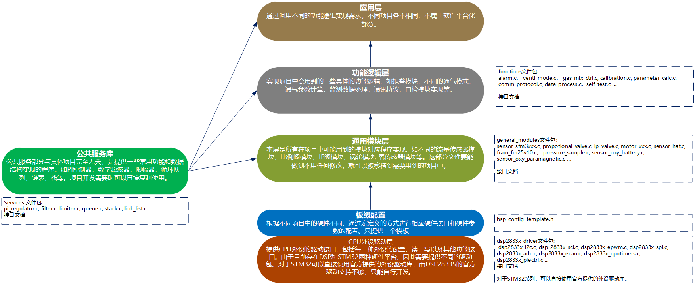
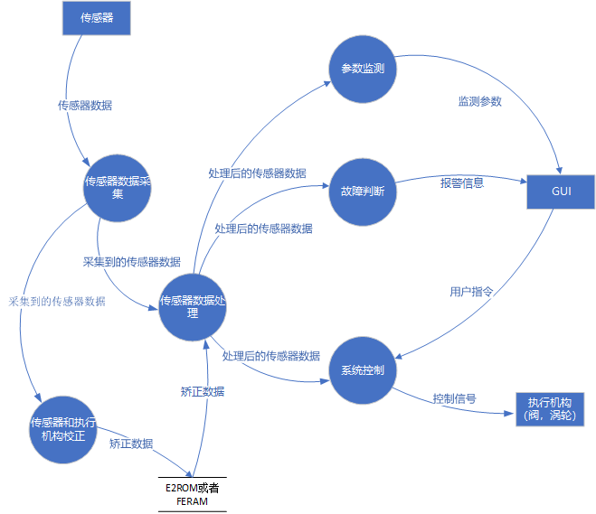
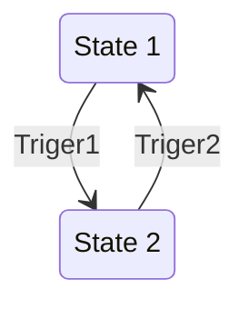
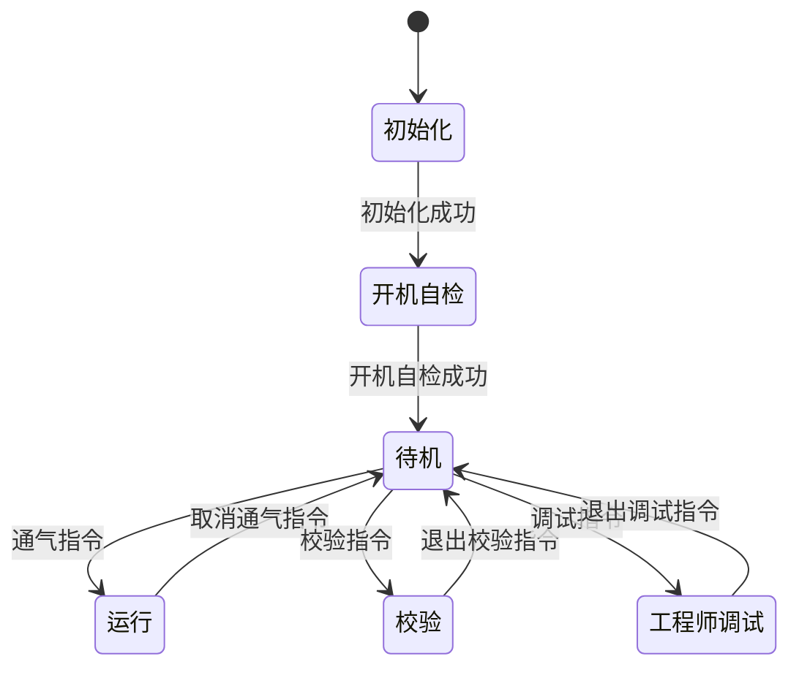
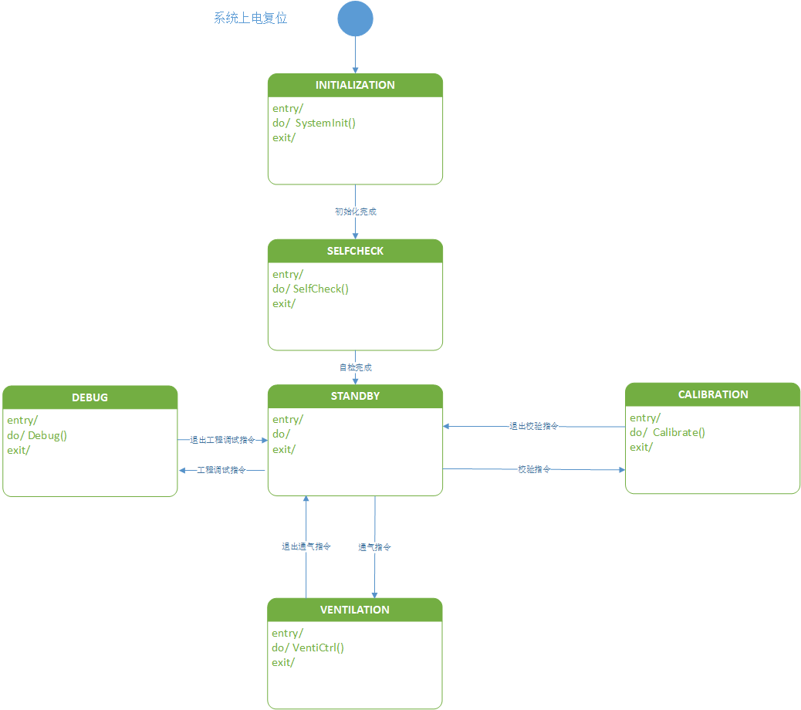

#  模块化软件平台接口设计

## 模块化软件平台架构设计

模块化软件平台架构的设计如下图所示，整个软件平台主要分为1. CPU外设驱动层，2. 通用模块层，3. 功能逻辑层，4. 公共服务库。

### 1. CPU外设驱动层

该层包括所有可能需要用到的外设的驱动实现，为上层提供硬件驱动接口。该层与硬件架构密切相关，考虑到我们目前主要用到TI的C2000DSP系列和STM32系列两种硬件架构，因此CPU驱动层也会按照这两种硬件架构分为两个软件包，虽然不同硬件平台的驱动实现不同，但是为了上层程序的复用性考虑，应尽量保证驱动调用的接口一致。此外STM32提供的标准外设库比较完备，需要重新编码的工作较少。而C2000系列DSP虽然也有官方提供的C2000 ware库，但是其中提供的驱动很少，需要自行编码的工作很多。

### 2. 通用模块层

该层模块包括所有在项目中可能会用到的具体的功能模块的软件实现。例如不同流量传感器模块，比例阀控制模块，IP阀控制模块，涡轮控制模块，氧传感器模块等。这一层的软件代码应该尽最大可能做到通用和易移植。

### 3. 功能逻辑层

这一层的软件负责调用不同的模块以实现项目中会用到的一些具体的功能逻辑，如报警模块，不同的通气模式实现，通气参数监测功能，气道参数计算功能，通讯协议实现，自建功能实现等。

### 4. 公共服务库

公共服务库部分提供一些通用的数据结构和功能模块实现，这部分代码与任何项目解耦，可以直接被移植和调用。例如PI控制器，数字滤波器，限幅器，循环队列，栈，链表等。




## 系统数据流分析

数据流图简称DFD，它普遍应用于企业的管理系统中，是一种结构化系统分析工具。它从数据传递和加工角度，以图形方式来表达系统的逻辑功能、数据在系统内部的逻辑流向和逻辑变换过程，是结构化系统分析方法的主要表达工具及用于表示软件模型的一种图示方法。

### 数据流图的主要元素：

1. →：数据流。数据流是数据在系统内传播的路径，因此由一组成分固定的数据组成。如订票单由旅客姓名、年龄、单位等**数据项**组成。由于数据流是流动中的数据，所以必须有流向，除了与**数据存储**之间的数据流不用命名外，数据流应该用名词或名词短语命名。
2. □：数据源（终点）。代表系统之外的实体，可以是人、物或其他软件系统。
3. ○：对数据的加工（处理）。加工是对数据进行处理的单元，它接收一定的数据输入，对其进行处理，并产生输出。
4. 〓：数据存储。表示信息的静态存储，可以代表文件、文件的一部分、数据库的元素等。



## 驱动层接口设计(以DSP28335为例)

### CPU配置

- void InitSysCtrl(void)
  - 功能： 完成CPU初始化，包括系统时钟，CPU的外设时钟的配置。
  - 返回值: 无
  - 参数：  无 
  - 说明： 时钟的配置通过板级配置文件BSP中的宏定义实现
- void InitFlash(void)
  - 功能： 完成CPU片内flash的初始化，flash操作时序的配置
  - 返回值: 无
  - 参数：  无 
  - 说明： flash操作时序中的延时配置通过板级配置文件BSP中的宏定义实现。
- void  InitPeripheralClocks(void)
  - 功能： 完成CPU外设的初始化，包括高速和低速外设时钟总线的配置。
  - 返回值: 无
  - 参数：  无 
  - 说明： 时钟的配置通过板级配置文件BSP中的宏定义实现

### SCI/UART

- void InitSci(struct SciType SCIx, struct SciInitType *Init)

  - 功能： 初始化SCI外设模块。

  - 返回值： 无

  - 参数： SCIx: Sci外设寄存器结构体， 可以为Scia, Scib, Scic. Init: Sci外设初始化结构体

  - 说明： SciInitType结构体定义如下：

    ```c
    struct SciInitType {
    	Uint16	DataBits;
    	Uint16  StopBits;
    	enum ParitySel	Parity;
    	Uint16  SciIntSel;
    	Uint16  SciFifoMode;
    	Uint32	Baudrate;
    	Uint16  SciRxFifoLevel;
    	Uint16  SciTxFifoLevel;
    };
    ```

- int16 SciReadPoll(struct SciType *Scix, Uint16 *Buff, Uint16 Num)

  - 功能： 以查询的方式从SCI读取数据。
  - 返回值：如果有读到数据，返回读取的字节数。如果读数据失败返回负值的错误码。
  - 参数： Scix: Sci外设结构体指针，Buff: 读取数据的保存缓冲区， Num: 想要读取的字节数。
  - 说明：该方法会以查询的方式接收数据，但是不会阻塞，没有收到数据时也会立即返回。

- int16 SciWriteBlock(struct SciType *Scix, const Uint16 *Buff, Uint16 Num)

  - 功能：以阻塞的方式从SCI发送指定数据。
  - 返回值：成功发送数据的字节数。如果发送数据失败则返回负值的错误码。
  - 参数：Scix: Sci外设结构体指针，Buff: 发送数据的缓冲区， Num: 想要发送的字节数
  - 说明：该方法会阻塞的进行发送, 直到发送完毕或出现错误才会退出。

- void SciSendByte(struct SciType *Scix, Uint8 Data)

  - 功能： 通过Scix发送单个字节数据Data;
  - 参数： Scix: Sci外设结构体指针，Data: 要发送的单字节数据。
  - 返回值：无
  - 说明：无

- Uint8 SciRecvByte(struct SciType *Scix)

  - 功能： 通过Scix接收单个字节数据Data;
  - 参数： Scix: Sci外设结构体指针
  - 返回值： Scix接收到的单字节数据

### I2C

- void InitI2c(struct I2cType I2cx, struct I2cInitType *Init)
  - 功能： 初始化I2c外设模块。
  - 返回值： 无
  - 参数： I2cx: I2c外设结构体指针， 可以为I2ca. Init: I2c外设初始化结构体
  - 说明： I2cInitType结构体定义如下：

  ```c
  struct I2cInitType {
  	Uint16						Clock_kHz;
  	Uint16						I2cMode;
  	Uint16						I2cIntSrc;
  	Uint16						I2cFifoMode;
  	Uint16						I2cRxFifoLevel;
  	Uint16						I2cTxFifoLevel;
  };
  ```

- void I2cSendByte(struct I2cType I2cx, Uint8 Data)

  - 功能： 通过I2cx发送单字节数据
  - 返回值: 无
  - 参数： I2cx: I2c外设结构体指针， Data: 要发送的单字节数据
  - 说明：

- Uint8 I2cRecvByte(struct I2cType I2cx)

  - 功能： 通过I2cx接收单字节数据
  - 返回值: 接收到的单字节数据
  - 参数： I2cx: I2c外设结构体指针
  - 说明：

### ADC

- void InitAdc(struct AdcType *Adcx, struct AdcInitType *Init)
  - 功能:  初始化外设模块Adcx
  - 返回值：无
  - 参数：Adcx：Adc结构体指针， Init: Adc初始化结构体指针
  - 说明：
- Uint16 GetAdcData(struct AdcType *Adcx, int Channl)
  - 功能：获取指定通道的Adc采样值
  - 返回值：获取到的采样值
  - 参数：参数：Adcx：Adc结构体指针，
  - 说明： 

### PWM

- ​	void InitPwm(struct PwmType *Pwmx, struct PwmInitType *Init)

  - 功能：初始化外设模块Pwmx;
  - 返回值：无
  - 参数： Pwm: Pwm结构体指针， 可以为Pwm1, Pwm2, Pwm3, Pwm4, Pwm5, Pwm6。Init: Pwm模块初始化结构体指针。
  - 说明：PwmInitType结构体定义如下：

  ```c
  struct PwmInitType{
  	Uint32 			ClockHz;
  	Uint16			CounterPeriod;
  	Uint16			CounterMode;
  	Uint16 			PhaseDir;
  	Uint16 			SynOutSel;
  	Uint16			IntEn;
  	Uint16			IntMode;
  	Uint16			IntPeriod;
  	struct CAMP		cmpA;
  	struct CAMP		cmpB;
  }EPWM_T;
  ```

  

### SPI

- void InitSpi(struct SpiType *Spix, struct SpiInitType *Init)
  - 功能： 初始化SPI模块Spix
  - 返回值： 无
  - 参数：Spix: Spi模块结构体指针
  - 说明：
- void SpiSendData(struct SpiType *Spix, Uint16 Data)
  - 功能：Spix发送单个数据
  - 返回值：无
  - 参数：Spix: Spi外设模块结构体指针，Data: 要发送的数据。
  - 说明：
- Uint16 SpiRecvData(struct SpiType *Spix)
  - 功能：Spix接收单个数据
  - 返回值：通过Spix接收到的单个数据
  - 参数：Spix: Spi外设模块结构体指针
  - 说明：

### 中断

- void InitPieCtrl(void)
  - 功能：初始化Pie中断控制器
  - 返回值：无
  - 参数：无
  - 说明：清零Pie使能位，清零所有Pie中断位
- void EnalbeInterrupts(void)
  - 功能： 使能PIE中断和CPU中断
  - 返回值：无
  - 参数： 无
  - 说明：
- void EnCpuIntSrc(Uint16 IrqId)
  - 功能： 使能中断号位IrqId的Cpu中断
  - 返回值：无
  - 参数： IrqId: Cpu 中断号
  - 说明：
- void DisCpuIntSrc(Uint16 IrqId)
  - 功能： 清零中断号位IrqId的Cpu中断使能位
  - 返回值：无
  - 参数： IrqId: Cpu 中断号
  - 说明：
- void EnPieIntSrc(Uint16 IrqGrp, Uint16 IrqId)
  - 功能： 使能Pie中断中的第IrqGrp组中的第IrqId个中断
  - 返回值：无
  - 参数： IrqGrp: Pie中断的组号， IrqId: 组内的中断号
  - 说明：
- void EnPieIntSrc(Uint16 IrqGrp, Uint16 IrqId)
  - 功能： 清零Pie中断中的第IrqGrp组中的第IrqId个中断使能
  - 返回值：无
  - 参数： IrqGrp: Pie中断的组号， IrqId: 组内的中断号
  - 说明：
- void InitPieVectTable(void)
  - 功能： 初始化中断向量表
  - 返回值： 无
  - 参数： 无
  - 说明：将中断向量表初始化为默认值
- int16 PieIrqRegisiter(Uint16 IrqId, PINT IrqHandler)
  - 功能： 注册中断向量表中的中断服务函数
  - 返回值：注册结果：成功或失败
  - 参数： IrqId: 中断号, PINT: 中断服务函数句柄（指针）
  - 说明：
- 

### Timer

- void InitCpuTimers(void)
  - 功能： 初始化Cpu定时器
  - 返回值： 无
  - 参数： 无
  - 说明：将CPU定时器初始化为默认状态
- void ConfigCpuTimer(struct CPUTIMER_VARS *Timerx, float Freq, float Period)
  - 功能： 配置CPU定时器x
  - 返回值：无
  - 参数：Timerx: CPU定时器结构体指针，可以为TImer0, TImer1, Timer2, Freq: CPU主频(单位MHZ)， Period: 定时周期，单位微秒
  - 说明： 无
- void StartTimer(struct CPUTIMER_VARS *Timerx)
  - 功能： CPU定时器x开始工作
  - 返回值：无
  - 参数：Timerx: CPU定时器结构体指针，可以为TImer0, TImer1, Timer2
  - 说明： 无
- void StopTImer(struct CPUTIMER_VARS *Timerx)
  - 功能： 停止CPU定时器x
  - 返回值：无
  - 参数：Timerx: CPU定时器结构体指针，可以为TImer0, TImer1, Timer2
  - 说明： 无


### 看门狗

- void InitWatchDog(void)
  - 功能：初始化看门狗
  - 返回值：无
  - 参数：无
  - 说明：看门狗模块的时钟通过BSP板级文件进行配置
- void EnableWatchDog(void)
  - 功能：使能看门狗模块
  - 返回值：无
  - 参数：无
  - 说明：调用该函数看门狗将会开始工作
- void ServiceWatchDog(void)
  - 功能：向看门狗模块喂狗
  - 返回值：无
  - 参数：无
  - 说明：通过此函数向看门狗定期喂狗，以确保不会进入看门狗复位。
- void DisableWatchDog(void)
  - 功能：关闭看门狗模块
  - 返回值：无
  - 参数：无
  - 说明：

## 公共服务层接口设计

### PI控制器

**PI控制器说明**

1. PI控制器的数学模型：

$$
u(t)=K_pe(t)+K_i\int e(t)dt
$$

​				其中u表示控制器输出，e表示给定和反馈之间的误差。

2. PI控制器的离散化

   控制器离散化的方式有很多种，这里采用后向差分的方式对前面的PI控制器进行离散化，得到：
   $$
   \begin{align}
   u(k) &= K_pe(k)+K_iT_s\sum_{i=1}^k e(i) \\
   	&= K_pe(k)+U_i(k)	\\
   	&= K_pe(k)+K_iT_se(k)+U_i(k-1)
   \end{align}
   $$
   其中，Ui表示对过去所有误差的积分。这样离散化得到的PI控制器称为**位置式PI控制器**， 这种PI控制器的输出与过去所有偏差的积累有关。并不易于熟悉控制系统的实现。

3. 增量式PI控制器

   对位置式PI控制器进行改进，计算每次控制器输出的增量：
   $$
   \Delta u(k) =u(k)-u(k-1) = K_p[e(k)-e(k-1)]+K_iT_se(k)
   $$
   根据上式有：
   $$
   \begin{align}
   u(k) &=u(k-1)+(k_p+K_iT_s)e(k)-K_pe(k-1)	\\
   	&=u(k-1)+\alpha e(k) - \beta e(k-1)    \\
   \end{align}
   $$
   其中：
   $$
   \alpha = K_p+K_iT_s \\
   \beta=K_p
   $$
   这样就得到了离散化的增量式PI控制器，这种控制器实现方便，适合数字控制系统。

pi控制器结构体：

```c
typedef struct PI_REGULATOR
{
    float   ref;        /*!< reference value */
    float   fed;        /*!< feedback value  */
    float   err;        /*!< error of reference and feedback value */
    float   out;        /*!< output of pi regulator */

    float   alpha;      /*!< alpha parameter */
    float   beta;       /*!< beta parameter */
    float   out_max;    /*!< output upper limit */
    float   out_min;    /*!< output lower limit */
}PI_REGU;
```

- PI_REGU *CreatePIRegu(void)
  - 功能：创建一个PI控制器
  - 返回值：如果创建成功，则返回一个PI控制器的指针，如果创建失败，则返回空指针。
  - 参数：无
  - 说明：需要对返回值进行检查，避免创建失败。实际使用时，也可以直接定义变量，而不需要调用此函数。
- void InitPIRegu(PI_REGU *p, float alpha, float beta, float max, float min)
  - 功能：初始化PI控制器
  - 返回值：无
  - 参数：p: PI控制器结构体指针，alpha: PI控制器参数，beta：PI控制器参数， max: PI控制器输出最大值，min：PI控制器输出最小值。
  - 说明：
- PISetPara(PI_REGU *p, float alpha, float beta)
  - 功能： 设置PI控制器控制参数
  - 返回值： 无
  - 参数： p: PI控制器结构体指针，alpha: PI控制器参数，beta：PI控制器参数
  - 说明：
- PISetLimit(PI_REGU *p, float max, float min)
  - 功能：设置PI控制器输出限幅
  - 返回值：无
  - 参数：p: PI控制器结构体指针，max: PI控制器输出最大值，min：PI控制器输出最小值。
  - 说明：
- float PICalc(PI_REGU *p, float ref, float fed)
  - 功能：运行PI控制器，计算控制器输出
  - 返回值：PI控制器的输出
  - 参数：p: PI控制器结构体指针， ref: 控制器的目标值， fed：控制器的反馈值
  - 说明：计算结果位PI控制器的输出

### 循环队列

循环队列结构体：

```c
typedef int16_t     elem_t;

struct QUEUE {
    elem_t *data;
    int16_t front;
    int16_t rear;
    int16_t size;
};
typedef struct QUEUE *queue_t;
```

- queue_t 			queue_create(int16_t size);  
  - 功能： 创建一个循环队列
  - 返回值：如果创建成功，则返回循环队列指针，如果创建失败，则返回空指针
  - 参数： size: 循环队列的总长度。
  - 说明：需要检查返回值，避免创建失败。
- queue_state_t    queue_en(queue_t qp, elem_t d);
  - 功能：向循环队列中插入新元素。
  - 返回值：插入操作结果，插入成功返回0，插入失败返回相应错误代码。
  - 参数： qp: 循环队列指针；d: 要插入的新队列元素
  - 说明： 插入操作在队列满时可能会失败。
- queue_state_t    queue_de(queue_t qp, elem_t *d);
  - 功能：取出循环队列头部元素
  - 返回值：取值操作结果，取值成功返回0，取值失败返回相应错误代码。
  - 参数：qp:循环对了指针，d: 取出队列元素存放变量的指针。
  - 说明：在循环队列为空时，可能会失败。
- int16_t          queue_is_empty(queue_t qp);
  - 功能：判断循环队列是否为空
  - 返回值：队列是否为空，1表示队列为空，0表示队列中有值
  - 参数：qp: 循环队列指针。
  - 说明：
- int16_t          queue_is_full(queue_t qp);
  - 功能：判断循环队列是否已满
  - 返回值：队列是否为满，1表示队列已满，0表示队列有空余位置。
  - 参数：qp: 循环队列指针。
  - 说明：
- int16_t          queue_length(queue_t qp);
  - 功能：返回当前循环队列的长度
  - 返回值：当前循环队列的长度
  - 参数：ｑｐ：循环队列指针
  - 说明：
- void             queue_clear(queue_t qp);
  - 功能：清空循环队列
  - 返回值：无
  - 参数：ｑｐ：循环队列指针
  - 说明：队列中所有元素都会被清零
- void             queue_free(queue_t *qp);
  - 功能：释放（删除）循环队列
  - 返回值：无
  - 参数：ｑｐ：循环队列指针
  - 说明：删除循环队列所占用的内存空间。

### 链表

链表结构体：

```c
typedef int16_t elem_t;

enum LIST_RET {
    NO_ERR,
    MALLOC_FAILED,
    ELEM_NOT_FIND
};
typedef enum LIST_RET state_t;

struct NODE {
    elem_t data;
    struct NODE *next;
};
typedef struct NODE *list_t;
typedef struct NODE *pos_t;
```

- state_t list_init(list_t *p);
- state_t list_append(list_t l, elem_t d);
- int16_t list_is_empty(list_t l);
- int16_t list_is_last(list_t l, pos_t p);
- pos_t list_find_elem(list_t l, elem_t d);
- state_t list_del_elem(list_t l, elem_t d);
- pos_t list_find_prev(list_t l, elem_t d);
- state_t list_insert(list_t l, elem_t d, pos_t p);
- void list_clear(list_t l);
- void list_free(list_t *lp);

### 数字滤波器

一阶低通数字滤波器结构体

```c
struct LPF_ST {
    float q;
    float output_last;
    float (*calc)(float input);
};

typedef struct LPF_ST FOLPF
```

- FOLPF *CreateLpf(void)
- void InitLpf(FOLPF *lpf,  Uint16 Freq)


### 状态机

> A state diagram is a type of diagram used in computer science and related fields to describe the behavior of systems. State diagrams require that the system described is composed of a finite number of states; sometimes, this is indeed the case, while at other times this is a reasonable abstraction.




状态机结构体：

```c
struct STATE {
	uint16_t		Index;				// System state

	StateWorkFcn	Work;			// Repeat running work in this state
	StateEntryFcn	Entry;			// Function invoked when entry this state
	StateExitFcn	Exit;			// Function invoked when exit this state
	TriggerFcn		Trig;			// State transfer trigger function
};

struct STATE_MACHINE {
	struct STATE 	*CurrentState;
	struct STATE 	*StateTbl[];
	uint16_t 		StateNum;
	uint16_t        StateNumMax;
};
```

- struct STATE_MACHINE *CreateStateMachine(uint16_t Size)
  - 功能：创建一个状态机
  - 返回值：如果创建成功，则返回状态机指针，如果创建失败，则返回空指针。
  - 参数： Size： 状态机中包含的状态数量。
  - 说明： 需要检查返回值，避免创建失败。
- int16_t RegisterState(struct STATE_MACHINE *Machine, uint16_t Index, StateWorkFcn Work, StateEntryFcn Entry, StateExitFcn Exit, TriggerFcn Trigger)
  - 功能：注册状态机中的状态
  - 返回值：
  - 参数：
    - Machine: 状态机指针，
    - Index: 状态索引，
    - Work: 状态工作函数，如果没有，可以传入NULL， 
    - Entry: 状态进入操作函数， 如果没有，可以传入NULL， 
    - Exit: 状态退出操作函数， 如果没有，可以传入NULL
    - Trigger: 状态转移触发函数。
  - 说明：状态机中每个状态的进入，退出，工作和转移操作需要编程者自己设计，然后调用此函数将状态注册到状态机中。
- void RunStateMachine(struct STATE_MACHINE *Machine)
  - 功能：运行状态机。
  - 返回值： 无
  - 参数：Machine: 状态机指针
  - 说明：

## 通用模块层接口设计

### 报警模块

报警模块结构体：

```c
struct ST_ALARM {
    ALARM_PREMISE       premise;
    ALARM_ATTR          attr;

    uint16_t            flag;
    uint16_t            thres;
    uint16_t            thres_recover;

    uint16_t            tcnt;
    uint16_t            tcnt_recover;
    uint16_t            tsample;
    uint16_t            tcontinue;
    uint16_t            trecover;

    ALARM_JUDGE_HANDLE  alarm_judge;
    ALARM_JUDGE_HANDLE  alarm_recover;
};
```

- void alarm_init(struct ST_ALARM* alarm, uint16_t premise, uint16_t attr, uint16_t thres, uint16_t thres_recover, uint16_t tsample, uint16_t tcontinue, uint16_t trecover);
- uint16_t alarm_update(struct ST_ALARM*  alarm, uint16_t input);
- void alarm_enable(struct ST_ALARM*  alarm);
- void alarm_disable(struct ST_ALARM*  alarm);

### 比例阀

比例阀模型结构体：

```c
typedef struct PROPO_VALVE_ST {
    float       FlowMax;
    float 		FlowMin;

    float       Gain;
    float       Inc;

    PI_REGU     *pi;
    float       (*ValveModelCalc)(float Flow)
} PROPO_VALVE;
```

比例阀驱动结构体：

```c
typedef struct VALVE_DRIVE {
    float   	DriveDuty;
    float   	DutyMax;
    float   	DutyMin;
    uint16_t  	PwmPeriod;
    uint16_t  	*PwmOutput;
} PROPO_VALVE_DRIVE;
```

- void PorpoValveInit(PROPO_VALVE*v, float gain, float inc, float flow_max);
- void ValveDriveInit(PROPO_VALVE_DRIVE*d, float duty_thres, float duty_max, uint16_t pwm_period, uint16_t *pwm_output);
- float PropoValveCtrl(PROPO_VALVE *v, float flow_ref, float flow);
- float PropoValveDrive(PROPO_VALVE_DRIVE*d, float duty);

### IP 阀

IP阀模型结构体：

```c
typedef struct IP_VALVE_STRUCT {
    float       PressMax;
    float 		PressMin;

    float       Gain;
    float       Inc;

    PI_REGU     *Pi;
    float       (*ValveModelCalc)(float Flow)
} IP_VALVE;
```

IP阀驱动结构体

```c
typedef struct VALVE_DRIVE {
    float   	DriveDuty;
    float   	DutyMax;
    float   	DutyMin;
    uint16_t  	PwmPeriod;
    uint16_t  	*PwmOutput;
} IP_VALVE_DRIVE;
```


- void IpValveInit(IP_VALVE *v, float gain, float inc, float flow_max);
- void IpValveDriveInit(IP_VALVE_DRIVE*d, float duty_thres, float duty_max, uint16_t pwm_period, uint16_t *pwm_output);
- float IpValveCtrl(IP_VALVE *v, float flow_ref, float flow);
- float IpValveDrive(IP_VALVE_DRIVE*d, float duty);

### 流量传感器

- float GetFlow(void)
- float SFMx_GetFlow(void)
- float HAF_GetFlow(void)

### 氧浓度传感器

- float GetO2Conc(void);
- float Moxa_GetO2Conc(void);
- float Paramag_GetO2Conc(void);

### 压力传感器

- float GetPressure(void)

### 涡轮


## 功能逻辑层接口设计

### 系统状态机





- void SysStateMachineCreate(void)
- void SysStateMachineRun(void)

### 呼吸状态机

- void VentiStateMachineCreate(void)
- void VentiStateMachineRun(void)

### 呼吸模式

不同的呼吸模式主要是呼气和吸气时的控制目标不同,切换的方式不同,对应的就是在不同的呼吸相下控制目标不同,呼吸转换触发方式不同.因此可以将呼吸模式抽象成4个操作,吸气控制,呼气控制,吸气触发,呼气触发.可以建立一张呼吸模式的表，然后根据当前的模式选择将呼吸模式的操作注册到呼吸状态机中。

呼吸模式结构体定义：

```c
struct MODE_OPERATIONS {
	ModeInspFcn  		Insp;
	ModeExpFcn			Exp;
	ModeInspTrig		InspTrig;
	ModeExpTrig			ExpTrig;
};
```

呼吸模式输入：

```c
struct MODE_INPUT {
	float 		Pinsp;
    float 		Peep;
    float 		Ti;
    float		Te;
    float		VgVlSel;
}
```

呼吸模式输出定义：

```c
struct MODE_OUTPUT {
	float	 	InspPaw;
	float	 	InspFlow;
    float 		ExpPaw;
    float       ExpFlow;
};
```


### 参数监测

定义SensorData结构体为通用模块层通过各种传感器或者ADC直接采样的到的数据，例如NNP项目中有如下数据：

```c
struct SENSOR_DATA {
	float	O2Flow;
    float 	AirFlow;
    float 	ProxFlow;
    float 	InspPress;
    float	ExpPress;
    float 	FiO2
};
```

定义MonitorData结构体为对原始数据经过处理后得到的监控数据：

```c
struct MONITOR_DATA {
    float  Peak;
    float  Peep;
    float  Pmean;
    float  Vti;
    float  Vte;
    float  Mvi;
    float  Mve;
}
```

- void FiltrateSensorData(struct SENSOR_DATA Origin, struct SENSOR_DATA Data)
- void CalcMonitorData(struct SENSOR_DATA Origin, struct MONITOR_DATA Data)

### 通信协议

- void ParseReceiveCmd(uint16_t *Frame)
- void SendCmd(uint16_t Origin, uint16_t Dest, uint16_t Cmd, uint16_t *Data)

### 控制算法

#### 压力控制

- void PressCtrl(float PressRef,  float Press, IP_VALVE *valve);

#### 流量控制

- void FlowCtrl(float FlowRef,  float Flow, PROPO_VALVE *valve);

#### 潮气量控制

- void VtCtrl(float VtRef, float Vt);

#### 氧浓度控制

- void O2ConcCtrl(float ConcRef, float O2Conc);


## 问题：

1. DSP和STM32的驱动接口如何统一
2. 某些外设驱动的写法， I2c，Uart
3. 数据流图
4. 存储
5. 校准
6. 补充模块
7. 任务分配

