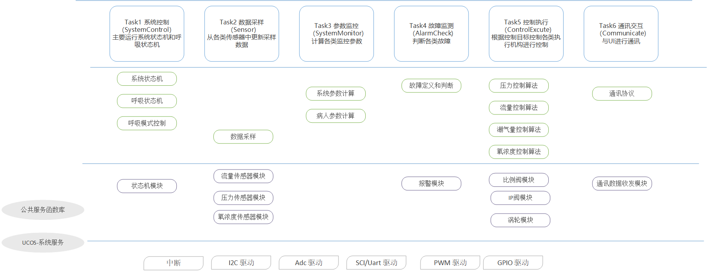
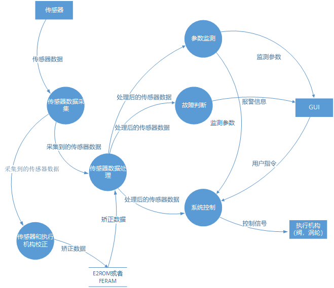
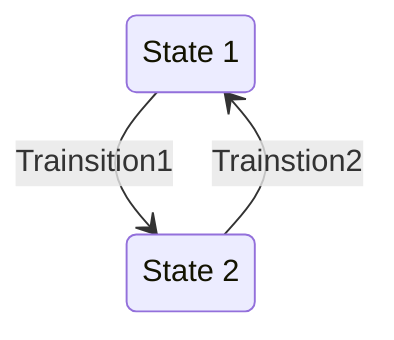
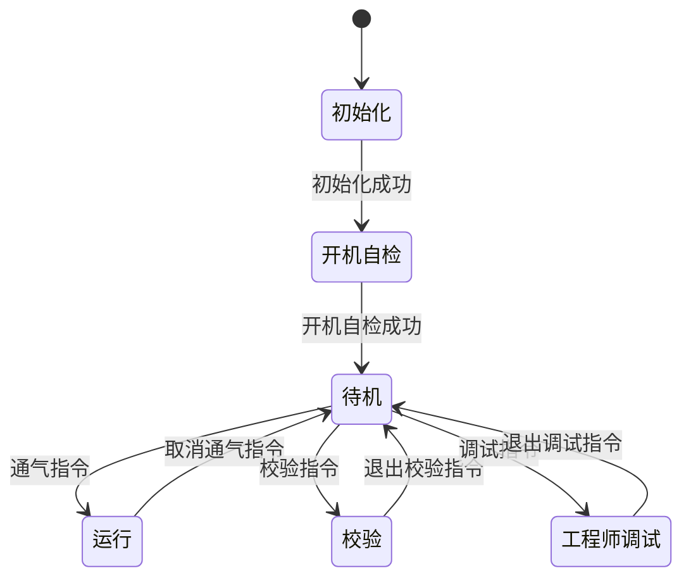
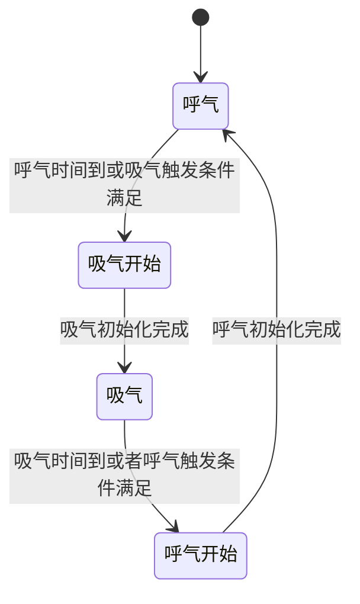
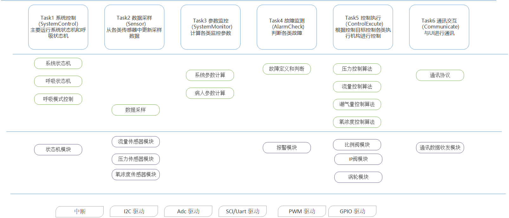
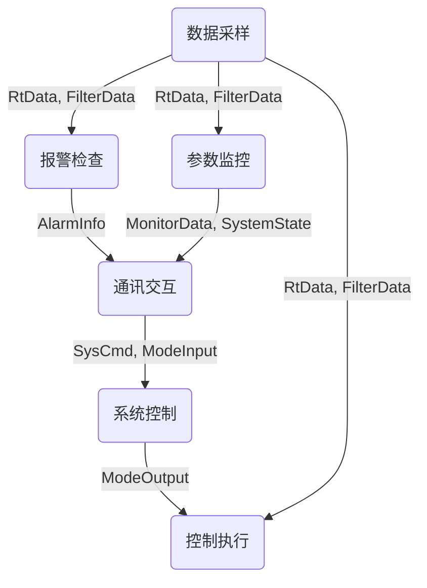

#  模块化软件平台设计

[TOC]

## 历史

| Version | date       | description                         | author | review |
| ------- | ---------- | ----------------------------------- | ------ | ------ |
| V0.1    | 2021.06.03 | 1. 对模块化软件平台做了初次整体设计 | 方冉   |        |
|         |            |                                     |        |        |


## 模块化软件平台架构设计

模块化软件平台架构的设计如下图所示，整个软件平台主要分为1. CPU外设驱动层，2. 通用模块层，3. 功能逻辑层，4. 公共服务库。

### 1. CPU外设驱动层

该层包括所有可能需要用到的外设的驱动实现，为上层提供硬件驱动接口。该层与硬件架构密切相关，考虑到我们目前主要用到TI的C2000DSP系列和STM32系列两种硬件架构，因此CPU驱动层也会按照这两种硬件架构分为两个软件包，虽然不同硬件平台的驱动实现不同，但是为了上层程序的复用性考虑，应尽量保证驱动调用的接口一致。此外STM32提供的标准外设库比较完备，需要重新编码的工作较少。而C2000系列DSP虽然也有官方提供的C2000 ware库，但是其中提供的驱动很少，需要自行编码的工作很多。

### 2. 通用模块层

该层模块包括所有在项目中可能会用到的具体的功能模块的软件实现。例如不同流量传感器模块，比例阀控制模块，IP阀控制模块，涡轮控制模块，氧传感器模块等。这一层的软件代码应该尽最大可能做到通用和易移植。

### 3. 功能逻辑层

这一层的软件负责调用不同的模块以实现项目中会用到的一些具体的功能逻辑，如报警模块，不同的通气模式实现，通气参数监测功能，气道参数计算功能，通讯协议实现，自建功能实现等。

### 4. 公共服务库

公共服务库部分提供一些通用的数据结构和功能模块实现，这部分代码与任何项目解耦，可以直接被移植和调用。例如PI控制器，数字滤波器，限幅器，循环队列，栈，链表等。


### 调用关系



## 系统数据流分析

数据流图简称DFD，它普遍应用于企业的管理系统中，是一种结构化系统分析工具。它从数据传递和加工角度，以图形方式来表达系统的逻辑功能、数据在系统内部的逻辑流向和逻辑变换过程，是结构化系统分析方法的主要表达工具及用于表示软件模型的一种图示方法。

### 数据流图的主要元素：

1. →：数据流。数据流是数据在系统内传播的路径，因此由一组成分固定的数据组成。如订票单由旅客姓名、年龄、单位等**数据项**组成。由于数据流是流动中的数据，所以必须有流向，除了与**数据存储**之间的数据流不用命名外，数据流应该用名词或名词短语命名。
2. □：数据源（终点）。代表系统之外的实体，可以是人、物或其他软件系统。
3. ○：对数据的加工（处理）。加工是对数据进行处理的单元，它接收一定的数据输入，对其进行处理，并产生输出。
4. 〓：数据存储。表示信息的静态存储，可以代表文件、文件的一部分、数据库的元素等。

### 呼吸机系统数据流图



## 驱动层接口设计(以DSP28335为例)

### CPU配置

- void InitSysCtrl(void)
  - 功能： 完成CPU初始化，包括系统时钟，CPU的外设时钟的配置。
  - 返回值: 无
  - 参数：  无 
  - 说明： 时钟的配置通过板级配置文件BSP中的宏定义实现
- void InitFlash(void)
  - 功能： 完成CPU片内flash的初始化，flash操作时序的配置
  - 返回值: 无
  - 参数：  无 
  - 说明： flash操作时序中的延时配置通过板级配置文件BSP中的宏定义实现。
- void  InitPeripheralClocks(void)
  - 功能： 完成CPU外设的初始化，包括高速和低速外设时钟总线的配置。
  - 返回值: 无
  - 参数：  无 
  - 说明： 时钟的配置通过板级配置文件BSP中的宏定义实现

### SCI/UART

- void InitSci(struct SciType SCIx, struct SciInitType *Init)

  - 功能： 初始化SCI外设模块。

  - 返回值： 无

  - 参数： SCIx: Sci外设寄存器结构体， 可以为Scia, Scib, Scic. Init: Sci外设初始化结构体

  - 说明： SciInitType结构体定义如下：

    ```c
    struct SciInitType {
    	Uint16	DataBits;
    	Uint16  StopBits;
    	enum ParitySel	Parity;
    	Uint16  SciIntSel;
    	Uint16  SciFifoMode;
    	Uint32	Baudrate;
    	Uint16  SciRxFifoLevel;
    	Uint16  SciTxFifoLevel;
    };
    ```

- int16 SciReadPoll(struct SciType *Scix, Uint16 *Buff, Uint16 Num)

  - 功能： 以查询的方式从SCI读取数据。
  - 返回值：如果有读到数据，返回读取的字节数。如果读数据失败返回负值的错误码。
  - 参数： Scix: Sci外设结构体指针，Buff: 读取数据的保存缓冲区， Num: 想要读取的字节数。
  - 说明：该方法会以查询的方式接收数据，但是不会阻塞，没有收到数据时也会立即返回。

- int16 SciWriteBlock(struct SciType *Scix, const Uint16 *Buff, Uint16 Num)

  - 功能：以阻塞的方式从SCI发送指定数据。
  - 返回值：成功发送数据的字节数。如果发送数据失败则返回负值的错误码。
  - 参数：Scix: Sci外设结构体指针，Buff: 发送数据的缓冲区， Num: 想要发送的字节数
  - 说明：该方法会阻塞的进行发送, 直到发送完毕或出现错误才会退出。

- void SciSendByte(struct SciType *Scix, Uint8 Data)

  - 功能： 通过Scix发送单个字节数据Data;
  - 参数： Scix: Sci外设结构体指针，Data: 要发送的单字节数据。
  - 返回值：无
  - 说明：无

- Uint8 SciRecvByte(struct SciType *Scix)

  - 功能： 通过Scix接收单个字节数据Data;
  - 参数： Scix: Sci外设结构体指针
  - 返回值： Scix接收到的单字节数据

### I2C

- void InitI2c(struct I2cType I2cx, struct I2cInitType *Init)
  - 功能： 初始化I2c外设模块。
  - 返回值： 无
  - 参数： I2cx: I2c外设结构体指针， 可以为I2ca. Init: I2c外设初始化结构体
  - 说明： I2cInitType结构体定义如下：

  ```c
  struct I2cInitType {
  	Uint16						Clock_kHz;
  	Uint16						I2cMode;
  	Uint16						I2cIntSrc;
  	Uint16						I2cFifoMode;
  	Uint16						I2cRxFifoLevel;
  	Uint16						I2cTxFifoLevel;
  };
  ```

- void I2cSendByte(struct I2cType *I2cx, Uint8 Data)

  - 功能： 通过I2cx发送单字节数据
  - 返回值: 无
  - 参数： I2cx: I2c外设结构体指针， Data: 要发送的单字节数据
  - 说明：

- Uint8 I2cRecvByte(struct I2cType *I2cx)

  - 功能： 通过I2cx接收单字节数据
  - 返回值: 接收到的单字节数据
  - 参数： I2cx: I2c外设结构体指针
  - 说明：

### ADC

- void InitAdc(struct AdcType *Adcx, struct AdcInitType *Init)
  - 功能:  初始化外设模块Adcx
  - 返回值：无
  - 参数：Adcx：Adc结构体指针， Init: Adc初始化结构体指针
  - 说明：
- Uint16 GetAdcData(struct AdcType *Adcx, int Channl)
  - 功能：获取指定通道的Adc采样值
  - 返回值：获取到的采样值
  - 参数：参数：Adcx：Adc结构体指针，Channl: Adc通道
  - 说明： 

### PWM

- ​	void InitPwm(struct PwmType *Pwmx, struct PwmInitType *Init)

  - 功能：初始化外设模块Pwmx;
  - 返回值：无
  - 参数： Pwm: Pwm结构体指针， 可以为Pwm1, Pwm2, Pwm3, Pwm4, Pwm5, Pwm6。Init: Pwm模块初始化结构体指针。
  - 说明：PwmInitType结构体定义如下：

  ```c
  struct PwmInitType{
  	Uint32 			ClockHz;
  	Uint16			CounterPeriod;
  	Uint16			CounterMode;
  	Uint16 			PhaseDir;
  	Uint16 			SynOutSel;
  	Uint16			IntEn;
  	Uint16			IntMode;
  	Uint16			IntPeriod;
  	struct CAMP		cmpA;
  	struct CAMP		cmpB;
  }EPWM_T;
  ```

- void UpdataPwmCounter(struct PWM_TYPE *Pwmx, Uint16 Value)

  - 功能：更新PWM比较寄存器值
  - 返回值：无
  - 参数：Pwmx: Pwm结构体指针，Value: 要更新的值
  - 说明：

### SPI

- void InitSpi(struct SpiType *Spix, struct SpiInitType *Init)
  - 功能： 初始化SPI模块Spix
  - 返回值： 无
  - 参数：Spix: Spi模块结构体指针
  - 说明：
- void SpiSendData(struct SpiType *Spix, Uint16 Data)
  - 功能：Spix发送单个数据
  - 返回值：无
  - 参数：Spix: Spi外设模块结构体指针，Data: 要发送的数据。
  - 说明：
- Uint16 SpiRecvData(struct SpiType *Spix)
  - 功能：Spix接收单个数据
  - 返回值：通过Spix接收到的单个数据
  - 参数：Spix: Spi外设模块结构体指针
  - 说明：

### 中断

- void InitPieCtrl(void)
  - 功能：初始化Pie中断控制器
  - 返回值：无
  - 参数：无
  - 说明：清零Pie使能位，清零所有Pie中断位
- void EnalbeInterrupts(void)
  - 功能： 使能PIE中断和CPU中断
  - 返回值：无
  - 参数： 无
  - 说明：
- void EnCpuIntSrc(Uint16 IrqId)
  - 功能： 使能中断号位IrqId的Cpu中断
  - 返回值：无
  - 参数： IrqId: Cpu 中断号
  - 说明：
- void DisCpuIntSrc(Uint16 IrqId)
  - 功能： 清零中断号位IrqId的Cpu中断使能位
  - 返回值：无
  - 参数： IrqId: Cpu 中断号
  - 说明：
- void EnPieIntSrc(Uint16 IrqGrp, Uint16 IrqId)
  - 功能： 使能Pie中断中的第IrqGrp组中的第IrqId个中断
  - 返回值：无
  - 参数： IrqGrp: Pie中断的组号， IrqId: 组内的中断号
  - 说明：
- void EnPieIntSrc(Uint16 IrqGrp, Uint16 IrqId)
  - 功能： 清零Pie中断中的第IrqGrp组中的第IrqId个中断使能
  - 返回值：无
  - 参数： IrqGrp: Pie中断的组号， IrqId: 组内的中断号
  - 说明：
- void InitPieVectTable(void)
  - 功能： 初始化中断向量表
  - 返回值： 无
  - 参数： 无
  - 说明：将中断向量表初始化为默认值
- int16 PieIrqRegisiter(Uint16 IrqId, PINT IrqHandler)
  - 功能： 注册中断向量表中的中断服务函数
  - 返回值：注册结果：成功或失败
  - 参数： IrqId: 中断号, PINT: 中断服务函数句柄（指针）
  - 说明：
- 

### Timer

- void InitCpuTimers(void)
  - 功能： 初始化Cpu定时器
  - 返回值： 无
  - 参数： 无
  - 说明：将CPU定时器初始化为默认状态
- void ConfigCpuTimer(struct CPUTIMER_VARS *Timerx, float Freq, float Period)
  - 功能： 配置CPU定时器x
  - 返回值：无
  - 参数：Timerx: CPU定时器结构体指针，可以为TImer0, TImer1, Timer2, Freq: CPU主频(单位MHZ)， Period: 定时周期，单位微秒
  - 说明： 无
- void StartTimer(struct CPUTIMER_VARS *Timerx)
  - 功能： CPU定时器x开始工作
  - 返回值：无
  - 参数：Timerx: CPU定时器结构体指针，可以为TImer0, TImer1, Timer2
  - 说明： 无
- void StopTImer(struct CPUTIMER_VARS *Timerx)
  - 功能： 停止CPU定时器x
  - 返回值：无
  - 参数：Timerx: CPU定时器结构体指针，可以为TImer0, TImer1, Timer2
  - 说明： 无


### 看门狗

- void InitWatchDog(void)
  - 功能：初始化看门狗
  - 返回值：无
  - 参数：无
  - 说明：看门狗模块的时钟通过BSP板级文件进行配置
- void EnableWatchDog(void)
  - 功能：使能看门狗模块
  - 返回值：无
  - 参数：无
  - 说明：调用该函数看门狗将会开始工作
- void ServiceWatchDog(void)
  - 功能：向看门狗模块喂狗
  - 返回值：无
  - 参数：无
  - 说明：通过此函数向看门狗定期喂狗，以确保不会进入看门狗复位。
- void DisableWatchDog(void)
  - 功能：关闭看门狗模块
  - 返回值：无
  - 参数：无
  - 说明：

## 公共服务层接口设计

### PID控制器

#### PID控制器说明

1. PID控制器的数学模型：

$$
u(t)=K_pe(t)+K_i\int e(t)dt+K_d \frac{\mathrm{d}e(t)}{\mathrm{d}t}
$$

​				其中u表示控制器输出，e表示给定和反馈之间的误差。

2. PID控制器的离散化

   控制器离散化的方式有很多种，这里采用后向差分的方式对前面的PI控制器进行离散化，得到：
   $$
   \begin{align}
   u(k) &= K_pe(k)+K_iT_s\sum_{i=1}^k e(i) + \frac{K_d}{T_s}(e(k)-e(k-1))\\
   	&= K_pe(k)+U_i(k) + \frac{K_d}{T_s}(e(k)-e(k-1))	\\
   	&= K_pe(k)+K_iT_se(k) + \frac{K_d}{T_s}(e(k)-e(k-1))+U_i(k-1)
   \end{align}
   $$
   其中，Ui表示对过去所有误差的积分。这样离散化得到的PI控制器称为**位置式PID控制器**， 这种PI控制器的输出与过去所有偏差的积累有关。并不易于熟悉控制系统的实现。

3. 增量式PID控制器

   对位置式PI控制器进行改进，计算每次控制器输出的增量：
   $$
   \begin{align}
     \Delta u(k) &= u(k)-u(k-1)  \\
                 &= K_p[e(k)-e(k-1)]+K_iT_se(k)+ \frac{K_d}{T_s}(e(k)-2e(k-1)+e(k-2)) \\
                 &= (K_p+K_iT_s+\frac{K_d}{T_s})e(k)-(K_p+\frac{2K_d}{T_s})e(k-1)+\frac{K_d}{T_s}e(k-2)
   \end{align}
   $$
   根据上式有：
   $$
   \begin{align}
   u(k) &=u(k-1)+(K_p+K_iT_s+\frac{K_d}{T_s})e(k)-(K_p+\frac{2K_d}{T_s})e(k-1)+\frac{K_d}{T_s}e(k-2)\\
   	&=u(k-1)+\alpha e(k) - \beta e(k-1) + \gamma e(k-2)   \\
   \end{align}
   $$
   其中：
   $$
   \begin{align}
   \alpha &= K_p+K_iT_s+\frac{K_d}{T_s}\\
   \beta &=K_p+\frac{2K_d}{T_s} \\
   \gamma &= \frac{K_d}{T_s}
   \end{align}
   $$
   这样就得到了离散化的**增量式PID控制器**，这种控制器实现方便，适合数字控制系统。

PID控制器结构体：

```c
typedef struct PID_REGULATOR
{
    float   Ref;        /*!< reference value */
    float   Fed;        /*!< feedback value  */
    float   Err;        /*!< error of reference and feedback value */
    float   Err_2;		/*!< error of reference and feedback of last time*/
    float   step; 		/*!< Output step */
    float   Out;        /*!< output of pi regulator */
	
    
    float   Alpha;      /*!< alpha parameter */
    float   Beta;       /*!< beta parameter */
    float   Gamma;		/*!< gama parameter */
    
    float   StepMax;		/*!< Step upper limit */
    float   StepMin;		/*!< Step lower limit */  
    float   OutMax;    /*!< output upper limit */
    float   OutMin;    /*!< output lower limit */
}PID_REGU;
```

#### PID控制接口

- PID_REGU *CreatePIDRegu(void)
  - 功能：创建一个PID控制器
  - 返回值：如果创建成功，则返回一个PID控制器的指针，如果创建失败，则返回空指针。
  - 参数：无
  - 说明：需要对返回值进行检查，避免创建失败。实际使用时，也可以直接定义变量，而不需要调用此函数。
- void InitPIDRegu(PID_REGU *p, float alpha, float beta, float gamma, float StepMax, float StepMin, float Outmax, float Outmin)
  - 功能：初始化PI控制器
  - 返回值：无
  - 参数：p: PID控制器结构体指针；alpha: PI控制器参数；beta：PID控制器参数；gamma: PID控制器参数；StepMax: PID控制器输出步长上限幅值； StepMin: PID控制器输出步长下限幅值；OutMax: PID控制器输出最大值；OutMin：PID控制器输出最小值。
  - 说明：
- PIDSetPara(PID_REGU *p, float alpha, float beta， float gamma)
  - 功能： 设置PID控制器控制参数
  - 返回值： 无
  - 参数： p: PID控制器结构体指针，alpha: PID控制器参数，beta：PID控制器参数, gamma: PID控制器参数，
  - 说明：
- PIDSetLimit(PID_REGU *p, float StepMax, float StepMin, float OutMax, float OutMin)
  - 功能：设置PID控制器输出限幅
  - 返回值：无
  - 参数：p: PID控制器结构体指针，StepMax: PID控制器输出步长上限幅值； StepMin: PID控制器输出步长下限幅值；OutMax: PID控制器输出最大值；OutMin：PID控制器输出最小值。
  - 说明：
- float PIDCalc(PID_REGU *p, float ref, float fed)
  - 功能：运行PID控制器，计算控制器输出
  - 返回值：PID控制器的输出
  - 参数：p: PID控制器结构体指针， ref: 控制器的目标值， fed：控制器的反馈值
  - 说明：计算结果位PID控制器的输出

### 循环队列

循环队列结构体：

```c
typedef int16_t     elem_t;

struct QUEUE {
    elem_t *data;
    int16_t front;
    int16_t rear;
    int16_t size;
};
typedef struct QUEUE *queue_t;
```

- queue_t 			queue_create(int16_t size);  
  - 功能： 创建一个循环队列
  - 返回值：如果创建成功，则返回循环队列指针，如果创建失败，则返回空指针
  - 参数： size: 循环队列的总长度。
  - 说明：需要检查返回值，避免创建失败。
- queue_state_t    queue_en(queue_t qp, elem_t d);
  - 功能：向循环队列中插入新元素。
  - 返回值：插入操作结果，插入成功返回0，插入失败返回相应错误代码。
  - 参数： qp: 循环队列指针；d: 要插入的新队列元素
  - 说明： 插入操作在队列满时可能会失败。
- queue_state_t    queue_de(queue_t qp, elem_t *d);
  - 功能：取出循环队列头部元素
  - 返回值：取值操作结果，取值成功返回0，取值失败返回相应错误代码。
  - 参数：qp:循环对了指针，d: 取出队列元素存放变量的指针。
  - 说明：在循环队列为空时，可能会失败。
- int16_t          queue_is_empty(queue_t qp);
  - 功能：判断循环队列是否为空
  - 返回值：队列是否为空，1表示队列为空，0表示队列中有值
  - 参数：qp: 循环队列指针。
  - 说明：
- int16_t          queue_is_full(queue_t qp);
  - 功能：判断循环队列是否已满
  - 返回值：队列是否为满，1表示队列已满，0表示队列有空余位置。
  - 参数：qp: 循环队列指针。
  - 说明：
- int16_t          queue_length(queue_t qp);
  - 功能：返回当前循环队列的长度
  - 返回值：当前循环队列的长度
  - 参数：ｑｐ：循环队列指针
  - 说明：
- void             queue_clear(queue_t qp);
  - 功能：清空循环队列
  - 返回值：无
  - 参数：ｑｐ：循环队列指针
  - 说明：队列中所有元素都会被清零
- void             queue_free(queue_t *qp);
  - 功能：释放（删除）循环队列
  - 返回值：无
  - 参数：ｑｐ：循环队列指针
  - 说明：删除循环队列所占用的内存空间。

### 链表

链表结构体：

```c
typedef int16_t elem_t;

enum LIST_RET {
    NO_ERR,
    MALLOC_FAILED,
    ELEM_NOT_FIND
};
typedef enum LIST_RET state_t;

struct NODE {
    elem_t data;
    struct NODE *next;
};
typedef struct NODE *list_t;
typedef struct NODE *pos_t;
```

- list_t* list_create(void);
  - 功能: 创建一个链表
  - 返回值：如果创建成功， 返回链表指针，否则返回NULL
  - 参数：无
  - 说明：
- state_t list_append(list_t l, elem_t d);
  - 功能：在链表尾端增加数据
  - 返回值：
  - 参数：l: 链表结构体， d: 要新增的元素
  - 说明：
- int16_t list_is_empty(list_t l);
  - 功能： 判断链表是否为空
  - 返回值：如果为空返回1
  - 参数： l：链表结构体
  - 说明：
- pos_t list_find_elem(list_t l, elem_t d);
  - 功能：在链表中查找元素
  - 返回值：如果超找到了返回该元素的节点指针，否则返回NULL
  - 参数： l：链表结构体， d：要查找的元素
  - 说明：
- state_t list_del_elem(list_t l, elem_t d);
  - 功能：在链表中删除元素
  - 返回值：删除成功返回0，删除失败返回错误码
  - 参数：  l：链表结构体， d: 要删除的元素
  - 说明：
- pos_t list_find_prev(list_t l, elem_t d);
  - 功能：在链表中查找一个元素的前一个元素（）
  - 返回值：如果超找到了返回该元素前驱的节点指针，否则返回NULL
  - 参数： l：链表结构体， d：要查找的元素
- state_t list_insert(list_t l, elem_t d, pos_t p);
  - 功能：在链表的指定位置插入一个元素
  - 返回值：插入成功返回0， 插入失败返回错误码
  - 参数：参数： l：链表结构体， d：要插入的元素， p: 指定的插入位置
  - 说明：
- void list_clear(list_t l);
  - 功能：清空链表
  - 返回值：无
  - 参数： l：链表结构体
  - 说明：
- void list_free(list_t *lp);
  - 功能：删除链表
  - 返回值：无
  - 参数：lp: 指向链表的指针
  - 说明：

### 数字滤波器

数字滤波器能够实现对数据的滤波作用，在我们软件中最常用的是数字一阶低通滤波器，通过低通滤波器可以有效的将相关的高频噪声滤除，但是如果滤波频率过低。

一阶低通数字滤波器结构体

```c
struct LPF_ST {
    float q;
    float output_last;
};
typedef struct LPF_ST FOLPF
```

- FOLPF *CreateLpf(uint16_t UpdataFreq, uint16_t FilterFreq)
  - 功能：创建一个一阶低通数字滤波器
  - 返回值：如果创建成功，返回一个一阶低通数字滤波器指针，如果失败，返回NULL
  - 参数：UpdataFreq: 数字滤波器的采样频率， FilterFreq: 数字滤波器的滤波截止频率
  - 说明：
- void InitLpf(FOLPF *lpf,  UpdataFreq, uint16_t FilterFreq)
  - 功能：初始化一个一阶低通数字滤波器
  - 返回值：无
  - 参数：lpf: 低通滤波器结构体指针，UpdataFreq: 数字滤波器的采样频率， FilterFreq: 数字滤波器的滤波截止频率
  - 说明：
- float LpfCalc(FOLPF *lpf, float input, float last)
  - 功能：对输入量进行低通滤波
  - 返回值：滤波结果
  - 参数： 

### 软件定时器

```c
struct SW_TIMER {
    uint16_t 	Tcnt;
    uint16_t	Tsample;
    uint16_t	Texpire;
};
```

- void InitSwTimer(struct SW_TIMER *Timer, uint16_t Tsample, uint16_t Texpire);
  - 功能：初始化软件定时器
- void SetSwTimerExpire(uint16_t Expire);
  - 功能：设置定时器定时时间
  - 返回值: 无
  - 参数:  Expire: 定时时间
  - 说明：
- uint16_t SwTimerExpired(struct SW_TIMER Timer);
  - 功能：判断定时时间是否已经达到
  - 返回值：定时器状态：返回1表示定时器已经计时到定时时间
  - 参数： Timer: 软件定时器结构体指针
  - 说明：
- void ResetSwTimer(struct SW_TIMER Timer);
  - 功能：清零定时器
  - 返回值：无
  - 参数：Timer：软件定时器指针
  - 说明：无

## 通用模块层接口设计

### 报警模块

```c
union ALARM_ATTR {
    uint16_t All;
    struct BITS {
        uint16_t Enable       :1;
        uint16_t Severe       :1;
        uint16_t Recoverable  :1;
        uint16_t Reserved     :13;
    }bits;
};

union ALARM_PREMISE {
    uint16_t All;
    struct PREMISE_BITS {
        uint16_t Standby       :1;
        uint16_t Inspiration   :1;
        uint16_t Expiration    :1;
        uint16_t Debug         :1;
        uint16_t Reserved      :12;
    }bits;
};


struct ALARM_MODULE {
    uint16_t 				flag;
    union ALARM_PREMISE		Premise;
    union ALARM_ATTR		Attr;
    
    struct SW_TIMER			AlarmTimer;
    struct SW_TIMER			RecoverTimer;
    
    int16_t			Thres;
    int16_t			ThresRecover;
    
    int16_t  		(*Judge)(void *, void *);
    int16_t			(*Recover)(void *, void *);
};
```

- void InitAlarm(struct ALARM_MODULE* Alarm, uint16_t Premise, uint16_t Attr, int16_t Thres, int16_t ThresRecover);
  - 功能：初始化一个报警模块。
  - 返回值：无
  - 参数：Alarm: 报警模块结构体指针， Premise: 报警前提条件（状态），Attr: 报警属性，Thres：报警限值，ThresRecover: 报警恢复限值。
  - 说明：
- uint16_t CheckAlarm(struct ALARM_MODULE*  Alarm, uint16_t input);
  - 功能：检查一个报警模块的状态。
  - 返回值：当前报警模块的状态
  - 参数：Alarm: 报警模块结构体指针
  - 说明：
- void SetAlarmThres(struct ALARM_MODULE *Alarm, uint16_t Thres);
  - 功能：设置报警模块的报警限值
  - 返回值：无
  - 参数：Alarm: 报警模块结构体指针，uint16_t Thres
  - 说明：

### 状态机

> A finite state machine (FSM) is a machine specified by a finite set of conditions of existence
> (called “states”) and a likewise finite set of transitions among the states triggered by events.  
>
> A state diagram is a type of diagram used in computer science and related fields to describe the behavior of systems. State diagrams require that the system described is composed of a finite number of states; sometimes, this is indeed the case, while at other times this is a reasonable abstraction.



状态机结构体：

```c
typedef uint16_t (*TriggerFcn)(void *);
typedef void (*StateWorkFcn)(void *);
typedef void (*StateEntryFcn)(void *);
typedef void (*StateExitFcn)(void *);

struct STATE {
	uint16_t		Index;			// System state index

	StateWorkFcn	Work;			// Repeat running work in this state
	StateEntryFcn	Entry;			// Function invoked when entry this state
	StateExitFcn	Exit;			// Function invoked when exit this state
	TriggerFcn		Trig;			// State transition trigger function
};

struct STATE_MACHINE {
	struct STATE 	*CurrentState;
	struct STATE 	*StateTbl[];
	uint16_t 		StateNum;
	uint16_t        StateNumMax;
};
```

- struct STATE_MACHINE *CreateStateMachine(uint16_t Size)
  - 功能：创建一个状态机
  - 返回值：如果创建成功，则返回状态机指针，如果创建失败，则返回空指针。
  - 参数： Size： 状态机中包含的状态数量。
  - 说明： 需要检查返回值，避免创建失败。
- int16_t RegisterState(struct STATE_MACHINE *Machine, uint16_t Index, StateWorkFcn Work, StateEntryFcn Entry, StateExitFcn Exit, TriggerFcn Trigger)
  - 功能：注册状态机中的状态
  - 返回值：
  - 参数：
    - Machine: 状态机指针，
    - Index: 状态索引，
    - Work: 状态工作函数，如果没有，可以传入NULL， 
    - Entry: 状态进入操作函数， 如果没有，可以传入NULL， 
    - Exit: 状态退出操作函数， 如果没有，可以传入NULL
    - Trigger: 状态转移触发函数。
  - 说明：状态机中每个状态的进入，退出，工作和转移操作需要编程者自己设计，然后调用此函数将状态注册到状态机中。
- void RunStateMachine(struct STATE_MACHINE *Machine)
  - 功能：运行状态机。
  - 返回值： 无
  - 参数：Machine: 状态机指针
  - 说明：

### 存储管理

目前项目中用到的存储器件主要有：flash， EEPROM 和FERAM。不同的存储硬件有不同的接口和读写方法。为了给上层调用者提供统一方便的接口，应该隐藏具体存储硬件的读写差异，提供一组通用的存储操作：

- int16_t 	ReadMemory(uint16_t Addr, uint16_t Size,  uint16_t Buff[]);
  - 功能：读取某一存储地址的数据
  - 返回值：实际读取到的字节数，如果为负值表示读取失败错误码
  - 参数：Addr: 读取地址， Size: 读取字节数， Buff: 读取数据的缓冲
  - 说明：
- int16_t     WriteMemory(uint16_t Addr, uint16_t Size, const uint16_t Buff[]);
  - 功能：向某一存储地址写数据
  - 返回值：实际写入数据的字节数，如果为负值表示相应的写失败错误码
  - 参数：Addr: 写入地址，Size: 写入字节数，Buff: 要写入数据的缓冲
  - 说明：

通用的读写接口通过输入地址范围来调度不同硬件读写模块的读写接口，不同的存储设备的读写接口也具有类似的形式如下：

#### Flash读写

- int16_t FlashRead(uint16_t Addr, uint16_t Size,  uint16_t Buff[]);
- int16_t FlashWrite(uint16_t Addr, uint16_t Size,  uint16_t Buff[]);

#### EEPROM读写

- int16_t E2RomRead(uint16_t Addr, uint16_t Size,  uint16_t Buff[]);
- int16_t E2RomWrite(uint16_t Addr, uint16_t Size,  uint16_t Buff[]);

#### FERAM读写

- int16_t FeRamRead(uint16_t Addr, uint16_t Size,  uint16_t Buff[]);
- int16_t FeRamWrite(uint16_t Addr, uint16_t Size,  uint16_t Buff[]);

### 比例阀

#### 比例阀控制说明

比例阀主要用来实现流速控制，不同厂家不同型号的比例阀特性不同，但是对于比例阀控制的基本框架是相同的，目前采用的基本都是前馈加反馈的形式。反馈项主要通过PI控制器或PID控制器实现，前馈项则由比例阀自身的特性相关，差异较大。为了使软件能够灵活适应不同的比例阀，选择将比例阀控制中相同的部分抽象出来，定义如下：

比例阀模型结构体：

```c
typedef struct PROPO_VALVE_ST {
    float       FlowMax;			// Maxium flow limit
    float 		FlowMin;			// minium flow limit
			
    float       Gain;				// Gain parameter in valve model
    float       Inc;				// Intercept parameter in valve model
	float 		FFCoe;				// Feedforward coefficient
    		
    PID_REGU    *pid;				// PID controller
    float       (*ValveModelCalc)(struct PROPO_VALVE_ST *valve, float Ref);		// Valve model, If not specified, output = flow * Gain + Inc;
} PROPO_VALVE;

static float ValveModeDefault(struct PROPO_VALVE_ST *Valve, float Ref)
{
 	float Ret = 0;
    Ret = Valve->Gain * Ref + Inc;
    
    return Ret;
}
```

其中 ValveModelCalc为一个函数指针，需要将其定义为用户自己定义的具体的比例阀模型，用户定义的这个函数应该实现的功能是：给定一个流量的目标值，能够返回根据模型计算出的理论驱动占空比。如果这个指针为空，那么将会采用默认的方式Output = FlowRef * Gain +Inc的方式计算前馈值。


比例阀驱动结构体：

```c
typedef struct VALVE_DRIVE {
    float   	DriveDuty;				
    float   	DutyMax;				// Maxium duty limit
    float   	DutyThres;				// Valve open threshold duty
    uint16_t  	PwmPeriod;				// PWM counter period
    uint16_t  	*PwmOutput;				// PWM comparator counter pointer
} PROPO_VALVE_DRIVE;
```

#### 比例阀控制接口

- void PorpoValveInit(PROPO_VALVE*v, float gain, float inc, float FFCoe, float flow_max);
  - 功能：初始化比例阀
  - 返回值：无
  - 参数：v: 比例阀结构体指针， gain: 比例阀模型增益，inc：比例阀模型截距，FFCoe: 前馈系数，flow_max: 比例阀支持的最大流量。
  - 说明：
- void ValveDriveInit(PROPO_VALVE_DRIVE*d, float duty_thres, float duty_max, uint16_t pwm_period, uint16_t *pwm_output);
  - 功能：初始化比例阀驱动
  - 返回值：无
  - 参数： d: 比例阀驱动结构体指针，duty_thres: 比例阀开启的PWM阈值， duty_max: 比例阀驱动PWM的计数周期，PwmOutput: 比例阀驱动PWM的比较器值指针。
  - 说明：
- float PropoValveCtrl(PROPO_VALVE *v, float flow_ref, float flow)
  - 功能：比例阀控制
  - 返回值：比例阀驱动PWM值（百分比）
  - 参数：v: 比例阀结构体指针，FlowRef: 流量控制目标， Flow: 流量反馈值
  - 说明：函数根据目标流量和反馈流量完成比例阀控制。
- float PropoValveDrive(PROPO_VALVE_DRIVE*d, float duty);
  - 功能：比例阀驱动
  - 返回值：比例阀驱动PWM的比较寄存器值
  - 参数：d: 比例阀驱动结构体指针， duty: 比例阀驱动占空比（百分比）
  - 说明：根据比例阀控制输出的duty值，驱动比例阀。

### IP 阀

#### IP阀控制说明

IP阀的控制框架与比例阀控制相同，均采用前馈加反馈的控制框架，但是IP阀的模型相对于比例阀要复杂，由于比例阀前后端压差特别大，后端压力变化对于比例阀控制影响很小。但是对于IP阀来说，流量的变化对于IP阀压力控制特性的影响是很大的，因此通过IP阀模型求取前馈量的过程会更复杂。与比例阀相同，同样定义如下的IP控制结构体，其中开放了IP阀的模型计算函数指针可以让使用者注册自己写的IP阀模型, 如果为空指针，同样默认采用线性的模型。

IP阀模型结构体：

```c
typedef struct IP_VALVE_STRUCT {
    float       PressMax;
    float 		PressMin;

    float       Gain;
    float       Inc;
	float       FFCoe;
    
    PI_REGU     *Pi;
    float       (*ValveModelCalc)(float Pressure, void *data)
} IP_VALVE;
```

IP阀驱动结构体

```c
typedef struct VALVE_DRIVE {
    float   	DriveDuty;
    float   	DutyMax;
    float   	DutyThres;
    uint16_t  	PwmPeriod;
    uint16_t  	*PwmOutput;
} IP_VALVE_DRIVE;
```

#### IP阀控制接口

- void IpValveInit(IP_VALVE *v, float gain, float inc, float FfCoe, float flow_max);
  - 功能：初始化IP阀
  - 返回值：无
  - 参数：v: IP阀结构体指针， gain: IP阀模型增益，inc：IP阀模型截距，FfCoe: 前馈系数，flow_max: IP阀支持的最大压力。
  - 说明：
- void IpValveDriveInit(IP_VALVE_DRIVE*d, float duty_thres, float duty_max, uint16_t pwm_period, uint16_t *pwm_output);
  - 功能：初始化IP阀驱动
  - 返回值：无
  - 参数： d: IP阀驱动结构体指针，duty_thres: IP阀开启的PWM阈值， duty_max: IP阀驱动PWM的计数周期，PwmOutput: IP阀驱动PWM的比较器值指针。
  - 说明：
- float IpValveCtrl(IP_VALVE *v, float PressRef, float Press);
  - 功能：IP阀控制
  - 返回值：IP阀驱动PWM值（百分比）
  - 参数：v: IP阀结构体指针，PressRef: 压力控制目标， Press: 压力反馈值
  - 说明：函数根据目标压力和反馈压力完成IP阀控制。
- float IpValveDrive(IP_VALVE_DRIVE*d, float duty);
  - 功能：IP阀驱动
  - 返回值：IP阀驱动PWM的比较寄存器值
  - 参数：d: IP阀驱动结构体指针， duty: IP阀驱动占空比（百分比）
  - 说明：根据IP阀控制输出的duty值，驱动IP阀。

### 流量传感器

在不同的项目中可能会用到不同的流量传感器，不同的流量传感器有着不同的配置和流量读取方式。为了能够方便修改程序以适配不同的流量传感器，可以加一层流量传感器的软件代理，以隐藏不同硬件流量传感器之间的差异。当使用的流量传感器硬件发生变化时，不需要对流量传感器相关函数的调用者做任何修改，直接修改底层流量传感器的接口即可。

```c
struct FLOW_SENSOR {
	float FlowZero;
    
	float (*GetFlow)(void);									// Get flow data
	void  (*Calibrate)(struct FLOW_SENSOR *);				// Calibrate flow sensor
	void  (*Config)(uint16_t);								// Configure sensor
};
```

#### 霍尼韦尔HAF系列流量传感器

```c
float HAF_GetFlow(void);					
void  HAF_ConfigSensor(uint16_t cmd);		
void  HAF_CaliSensor(struct FLOW_SENSOR *sensor);				
```

#### SENSORIES SFM3x系列传感器

``` c
float SFM3x_GetFlow(void);
void  SFM3x_ConfigSensor(uint16_t cmd);
void  SFM3x_CaliSensor(struct FLOW_SENSOR *sensor);
```

#### 流量传感器定义和使用举例

例如项目中使用到了一个SFM3200作为近端流量传感器，两个HAF传感器分别作为空气和氧气流量传感器。可以做如下定义：

``` c
struct FLOW_SENSOR ProxFLowSensor = {0, SFM3x_GetFlow, SFM3x_CaliSensor, SFM3x_ConfigSensor};
struct FLOW_SENSOR O2FlowSensor = {0, HAF_GetFlow, HAF_CaliSensor, HAF_ConfigSensor};
struct FLOW_SENSOR AirFlowSensor = {0, HAF_GetFlow, HAF_CaliSensor, HAF_ConfigSensor};

ProxFlow = ProxFlowSensor.GetFlow();		// Get proximate flow
O2Flow = O2FlowSensor.GetFlow();			// Get O2 flow
AirFlow = AirFlowSensor.GetFlow();			// Get Air flow
```

### 氧浓度传感器

与流量传感器相同，项目中可能会使用不同氧浓度传感器，同样为了软件更方便的适配不同的氧浓度传感器，选择加一层氧浓度传感器的代理，当硬件变化时，只需要更改响应的底层传感器接口即可。

```c
struct O2_CONC_SENSOR {
    float O2Conc_21;
    float O2Conc_100;
    float (*GetO2Conc)(void);
    void  (*Calibrate)(struct O2_CONC_SENSOR *);
}
```

#### Moxa化学氧传感器

``` c
float Moxa_GetO2Conc(void);
void  Moxa_Calibrate(struct O2_CONC_SENSOR *);
```

#### 顺磁氧传感器

``` c
float Paramag_GetO2Conc(void);
void  Paramag_Calibrate(struct O2_CONC_SENSOR *);
```

### 压力传感器

同样为了隐藏硬件的具体细节，定义压力传感器的代理：

```c
struct PRESSURE_SENSOR {
    float PressureZero;
    float (*GetPressure)(void);
    void  (*Calibrate)(struct PRESSURE_SENSOR *);
}
```


### 涡轮


## 功能逻辑层接口设计

### 系统状态机

系统控制字定义

| bits      | name           | description       |
| --------- | -------------- | ----------------- |
| bit0      | 开机自检指令   | 1：开机自检       |
| bit1      | 通气指令       | 1：开始通气运行   |
| bit2      | 待机指令       | 1：进入待机       |
| bit3      | 设备校验指令   | 1：进入校验状态   |
| bit4      | 工程师调试指令 | 1：进入工程师模式 |
| bit5-bit7 | 保留           |                   |
|           |                |                   |




- void SysStateMachineCreate(void)
  - 功能：创建系统状态机，并注册所有系统状态
  - 返回值：无
  - 参数：无
  - 说明：通过公共服务层中的状态机模块提供的接口，创建一个系统状态机，同时将所有的系统状态注册到该状态机中。
- void SysStateMachineRun(void)
  - 功能：运行系统状态机
  - 返回值：无
  - 参数：无
  - 说明：运行系统状态机。

### 呼吸状态机



- void VentiStateMachineCreate(void)
  - 功能：创建呼吸状态机
  - 返回值：无
  - 参数：无
  - 说明：通过调用状态机模块接口创建一个呼吸状态机
- void VentiStateMachineRun(void)
  - 功能：运行呼吸状态机
  - 返回值：无
  - 参数：无
  - 说明：运行呼吸状态机

### 呼吸模式

不同的呼吸模式主要是呼气和吸气时的控制目标不同,切换的方式不同,对应的就是在不同的呼吸相下控制目标不同,呼吸转换触发方式不同.因此可以将呼吸模式抽象成4个操作,吸气控制,呼气控制,吸气触发,呼气触发.可以建立一张呼吸模式的表，然后根据当前的模式选择将呼吸模式的操作注册到呼吸状态机中。

呼吸模式结构体定义：

```c
struct VENTI_MODE {
    uint16_t			Index;
	ModeInspFcn  		Insp;
	ModeExpFcn			Exp;
	ModeInspTrig		InspTrig;
	ModeExpTrig			ExpTrig;
};
```

呼吸模式输入：

```c
struct MODE_INPUT {
	float 		Pinsp;
    float 		Peep;
    float 		Ti;
    float		Te;
    float		VgVlSel;
}
```

呼吸模式输出定义：

```c
struct MODE_OUTPUT {
	float	 	InspPaw;
	float	 	InspFlow;
    float 		ExpPaw;
    float       ExpFlow;
};
```

- void ChangeMode(uint16_t ModeIndex);
  - 功能：切换呼吸模式
  - 返回值：无
  - 参数：ModeIndex: 呼吸模式索引。
  - 说明：切换呼吸模式前提应该是待机或者是呼气末，可以在程序中通过任务间同步机制来协调，如使用信号量做同步。

### 参数监测

定义REALTIME_DATA结构体为通用模块层通过各种传感器或者ADC直接采样的到的数据，例如NNP项目中有如下数据：

```c
/* Real time data from sensor */
struct REALTIME_DATA {
	float PAirSrc;		// Air source pressure
	float PO2Src;		// O2 source pressure
	float Pprox;		// Proximity pressure
	float Pinsp;		// Inspiration port pressure
	float PAtmos;		// Atmospheric pressure

	float FlowAir;		// Air source flow
	float FlowO2;		// O2 source flow
	float FLowProx;		// Proximity flow

	float FiO2;			// O2 concentration
};
```

定义MonitorData结构体为对原始数据经过处理后得到的监控数据：

```c
/* monitor data after data process */
struct MONITOR_DATA {
	float Ppeak;		
	float Peep;
	float Pmean;

	float Vti;
	float Vte;
	float Mvi;
	float Mve;

	float FreqTotal;
	float FreqSpont;
	float Ti;
	float Te;
};
```

- void UpdateSensorData(struct REALTIME_DATA  *RtData);
  - 功能：更新当前所有传感器的数据
  - 返回值：无
  - 参数：RtData: 指向实时采样数据的结构体指针。
  - 说明：在此函数中调用通用模块层中的各种传感器数据读取函数。实现传感器数据的更新。
- void FiltrateSensorData(struct REALTIME_DATA Origin, struct REALTIME_DATA  Output)
  - 功能：对直接从传感器获取到的数据进行滤波
  - 返回值： 无
  - 参数： Origin: 从传感器获取的原始采样数据， Output: 经过滤波处理后的采样数据。
  - 说明：并非所有采样数据都需要滤波，滤波频率也需要看具体需要。
- void CalcMonitorData(struct REALTIME_DATA Origin, struct MONITOR_DATA Monitor)
  - 功能：通过实时的采样数据计算需要进行监测的参数。
  - 返回值：无
  - 参数：Origin: 传感器实时采样数据（没有滤波或者滤波后的）， Monitor: 经过计算和处理后的监控数据。
  - 说明：监控数据中很多和呼吸周期以及时间因素有关，这就需要用到任务间的同步机制。

### 故障监测

针对呼吸机的不同监测值和设备运行状态应该实时进行报警判断，系统级的报警信息可以用报警字的机制来判断。每个报警占用1bit的信息，该bit为1表示为故障报警状态，为0表示为正常状态。考虑到呼吸机中的故障可以分为设备类和生理类，可以将这两类故障分成不同的故障字表示。例如：

| 生理报警字bit | name         | description                  |
| ------------- | ------------ | ---------------------------- |
| 0             | 气道压力高   | 监测测到起到压力高于保护限值 |
| 1             | 分钟通气量低 | 监测到分钟通气量低于保护值   |
| 2             | 窒息         | 监测到窒息                   |
| 3-15          | ...          | ...                          |
|               |              |                              |

| 设备报警字BIT | name                 | description                  |
| ------------- | -------------------- | ---------------------------- |
| 0             | 近端流量传感器未连接 | 检测到没有连接近端流量传感器 |
| 1             | 氧传感器需要校验     | 检测到氧传感器需要重新校验   |
| 2             | 电池电量低           | 检测到电池电量低于10%        |
| 3-15          | ...                  | ...                          |

这样所有的故障在程序中只需要两个uint16_t型来表示，利于程序中对于故障状态的判断和处理。在向UI发送数据时也不用一个故障就发送一个字，减少了数据传输量。

### 通信协议

通信协议所作的是，在接收时将一帧数据按照协议解析成命令和参数，在发送时将相应的命令与参数按照协议打包成一帧数据发送。

- void ParseReceiveCmd(uint16_t *Frame)
  - 功能：按照协议解析收到的收据
  - 返回值： 无
  - 参数： Frame：指向收到的数据帧的指针
  - 说明：
- void SendCmd(uint16_t Origin, uint16_t Dest, uint16_t Cmd, uint16_t *Data)
  - 功能：按照协议将命令和数据打包成帧发送
  - 返回值：无
  - 参数：Origin: 源地址， Dest: 目标地址， Cmd: 指令， Data: 数据
  - 说明：

### 控制算法

#### 压力控制

由于不同的项目中压力控制的执行机构不同，有使用IP阀实现压力控制的，也有使用涡轮实现压力控制的。为了对上层接口的统一，使用条件编译的方式做一个函数的封装。

```c
#ifdef PRESS_ACTUATOR  == IP_VALVE		// Control pressure through IP valve
	#define PressCtrl(Ref, Press, Actuator) PressCtrlVlave(Ref, Press, Actuator)
#else  									// Control pressure through SERVO
	#define PressCtrl(Ref, Press, Actuator) PressCtrlServo(Ref, Press, Actuator)
#endif
```

- void PressCtrlValve(float PressRef,  float Press, IP_VALVE *Servo);
  - 功能：基于IP阀 实现压力控制
  - 返回值：无
  - 参数：PressRef: 压力控制目标， Press: 压力反馈， Valve: 用于压力控制的IP阀结构体指针。
  - 说明： 
- void PressCtrlServo(float PressRef,  float Press, SERVO *Servo);
  - 功能：基于涡轮实现压力控制
  - 返回值：无
  - 参数：PressRef: 压力控制目标， Press: 压力反馈， Servo: 用于压力控制的涡轮结构体指针。
  - 说明： 

#### 流量控制

与压力控制一样，针对可能存在的不同执行机构，采用条件编译的方式做一层封装：

```c
#ifdef FLOW_ACTUATOR  == PROPO_VALVE		// Control flow through IP valve
	#define FlowCtrl(Ref, Press, Actuator) FlowCtrlVlave(Ref, Press, Actuator)
#else  									// Control flow through SERVO
	#define FlowCtrl(Ref, Press, Actuator) FlowCtrlServo(Ref, Press, Actuator)
#endif
```

- void FlowCtrlValve(float FlowRef,  float Flow, PROPO_VALVE *Valve);
  - 功能：基于比例阀实现流速控制
  - 返回值：无
  - 参数：FlowRef: 流速控制目标， Flow: 流速反馈, Valve: 用于流速控制的比例阀结构体指针。
  - 说明：
- void FlowCtrlServo(float FlowRef,  float Flow, Servo *Servo);
  - 功能：基于涡轮实现流速控制
  - 返回值：无
  - 参数：FlowRef: 流速控制目标， Flow: 流速反馈, Servo: 用于流速控制的涡轮结构体指针。
  - 说明：

#### 潮气量控制

-  float VtCtrl(float VtRef, float Vt);
  - 功能： 实现潮气量控制
  - 返回值：潮气量控制输出目标，一般是流量目标或者压力目标
  - 参数：VtRef：潮气量控制目标，Vt：潮气量反馈
  - 说明：　

#### 氧浓度控制

-  float　O2ConcCtrl(float ConcRef, float O2Conc);
  - 功能：实现氧浓度控制
  - 返回值：氧气占总气体容量的百分比
  - 参数：ConcRef: 氧浓度控制目标，O2Conc: 氧浓度反馈
  - 说明：


## ucos任务设计

#### 任务分配与调用层次

任务的分配和设计属于应用层的工作，这里只给出一个大概的设计，针对不同的项目应该有不同的任务规划。

| task     | description                | 主要输入                                   | 主要输出                 |
| -------- | -------------------------- | ------------------------------------------ | ------------------------ |
| 系统控制 | 运行系统状态机和呼吸状态机 | 来自UI的指令，模式参数                     | 呼吸模式输出，系统状态   |
| 数据采样 | 从各类传感器中更新采样数据 | 硬件传感器（外部实体）                     | 实时采样数据             |
| 控制执行 | 计算各类监控参数           | 呼吸模式的输出（各类控制目标）             | 执行机构动作（外部实体） |
| 故障监测 | 判断各类故障               | 实时采样数据和监控数据                     | 故障数据                 |
| 参数监控 | 根据控制目标执行各种控制   | 实时采样数据                               | 监控数据                 |
| 通讯交互 | 与UI进行交互               | 实时采样数据，监控数据，故障数据，系统状态 | 控制指令，模式参数       |




#### 任务间的数据交互



#### 任务间的同步

1. 数据采样是其他任务的基础，当数据采样更新时可以通过任务间通信的方式通知参数监控，报警检查模块。
2. 系统控制输出控制目标，当控制目标更新时就可以通知控制执行任务进行控制动作更新。
3. 参数监控中的部分参数和呼吸周期的阶段有关，当系统控制中的呼吸状态达到特定阶段时（呼气末）通过通信的方式通知参数监测模块。
4. 模式切换应该只能在待机或者呼气阶段进行

#### 需要保护的全局数据

1. 呼吸计时器：记录吸气时间，呼气时间，整个呼吸时间。
2. 系统状态：包括系统状态和呼吸状态
3. 呼吸模式

## 模块测试要求

### 系统调试开关和调试信息定义

在进行系统调试时，需要执行一些调试代码或者打印一些调试信息，在软件正式版本发布时，这部分代码又不应当执行，所以需要在程序中配置相应的调试开关，并做一些调试信息的规范，已方便后期软件的维护。


### 单元测试程序编写

在进行功能模块的程序编写时，应当同时要编写相应的单元测试程序。单元测试程序中要调用所测试的软件模块，并给不同的输入，测试模块的输出结果。

### 单元测试报告
