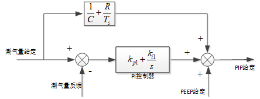

# 呼吸机潮气量控制

## 介绍

潮气量（Tidal volume,VT）是指平静呼吸时每次吸入或呼出的气量。它与年龄、性别、体积表面、呼吸习惯、机体新陈代谢有关。吸气和呼气时的潮气量分别称为吸气潮气量(Vti)和呼气潮气量(Vte)。设定的潮气量通常指吸入气量， 潮气量的设定并非恒定，应根据病人的血气分析进行调整。正常情况下：成人：8-10ml/kg， 小儿：6-10ml/kg。

## 相关概念

### 1. 气道阻力Airway Resistance

$$
R_{aw}=\frac{\Delta P}{\dot V}
$$

吸气阻力
$$
R_{awI}=\frac{PIP-P_{plat}}{\dot V_{I\_End}}
$$
呼气阻力
$$
R_{awE}=\frac{P_{plat}-PEEP}{\dot V_{E\_Max}}
$$

### 2. 顺应性Compliance

$$
Compliance = \frac{\Delta V}{\Delta P}
$$

静态顺应性与动态顺应性

> Static lung compliance is the change in volume for any given applied pressure. Dynamic lung compliance is the compliance of the lung at any given time during actual movement of air.

$$
C_{stat}=\frac{V_T}{P_{plat}-PEEP}
$$

$$
C_{dyn}=\frac{V_T}{PIP-PEEP}
$$
## 理论模型

根据人肺和呼吸机连接时的理论建模：
$$
\Delta P_{aw}=\dot V*R+\frac{\Delta V}{C}
$$

当采样时间足够短的时候，用差分代替积分得到：
$$
\Delta P_{aw} =\frac{\Delta V}{\Delta t} * R + \Delta V/C=\Delta V(\frac{RC+T_s}{C*T_s})
$$
对上式两边做一个吸气时间的积分：
$$
PIP-PEEP=V_T*(\frac{RC+T_s}{C*T_s})
$$
这样可以得到潮气量与气道压力之间的关系，将潮气量的控制转化为气道压力的控制。

### 控制算法

根据上面的理论推导，得到了潮气量与峰值压力PIP以及PEEP之间的关系，可以通过该关系将对潮气量的控制转化为对气道压力的控制。但这种控制是开环的，会有静态误差。因此在前面的基础上还需要加上闭环的控制，直接采用PI反馈调节即可。最终的控制框图如下：

最终得到的PIP给定，可以结合吸气时间，得到吸气相的实时气道压力给定。

