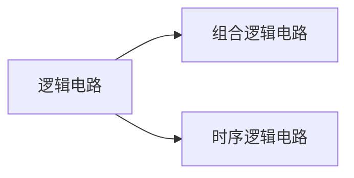

# 软考嵌入式系统设计师

## 数字电路基础

### 组合逻辑电路

电路在任一时刻的输出仅取决于该时刻的输入信号，而与输入信号作用前的电路状态无关。

组合逻辑电路一般由没电路组成，没有记忆原件，而且输入输出之间无反馈。

#### 组合逻辑电路的描述

1. 真值表
2. 布尔代数： AND, OR, NOT
   1. 摩根定律: $\overline{A+B}=\overline{A}\bullet\overline{B} \\ \overline{A\bullet B}=\overline{A}+\overline{B} $
3. 门电路：任何一种逻辑电路都可以由与，或，非门电路实现，或者由（与非，或非门实现）

#### 译码器与编码器

译码器是一个多输入多输出的组合逻辑网络，对于n个输入端，m个输出端的译码器，每输入一个n位的二进制代码，m个输出端只有一个有效。编码器的功能则与译码器相反。

1. 二进制译码器：2-4译码器，3-8译码器
2. 二-十进制译码器：8421码输入（余3码输入）译成对应十进制
3. 显示译码器

#### 数据选择器与数据分配器

1. 数据选择器：又称多路开关，在选择信号的作用下，从输入通道中选择一个通道的数据作为输出。**数据选择器除了选择输入通道，还可以利用它实现任意的组合逻辑函数， 2n个数据输入的多路选择器可以实现n+1个变量的组合逻辑函数**
2. 数据分配器：数据分配器又称为多路分配器，它有一个输入和多个输出，能够在选择信号的作用下将输入信号送至输出端的某一个。
3. 双向多路开关：将多路选择器和多路分配器并联使用，就可以实现在一条线上分时的传送多路信号。

### 时序逻辑电路

时序逻辑电路的任一时刻的输出不仅与该时刻的输入有关，还与该时刻电路的状态有关。时序逻辑电路中必须包含记忆原件。

### 时序逻辑电路基础

1. 时钟信号：有固定周期并与运行无关的信号量，它决定逻辑单元中的状态何时刷新。
2. 触发器：

   1. 电位触发器：输出信号只在同步控制信号为“1”或“0”时反应输入信号的变化。当同步控制信号不是约定有效电平时，输出信号维持之前的状态不变。通常用来实现锁存器。
   2. 边沿触发器（延时触发器）：触发器时时钟信号CP的某一约定的跳变来到时的输入数据。在CP=1，CP=0以及非约定跳变边沿时，触发器不接收数据。具有很强的抗数据端干扰能力，可以用来组成寄存器，计数器和移位寄存器。

3. 寄存器
4. 计数器

## 嵌入式微处理器

### 8位微处理器

### 16位微处理器

### 32位微处理器

#### ARM

#### MIPS

#### POWER PC

