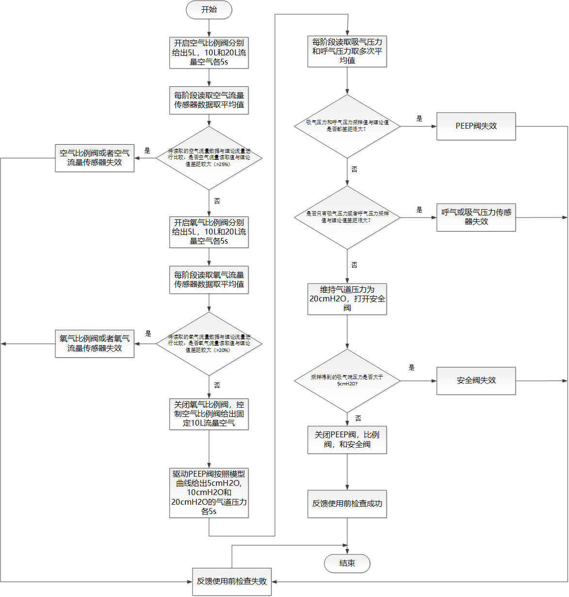

# 风险分析BDU应对措施解决方案——模块自检

## A机型

### 安全阀自检

安全阀目前没有硬件的驱动反馈信号，无法直接在不通气的情况下进行开机自检。

安全阀的自检需要在接上气源和管路的条件下，自检步骤：

1. 开启空气比例阀，输出10L流量的空气。
2. 驱动PEEP阀控制气道压力为20cmH2O。
3. 开启安全阀，监测气道压力是否明显降低。如果明显降低，说明安全阀工作正常，如果没有说明安全阀出现故障。

### PEEP阀自检

PEEP阀开机自检：

1. 在给定PEEP阀驱动占空比为0的条件下，读取比例阀驱动电压反馈是否为0， 如果偏差较大则说明PEEP阀驱动异常。
2. 给定PEEP阀驱动一个固定占空比，例如30%，读取比例阀驱动电压反馈值，看是否在和理范围内，如果偏差较大则说明PEEP阀驱动异常。

PEEP阀的使用前自检需要在接上气源和管路的条件下，并且需要配合压力传感器和比例阀，自检步骤：

1. 开启空气比例阀，输出固定10L流量的空气。
2. 测试驱动PEEP阀开环方式控制气道压力为5cmH2O, 10cmH2O和20cmH2O。
3. 对比压力测量结果和目标，看偏差是否过大，过大则说明PEEP阀控制出现问题。

### 气源流量传感器自检

流量传感器的开机自检：

1. 刚开机时，给定空气和氧气比例阀的驱动占空比为0；
2. 读取空气和氧气流量传感器的采样流量值，取多个周期的平均值看是否接近为0，如果有较大值，则说明流量采样零漂很大，流量采样不准确。

空气流量传感器和氧气流量传感器的自检需要和比例阀配合，自检步骤如下：

1. 开启空气比例阀，分别输出5L， 10L， 20L流量的空气各5s钟。
2. 通过空气流量传感器获取空气流量数据，与当前控制的输出流量做对比，看偏差是否过大，过大则说明空气流量传感器采样不准。
3. 开启氧气比例阀，分别输出5L， 10L， 20L流量的气体各5s钟；
4. 通过氧气流量传感器获取氧气流量数据，与当前控制的输出流量做对比，看偏差是否过大，过大则说明氧气流量传感器采样不准。

### 压力传感器自检

压力传感器的开机零漂自检：

1. 刚开机时，给定空气和氧气比例阀的驱动占空比为0；
2. 读取吸气和呼气压力传感器的压力采样值，看是否接近为0，如果有较大值则说明压力传感器有较大零漂，采样不准。

压力传感器自检的使用前自检需要在通气条件下与PEEP阀配合，在通气情况下：

1. 开启空气比例阀，输出固定10L流量的空气。
2. 测试驱动PEEP阀开环方式控制气道压力为5cmH2O, 10cmH2O和20cmH2O。
3. 对比压力测量结果和目标，看偏差是否过大，过大则说明压力采样偏差过大。

### 比例阀自检

比例阀开机自检：

1. 在给定空气和氧气比例阀驱动占空比为0的条件下测试空气和氧气比例阀驱动的反馈电压。看反馈电压是否接近0。
2. 给空气和氧气比例阀一定的驱动占空比例如30%，看反馈的驱动电压是否在合理范围内，如果反馈驱动电压超出一定范围，则比例阀驱动出现故障。

比例阀在接上气源条件下的使用前自检需要配合空气和氧气流量传感器，在接上气源的条件下：

1. 开启空气比例阀，分别输出5L， 10L， 20L流量的空气各5s。
2. 通过空气流量传感器获取空气流量数据，与当前控制的输出流量做对比，看偏差是否过大。
3. 开启氧气比例阀，分别输出5L， 10L， 20L流量的气体各5s；
4. 通过氧气流量传感器获取氧气流量数据，与当前控制的输出流量做对比，看偏差是否过大。

### 近端流量传感器

近端流量传感器开机自检：

1. 开机后测试与近端流量传感器的通讯，看近端流量传感器是否连接
2. 如果近端流量传感器连接，连续读取10次近端流量传感器返回的流量值，取平均后判断是否大于20ml/s，如果大于，说明传感器零漂过大。

近端流量传感器维护自检：

1. 接上管路和近端流量传感器，接上气源。
2. 堵住呼气口。
3. 开启空气比例阀，分别输出5L/min, 10L/min和20L/min的流速，读取对应的近端流量传感器值和空气源流量传感器，对比近端流量传感器读数以及氧气源流量传感器读数。
4. 如果近端流量传感器的读数与气源流量传感器读数相差较大，说明近端流量传感器需要校验或者更换。

## C 机型

**C机型的安全阀，气源流量传感器以及比例阀自检流程与A 机型相同**。

### 安全阀自检

安全阀目前没有硬件的驱动反馈信号，无法直接在不通气的情况下进行开机自检。

安全阀的自检需要在接上气源和管路的条件下，自检步骤：

1. 开启空气比例阀，输出10L流量的空气。
2. 驱动PEEP阀控制气道压力为20cmH2O。
3. 开启安全阀，监测气道压力是否明显降低。如果明显降低，说明安全阀工作正常，如果没有说明安全阀出现故障。

### 气源流量传感器自检

流量传感器的开机自检：

1. 刚开机时，给定空气和氧气比例阀的驱动占空比为0；
2. 读取空气和氧气流量传感器的采样流量值，取多个周期的平均值看是否接近为0，如果有较大值，则说明流量采样零漂很大，流量采样不准确。

空气流量传感器和氧气流量传感器的自检需要和比例阀配合，自检步骤如下：

1. 开启空气比例阀，分别输出5L， 10L， 20L流量的空气各5s钟。
2. 通过空气流量传感器获取空气流量数据，与当前控制的输出流量做对比，看偏差是否过大，过大则说明空气流量传感器采样不准。
3. 开启氧气比例阀，分别输出5L， 10L， 20L流量的气体各5s钟；
4. 通过氧气流量传感器获取氧气流量数据，与当前控制的输出流量做对比，看偏差是否过大，过大则说明氧气流量传感器采样不准。

### 比例阀自检

比例阀开机自检：

1. 在给定空气和氧气比例阀驱动占空比为0的条件下测试空气和氧气比例阀驱动的反馈电压。看反馈电压是否接近0。
2. 给空气和氧气比例阀一定的驱动占空比例如30%，看反馈的驱动电压是否在合理范围内，如果反馈驱动电压超出一定范围，则比例阀驱动出现故障。

比例阀在接上气源条件下的使用前自检需要配合空气和氧气流量传感器，在接上气源的条件下：

1. 开启空气比例阀，分别输出5L， 10L， 20L流量的空气各5s。
2. 通过空气流量传感器获取空气流量数据，与当前控制的输出流量做对比，看偏差是否过大。
3. 开启氧气比例阀，分别输出5L， 10L， 20L流量的气体各5s；
4. 通过氧气流量传感器获取氧气流量数据，与当前控制的输出流量做对比，看偏差是否过大。

### 近端流量传感器自检

开机自检：

无

定期维护自检：
1. 刚开机时，给定空气和氧气比例阀的驱动占空比为0；
2. 读取吸气和呼气压力传感器的压力采样值，看是否接近为0，如果有较大值则说明压力传感器有较大零漂，采样不准。

### 压力传感器自检

开机自检：

1. 刚开机时，给定空气和氧气比例阀的驱动占空比为0；
2. 读取吸气和呼气压力传感器的压力采样值，看是否接近为0，如果有较大值则说明压力传感器有较大零漂，采样不准。

使用维护自检（**待定**）：

1. 控制空气比例阀输出指定流速的空气，例如分别输出5L/min, 10L/min, 20L/min流速气体各5s。
2. 读取压力传感器的读数，与科恩达的理论曲线对比，如果相差较大就说明压力传感器不准。

## 开机自检流程

开机自检主要进行比例阀，peep阀的驱动电压测试和流量，压力传感器的零漂测试。测试流程如下：

## 使用前自检流程

使用前自检主要对比例阀，PEEP阀，安全阀的功能进行测试，测试各类阀是否工作正常，同时对流量传感器和压力传感器进行测试，测试读书是否正常。由于采取了相互比对校验的方式，当出现问题时，可能无法判断是阀失效还是传感器失效。使用前自检流程图如下：

## 实时故障判断：

### 气源流量传感器和比例阀之间的相互比较判断

### 压力传感器和IP阀之间的相互比较判断

### 压力传感器和科恩达发生器之间的相互比较判断

### 开机自检协议

BDU向UI反馈自检状态字

| bit         | name                   | descripion                |
| ----------- | ---------------------- | ------------------------- |
| bit0        | 自检状态               | 0：自检未完成 1：自检完成 |
| bit1        | 安全阀自检结果         | 0: 自检成功   1：自检失败 |
| bit2        | 空气比例阀自检结果     | 0: 自检成功   1：自检失败 |
| bit3        | 氧气比例阀自检结果     | 0: 自检成功   1：自检失败 |
| bit4        | 空气流量传感器自检结果 | 0: 自检成功   1：自检失败 |
| bit5        | 氧气流量传感器自检结果 | 0: 自检成功   1：自检失败 |
| bit6        | 吸气压力传感器自检结果 | 0: 自检成功   1：自检失败 |
| bit7        | 近端压力传感器自检结果 | 0: 自检成功   1：自检失败 |
| bit8        | 近端流量传感器是否连接 | 0: 传感器连接   1：未连接 |
| bit9        | 近端流量传感器自检结果 | 0: 自检成功 1：自检失败   |
| bit10       | PEEP阀自检结果         | 0: 自检成功   1：自检失败 |
| bit11-bit15 | 保留                   |                           |
|             |                        |                           |
|             |                        |                           |
|             |                        |                           |

### 使用前自检协议：

BDU向UI发送使用前自检状态字

| bit        | name                           | description                                                  |
| ---------- | ------------------------------ | ------------------------------------------------------------ |
| bit0-bit2  | 自检状态                       | 0：自检完成  1:空气比例阀自检中 2:氧气比例阀自检中 3: PEEP阀自检中，4. 安全阀自检中 |
| bit3       | 安全阀自检结果                 | 0: 自检成功   1：自检失败                                    |
| bit4       | 空气比例阀和流量传感器自检结果 | 0: 自检成功   1：自检失败                                    |
| bit5       | 氧气比例阀和流量传感器自检结果 | 0: 自检成功   1：自检失败                                    |
| bit6       | PEEP阀自检结果                 | 0: 自检成功   1：自检失败                                    |
| bit7       | 近端流量传感器是否连接         | 0: 传感器连接   1：未连接                                    |
| bit8       | 近端流量传感器自检结果         | 0: 自检成功 1：自检失败                                      |
| bit9-bit15 | 保留                           |                                                              |
|            |                                |                                                              |
|            |                                |                                                              |
|            |                                |                                                              |
|            |                                |                                                              |
|            |                                |                                                              |
|            |                                |                                                              |

